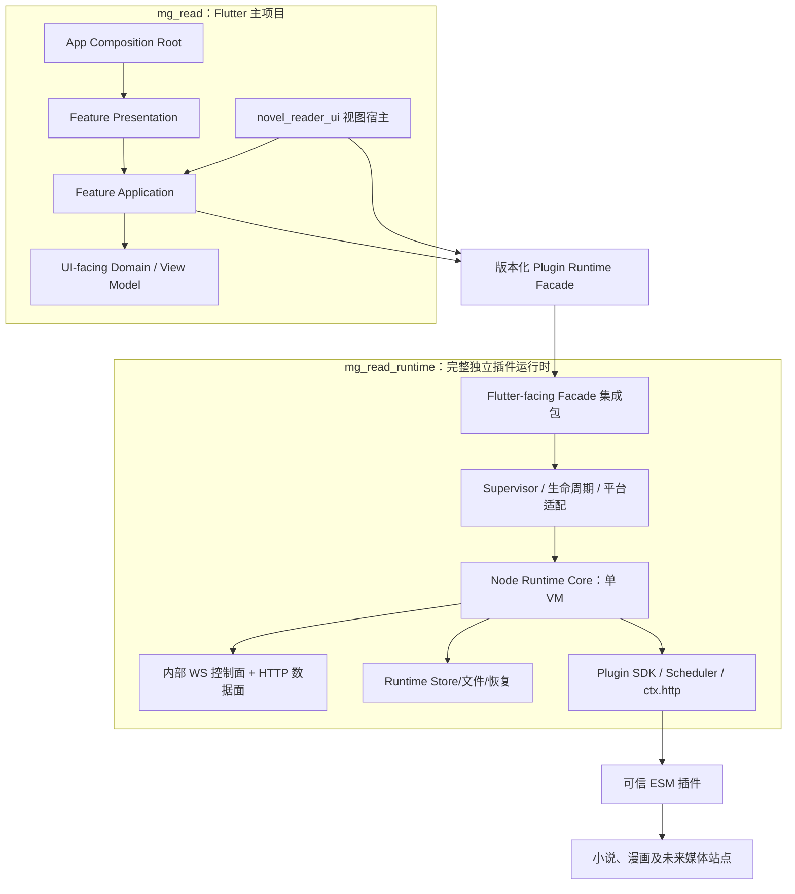

# 02 系统分层与组件边界

## 架构目标

MgRead 将 Flutter 主项目与插件运行时视为两个独立产品边界：主项目只负责 UI、路由、
主题、用户意图和阅读器视图宿主；`mg_read_runtime` 独立完成插件执行、平台承载、
内部通信、数据与文件管理。这个边界由 [ADR-0008](adr/0008-standalone-plugin-runtime-boundary.md)
固定，优先于此前“主项目承载 Runtime Client/宿主数据库”的规划。



主项目不能以“只是一个适配器”为理由重新实现 Runtime Supervisor、Javet/Node 启动、
WS/HTTP Client、协议 DTO、`host.*` 回调、插件 Cookie/文件服务或 Runtime 数据库。

## 主项目分层

目标目录继续按 feature 垂直切片扩展：

```text
lib/
  app/
    app.dart
    app_router.dart
    app_theme.dart
    bootstrap.dart
  core/
    diagnostics/               # Runtime 脱敏快照的 UI 投影
    errors/                    # Runtime 稳定错误码到 UI 的安全映射
  features/
    library/
    plugins/
    discovery/
    content_detail/
    downloads/
    reader/
    settings/
  shared/
```

这是一份目标布局；不存在的目录在对应里程碑才创建。主项目不预留
`core/runtime/`、`core/persistence/`、`core/files/` 或 `core/scheduling/` 来承载插件
Runtime 的实现。若 UI 自身将来需要短期展示缓存或纯 UI 工具，它必须不含插件数据、
协议或平台 Runtime 职责。

### 依赖规则

- `app` 只负责组合、主题、路由和生命周期的 UI 通知。
- `presentation` 依赖 application 状态和不可变 view state；Widget 不访问 Runtime
  内部端点、数据库、文件或平台脚本引擎。
- `application` 只编排用户意图、取消 UI 请求和将 Runtime 结果映射为状态；不得管理
  Runtime 的启动、重连、持久化或通信状态机。
- `domain` 只包含 UI 所需的稳定类型、显示规则和窄端口；不复制 Runtime wire schema。
- `data` 若存在，只适配 Runtime Facade 的公开类型和 `novel_reader_ui` 的公开 API；
  不实现 Repository、SQLite、HTTP、WS 或插件协议。
- `shared` 只能放真正跨 feature 的 UI/工具；不得变成对 Runtime 的 Service Locator。

依赖方向为：

```text
app -> feature presentation -> feature application -> UI-facing domain
                                            |
                                            v
                              Runtime Facade / reader public API
```

### 状态与路由

- 计划使用 Riverpod 的不可变 `Notifier/AsyncNotifier` 管理 UI 状态生命周期。
- 每个请求状态必须区分初始、加载、已有数据刷新、成功、空、可重试失败和不可行动失败。
- 所有异步结果提交前检查请求世代/取消状态；Widget 生命周期结束后不再写状态。
- 路由采用声明式类型化定义；只携带稳定 ID 或轻量值，不携带正文、资源流、Runtime
  连接、Repository 或 controller。
- 禁止 Service Locator 和保存当前用户/当前书籍/当前进度的全局业务单例。

## Runtime Facade：主项目唯一接口

Runtime 发布 Flutter-facing 集成包。主项目只使用版本化的强类型调用对象与结果：

```text
PluginRuntime.invoke<T>(PluginInvocation<T>) -> Future<T>
```

`PluginInvocation` 表达插件 ID、版本化 capability、参数、取消和结果类型；它不是 WS
envelope，也不允许主项目拼接任意方法字符串。插件管理、发现、搜索、详情、目录、
书架、阅读进度、下载、诊断和资源访问都通过这一门面表达。资源结果是 Runtime 管理的
对象，主项目不构造或猜测 loopback URL、`bootId`、handle TTL 或 HTTP 请求头。

门面首次调用时自行完成 Runtime 初始化、版本/健康校验与连接建立。主项目不调用
`ensureReady()`、不持有端口或子进程，也不传入路径、数据库、Cookie、文件服务、
平台通道或 `host.*` handler。Runtime 异常以稳定的门面错误和脱敏诊断投影返回。

## Runtime 内部职责

`mg_read_runtime` 必须独立拥有：

- Android Javet Adapter、Windows/macOS Node 启动与打包集成，以及跨平台 Supervisor。
- 单 Node VM、ESM 插件加载、SDK、`ctx.http`、有界调度、取消、限流和诊断。
- 内部 WS 控制面、loopback HTTP 数据面、ready/hello、资源句柄、Range、背压与重连。
- 插件安装、ZIP 校验、官方仓库、不可变版本目录、冷激活、回滚与启停。
- Runtime Store：插件版本、书架/来源绑定、目录快照、阅读进度、书签、下载任务、
  内容/缓存文件、Cookie、插件 KV、Runtime 设置和脱敏诊断。
- Runtime Store 内部使用稳定记录 envelope 与按作用域/记录类型版本化的 JSON；正文、
  二进制和明文敏感数据不进入普通 JSON。详细设计见
  [10 Runtime Store 持久化设计](10-runtime-store-persistence.md)。
- Runtime 自行解析受控应用数据根目录、执行迁移、文件原子提交和启动恢复；不等待或
  请求主项目提供这些能力。
- 未来 WebView、文件选择、通知和媒体等能力的跨平台实现或明确 `unsupported`；不得
  通过回调把未实现能力转移给主项目。

## 数据所有权

| 数据 | 唯一权威拥有者 | 主项目可做什么 |
| --- | --- | --- |
| 插件安装、版本、启用、诊断 | Runtime Store | 通过 Facade 查询、触发 capability、显示投影 |
| 书架、来源绑定、目录、阅读进度、书签 | Runtime Store | 读取投影、发起用户操作、渲染状态 |
| 下载、缓存、内容文件、Cookie、插件 KV | Runtime Store | 读取脱敏状态或 Runtime 资源对象 |
| Runtime 生命周期、协议、内部连接 | Runtime | 只接收稳定就绪/失败/诊断结果 |
| 路由、主题、窗口与短期页面状态 | Flutter 主项目 | 唯一所有者 |

Runtime 不打开主项目数据库；主项目也不打开 Runtime 数据库、扫描 Runtime 文件或旁路
Runtime 修改任何插件数据。插件缺失或 Runtime 暂时不可用时，Facade 仍负责返回可读取
的本地投影或稳定不可用错误，UI 不自行拼装离线回退存储。

## 阅读器边界

- 主应用只导入 `package:novel_reader_ui/novel_reader_ui.dart` 的公开 API。
- Runtime 发布小说/漫画 `DataSource`、`StateStore` 与资源适配，使其通过 Facade 获取
  内容、保存语义进度并访问 Runtime 资源；主项目只将这些公开适配器交给阅读器视图。
- 阅读器不访问网络、不加载数据来源插件、不打开 Runtime 存储。
- 退出阅读器通过公开 observer 通知主项目；路由和确认由主项目决定。
- 进度仍使用阅读器定义的语义锚点，绝不以页码或像素偏移替代。

## 平台与测试边界

Android Runtime 线程、Javet 事件循环泵送、桌面子进程、签名包内 Node、WS/HTTP
readiness、Runtime Store 恢复和插件执行均由 Runtime 仓库测试和验收。主项目只测试
Facade 契约替身下的 UI/路由/错误呈现，以及最终集成包在真实应用中的消费结果。
Runtime Store 还必须按[独立验收规范](11-runtime-store-acceptance.md)在临时数据根中运行，
且不启动主应用、Node/Javet、网络或真实书源。

## 架构禁止项

- 在 `mg_read` 新建 Runtime Supervisor、WS/HTTP Client、Javet/Node bridge 或 raw
  protocol handler。
- 主项目注入数据库、文件、Cookie、平台通道、回调或 `host.*` 服务给 Runtime。
- 主项目直接打开 Runtime SQLite/文件，或复制书架、进度、下载和插件安装的权威状态。
- Widget 在 `build()` 中发 Runtime 调用或写 Runtime 数据；必须由 application 状态边界
  发起并释放。
- 通过预扫描端口后再绑定的方式选择 Runtime 端口，或向 UI 暴露端口/ready/bootId。
- 为未承诺平台或未来媒体能力在主项目增加 Runtime 条件分支和半成品 UI。
