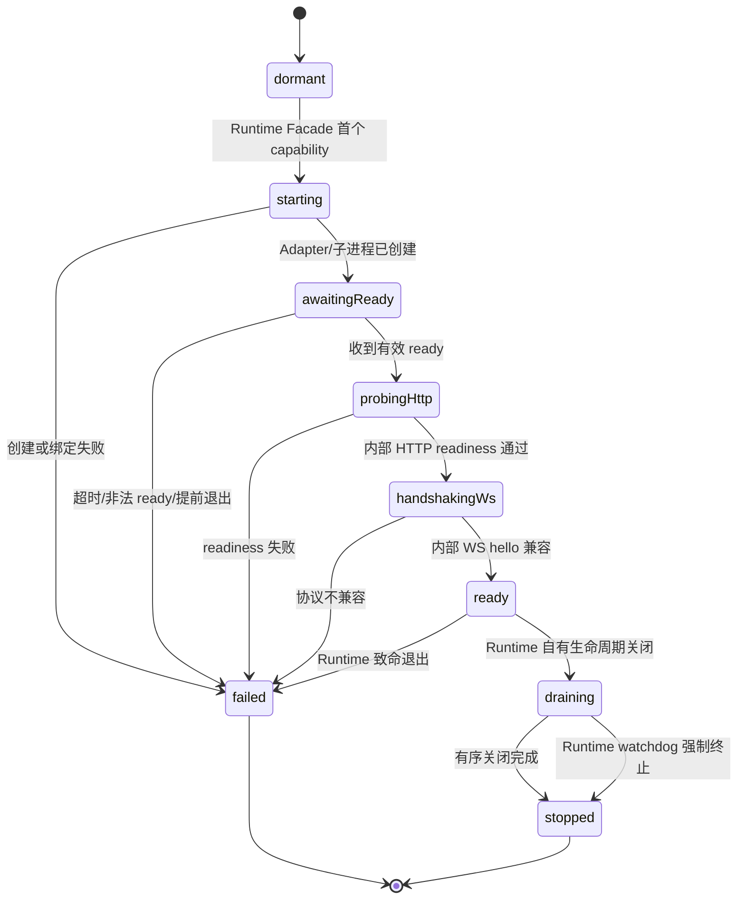
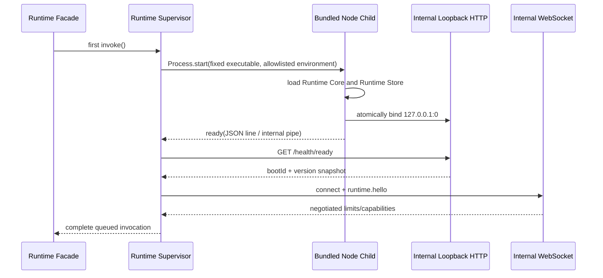

# 03 Runtime 生命周期

## 所有权与不变量

本章描述 `mg_read_runtime` 的内部生命周期。它不是 Flutter 主项目需要实现或调用的
流程；主项目只通过 Runtime Facade 发起版本化 capability。完整仓库边界见
[ADR-0008](adr/0008-standalone-plugin-runtime-boundary.md)。

- 任意时刻每个 MgRead 应用进程最多存在一个 Node Runtime、一个 V8 Isolate/Context。
- 所有插件共享该 Runtime 和事件循环；禁止 `worker_threads`、`child_process`、第二个
  VM、Engine Pool 和原生 Addon。
- libuv 为异步系统调用使用的 I/O Worker Pool 不算第二个 JavaScript VM，可以由 Node
  Core 使用。
- 单 VM 优化目标是高并发非阻塞 I/O。CPU 密集解析、同步死循环和过长微任务会阻塞所有
  插件；异步超时无法抢占任意同步 JavaScript。
- Runtime 按需懒启动。Facade 的首个调用触发启动，同一进程内并发调用共享启动任务；
  主项目不管理启动 Future、端口或状态机。
- Runtime Store、插件目录、Cookie、缓存与恢复全部由 Runtime 自行打开和维护。没有
  Flutter 数据库、路径或 `host.*` 服务注入。

## 平台承载

| 平台 | Runtime 内部承载 | 发布架构 | 对主项目的可见性 |
| --- | --- | --- | --- |
| Android | Runtime 仓库交付的 Javet Adapter，在专用后台线程创建唯一 `NodeRuntime` | 生产 `arm64-v8a`；模拟器/CI `x86_64` | Facade；不暴露 Javet 或线程 |
| Windows | Runtime 集成包从自身打包的固定 Node 24 隐藏启动子进程 | x64 | Facade；不暴露 executable、PID 或端口 |
| macOS | Runtime 集成包从已签名的固定包内路径启动 Node 24 子进程 | arm64 与 x64 分包 | Facade；不暴露签名/进程控制 |

正式选型时固定一个 Javet 版本，并读取其实际携带的精确 Node 24 版本。Windows/macOS
Runtime 包携带完全相同的小版本；Node/Javet/Runtime Core/协议兼容矩阵作为一个变更
单元发布。不能只对齐 Node 主版本。

## 内部 Supervisor 状态机



状态只由 Runtime 内部 `RuntimeSupervisor` 改变。Facade 将 `ready`、稳定错误码和脱敏
诊断投影给主项目；feature 和 Widget 不得观察或操纵中间状态。首版 Runtime 致命失败
后不在同一应用进程静默创建第二个 VM，Facade 返回 `runtime_unavailable` 并提示用户
重启应用。

## 桌面启动



### 端口与启动通道

- Runtime 子进程直接绑定 `127.0.0.1:0`，由操作系统原子选择端口。任何 Runtime 内部
  组件不得预扫描空闲端口。
- 禁止监听 `0.0.0.0`、局域网地址或 IPv6 任意地址。
- stdin/stdout 或匿名管道只允许 Runtime 内部传启动参数、结构化日志、失败原因和单条
  `ready`；不承载 plugin capability 或 UI 业务数据。
- Windows 使用隐藏窗口方式启动。macOS 以 Runtime 包内已签名的固定路径启动。
- 子进程环境采用 Runtime 定义的显式允许列表；不继承可能改变模块解析、代理或调试
  行为的任意 Node 环境变量。

### `ready` 消息

```json
{
  "type": "ready",
  "pid": 12345,
  "bootId": "019ffa-runtime-opaque-id",
  "host": "127.0.0.1",
  "port": 43127,
  "runtimeVersion": "1.0.0",
  "nodeVersion": "24.x.y",
  "protocolVersion": "1.0",
  "startedAt": "2026-08-13T08:00:00Z"
}
```

`ready` 只能在 Core、Runtime Store、HTTP 路由与内部 WS 路由都准备后发送。Supervisor
严格验证 JSON、PID、版本、端口和重复消息，但这些字段仅用于 Runtime 内部，Facade
不会将它们作为主项目 API 暴露。

### 当前 M1.2 desktop bootstrap 证据

`mg_read_runtime` 当前已在 Windows x64 的源码 bundle 上实现最小路径：固定 Node child
绑定 `127.0.0.1:0`，输出 ready，Runtime-owning Flutter Facade 再验证
`/health/ready` 与 `runtime.hello` 后执行 `runtime.ping`。四个并发 Facade 调用会共享同一
child process；主项目没有参与启动、端口或 WS 代码。实现与测试说明见
[Runtime M1.2 文档](../../../mg_read_runtime/docs/desktop-runtime-bridge.md)。

该 M1.2 `ready` 只代表最小 Core、health 路由和 WS 路由已经准备，并**不**满足本节的
产品级 Store/插件/恢复前置条件；Runtime Store 尚未实现，因此不得把此测试信号当作完整
首版 ready 或让主项目据此接入。移动端/Javet 和 macOS 未在本轮测试。

## Android 启动

Android 复用相同的 Core、Runtime Store、HTTP、WS 和协议验证，区别仅在承载：

1. Runtime 自有 Android Adapter 在专用后台线程创建唯一 `NodeRuntime`。
2. Adapter 注入只包含 Runtime 自己的路径、版本、日志回调和启动配置；不接受主项目
   数据库、Cookie、文件或业务 callback。
3. Node Core 原子绑定 loopback 端口，并通过 Runtime 内部原生回调发送结构化 `ready`。
4. Adapter 自行完成 HTTP readiness 和 WS hello，随后才让 Facade 完成调用。
5. Runtime 的执行、事件循环泵送、异常回调和销毁始终回到所属线程。

Flutter UI Isolate 不创建、泵送或销毁 Javet，也不接收原始插件对象。Javet 的 Java
交互只用于 Runtime 生命周期桥接，不成为主项目的第二套业务协议。

## 内部 readiness 与协议协商

`GET /health/ready` 仅在以下条件满足时返回成功：

- Core 已完成初始化。
- Runtime Store、插件目录、缓存和下载目录已完成最低限度恢复扫描。
- 内部 WS 和资源 HTTP 路由已注册。
- 没有版本、路径、迁移或平台适配的致命配置错误。

随后 `runtime.hello` 完成协议主版本、能力、`maxInlineBytes`、事件序号、资源句柄和
精确版本协商。二者都是 Runtime 内部门禁；主项目只看到 capability 成功结果或稳定
错误，不能跳过检查进入部分可用状态。

## 失败语义

| 阶段 | 典型失败 | Facade 对调用方的结果 |
| --- | --- | --- |
| 创建前 | executable/AAR 不存在、架构不匹配 | `runtime_start_failed`，带可行动诊断 |
| 创建中 | Node/Javet 异常、线程初始化失败 | `runtime_start_failed` |
| 监听前 | Core、Store、ESM、路径或端口绑定失败 | 结构化启动失败，禁止静默退出 |
| ready 后 | HTTP 不可达、bootId 不一致 | `runtime_not_ready` |
| hello | 协议/Node/Runtime 版本不兼容 | `version_incompatible` |
| ready 运行中 | Runtime 退出或内部 WS/HTTP 同时失效 | 在途 capability 显式失败，Supervisor 进入 `failed` |

断线或 Runtime 失败时，所有在途 capability 以 `transport_disconnected` 或
`runtime_unavailable` 完成，不能悬挂。与旧 `bootId` 绑定的临时资源失效；Runtime
Store 中已提交内容、进度、书签和下载检查点保留并由下次 Runtime 启动恢复。

## 后台、关闭与恢复

- 普通阅读退到后台后不承诺 Node、预取或缓存任务继续运行。
- Runtime 在自身生命周期通知下有界 flush 下载检查点和内部存储；主项目不负责转发
  存储或协议关闭。
- 系统终止进程是正常恢复路径，Runtime 在下次启动扫描 `.part`、事务记录和缓存。
- 首版不使用普通 Android 后台 Service 维持 Node 常驻。
- 有序关闭依次拒绝新 capability、取消可取消任务、关闭 WS/HTTP、清理 Runtime 自有
  Timer/句柄、关闭 Store，并在桌面等待精确子进程或在 Android 所属线程销毁 Runtime。
- 未提交文件留给下次 Runtime 启动恢复，不在关闭临界路径做无界清理。

## M1 可行性探针

所有探针由 `mg_read_runtime` 实现和验收；主项目只消费已发布的集成包。

| 探针 | Android/Javet | Windows | macOS | 通过证据 |
| --- | --- | --- | --- | --- |
| 精确版本 | 必须 | 必须 | 必须 | Node/Runtime/协议版本一致快照 |
| Node 模式与 ESM | 必须 | 必须 | 必须 | 同一 ESM fixture 加载成功/失败用例 |
| 内部 HTTP/WS loopback | 必须 | 必须 | 必须 | ready + hello + capability 调用 |
| `127.0.0.1:0` | 必须 | 必须 | 必须 | 实际绑定端点与 bootId |
| Runtime Store | 必须 | 必须 | 必须 | 受控根目录、迁移、原子写入与恢复 |
| HTTP Range/背压 | 必须 | 必须 | 必须 | 206/416、取消、慢消费者、大文件 |
| 控制台与异常 | 必须 | 必须 | 必须 | 脱敏日志、未捕获异常、拒绝 Promise |
| 零主项目注入 | 必须 | 必须 | 必须 | 不传 callback/path/DB/Cookie 的独立启动测试 |
| 生命周期 | 必须 | 必须 | 必须 | 前后台/退出/强杀/下次启动恢复 |
| 关闭 | 必须 | 必须 | 必须 | Promise/Timer/连接残留与 watchdog |
| 发布包 | AAR/ABI | Node x64 | 签名 Node arm64/x64 | 安装后的真实包内运行证据 |

任何探针失败都先阻断后续 Runtime 里程碑。允许的处置是固定另一个 Javet 版本、维护
明确补丁或调整 Runtime 内部适配；禁止静默更换引擎、降低 Node 主版本、向主项目暴露
私有协议或重新引入 `host.*` 注入。
