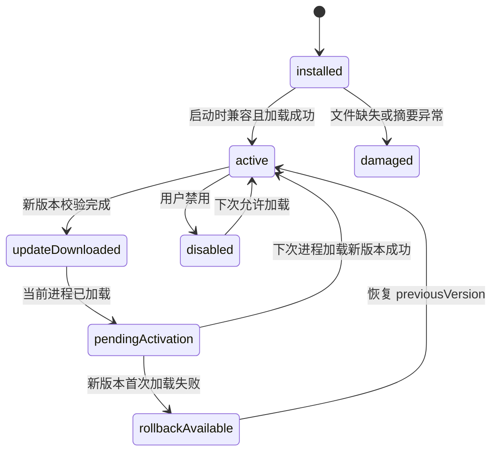

# 04 插件 SDK、ZIP 与官方仓库

## 信任与执行模型

首版只安装用户主动选择的官方仓库插件或本地 ZIP，并把插件视为完全可信代码。不实现沙箱、权限强制、代码签名信任链或本地通信鉴权。

这不意味着插件安全：插件与 Runtime Core 共享单 VM，能够消耗事件循环、内存和网络资源；同步死循环可能拖死全部插件。能力声明只用于兼容性、UI 展示、诊断和未来治理。详见 [ADR-0002](adr/0002-trusted-plugins.md)。

## 固定 ZIP 结构

```text
plugin.zip
  manifest.json
  dist/
    index.mjs
  assets/
  README.md
  LICENSE
```

规则：

- `manifest.json` 与 `dist/index.mjs` 必须存在，入口固定在包根相对路径内。
- 第三方纯 JavaScript 依赖必须打包进 `dist`。
- 禁止 `node_modules`、安装脚本、可执行文件、动态下载代码、原生 Addon 和符号链接。
- ZIP 条目必须使用规范化 `/` 相对路径；拒绝绝对路径、驱动器前缀、`..`、NUL、重复规范化路径及大小写碰撞。
- 安装器在解压前检查条目数量、单项大小、总压缩/解压大小和压缩比上限；具体上限属于可版本化 Runtime 策略，不由插件覆盖。
- `assets/`、`README.md`、`LICENSE` 可选，但清单引用的图标必须存在且满足 MIME/尺寸策略。
- 包内所有文件参与 SHA-256 完整性校验；SHA-256 只检测损坏，不构成首版发布者身份认证。

## Manifest v1

示例：

```json
{
  "schemaVersion": 1,
  "id": "org.example.library",
  "name": "示例书源",
  "version": "1.2.3",
  "entry": "dist/index.mjs",
  "contentKinds": ["novel", "comic"],
  "mgreadApi": ">=1.0.0 <2.0.0",
  "nodeVersion": ">=24.0.0 <25.0.0",
  "minimumAppVersion": "1.0.0",
  "capabilities": ["network", "runtime.cookie"],
  "author": {
    "name": "Example Team",
    "url": "https://example.invalid"
  },
  "description": "用于展示协议的示例插件",
  "icon": "assets/icon.png"
}
```

| 字段 | 规则 |
| --- | --- |
| `schemaVersion` | 正整数；未知主 Schema 版本拒绝安装 |
| `id` | 全局稳定、小写、点分命名；升级不得改变 |
| `name` | 非空展示名，有长度上限 |
| `version` | 严格 SemVer，不接受可变标签作为安装版本 |
| `entry` | v1 必须为 `dist/index.mjs` |
| `contentKinds` | 去重数组；首版实现 `novel`、`comic`，`audio`、`video` 仅可保留声明 |
| `mgreadApi` | 插件 SDK/API 的 SemVer 兼容区间 |
| `nodeVersion` | Node SemVer 兼容区间；Runtime 仍使用平台统一的精确 Node 24 小版本 |
| `minimumAppVersion` | 最低 MgRead 应用 SemVer |
| `capabilities` | 已知字符串集合；未知必需能力导致不兼容，未知可选能力只展示 |
| `author` | 展示元数据，不作为身份或信任证明 |
| `description` | 纯文本，禁止当 HTML 渲染 |
| `icon` | 包内相对资源路径，不允许外部 URL |

清单 JSON 必须由共享 Schema 校验。运行时读取后映射为内部不可变类型，不把任意附加字段透传进 UI。

## 能力声明

v1 预定义能力：

| 能力 | 含义 | 首版状态 |
| --- | --- | --- |
| `network` | 使用 SDK 管理的 `ctx.http` | 支持 |
| `runtime.storage` | 插件作用域的小型结构化状态 | 支持，由 Runtime Store 直接管理 |
| `runtime.cookie` | 使用插件/源站作用域 Cookie jar | 支持基础 HTTP Cookie；禁止日志 |
| `runtime.file.import` | Runtime 自己发起受控本地 ZIP 导入 | 由 Runtime Flutter 集成包实现；主项目不注入文件服务 |
| `runtime.webview` | 交互登录或验证码 | 预留；首版统一 `unsupported` |
| `runtime.notification` | 系统通知 | 预留；未实现时 `unsupported` |
| `runtime.media` | 原生媒体会话 | 预留；首版统一 `unsupported` |

能力声明不授予安全权限，也不能绕过 SDK；未来若启用权限强制，必须新增 ADR 和兼容迁移。

## ESM 入口与 SDK

入口默认导出由 `definePlugin()` 创建的对象：

```ts
export default definePlugin({
  async search(request, ctx) {},
  async getItem(request, ctx) {},
  async getCatalog(request, ctx) {},
  async getTextChapter(request, ctx) {},
  async getComicChapter(request, ctx) {},
});
```

此片段是目标 API 形状，不表示 SDK 已实现。

### 核心方法

| 方法 | 输入 | 输出 | 要求 |
| --- | --- | --- | --- |
| `search` | query、可选 source、opaque cursor、pageSize | `Page<ContentSummary>` | cursor 对宿主不透明；不得假设页码 |
| `getItem` | `opaqueRemoteId`、可选版本提示 | `ContentDetail` | 返回稳定远端 ID 和内容类型 |
| `getCatalog` | 内容引用、opaque cursor、pageSize | `Page<CatalogNode>` | 章节/图片集 ID 在来源内稳定 |
| `getTextChapter` | 内容与章节引用、版本提示 | 内联正文或文本 `ResourceHandle` 描述 | 超过协商上限必须用 HTTP 资源 |
| `getComicChapter` | 内容与章节引用 | 有序图片资源描述 | 不把图片 Base64 放入 JSON |

音频/视频方法不属于 v1 必须实现接口。即使清单声明保留类型，Runtime 也不能向首版 UI 宣称可播放。

### `PluginContext`

- `ctx.signal`：当前请求的 `AbortSignal`，所有子操作必须传播。
- `ctx.deadline`：绝对 deadline；插件不得自行延长。
- `ctx.http`：唯一网络入口，负责连接复用、超时、重定向、Cookie、字符集、压缩、重试、响应上限和指标。
- `ctx.resources`：把流或已安全落盘文件注册为 `ResourceHandle`。
- `ctx.storage`：插件 ID 作用域的小型结构化 KV，由 Runtime Store 管理；禁止正文和大对象。
- `ctx.platform`：Runtime 自有、版本化的平台能力入口；首版仅暴露已由 Runtime 实现的能力，绝不回调或注入主项目服务。
- `ctx.log`：结构化脱敏日志，只接受允许字段。

插件禁止直接创建未管理网络连接、访问 Runtime 未授权路径、调用同步文件/压缩 API、运行子进程或创建无界并发。SDK 构建和 lint 规则应尽早发现这些用法；可信模型不取消工程限制。

## 标识与分页

- `pluginId` 来自清单并跨版本稳定。
- `opaqueRemoteId` 由插件定义，Runtime 只存储、比较和回传，不解析 URL 或内部结构。
- `SourceBinding = pluginId + opaqueRemoteId`，URL 不能作为书籍业务主键。
- 章节和资源远端 ID 也保持不透明；Runtime 为书架项和下载任务生成自己的稳定 ID。
- 所有分页都使用插件返回的不透明 cursor；空 cursor 表示结束，cursor 只在对应方法、插件版本和查询上下文内有效。
- 首版不自动把不同插件返回的相似作品合并为一本书。

## 官方空白项目

独立的 `mg_read_plugin_template` 计划提供：

- TypeScript 类型、`definePlugin` 和构建配置。
- 不联网的假数据小说/漫画插件。
- 清单 Schema 校验、lint、类型检查、打包和可重现 ZIP 命令。
- 路径遍历、超限包、错误 cursor、取消、超时和大资源契约测试。
- 与 Dart/Runtime 共用的协议 fixture。
- README、LICENSE 和发布清单模板。

模板必须让插件作者只依赖公开 SDK，不要求阅读 Runtime Core 或 Flutter 阅读器私有源码。

## 唯一官方仓库

v1 只有一个由应用配置固定的官方仓库，不提供自定义 URL。仓库索引是版本化 JSON，支持 ETag/条件请求。

示例条目：

```json
{
  "schemaVersion": 1,
  "generatedAt": "2026-08-13T08:00:00Z",
  "plugins": [
    {
      "id": "org.example.library",
      "version": "1.2.3",
      "packageUrl": "https://registry.example.invalid/packages/org.example.library/1.2.3.zip",
      "sha256": "0123456789abcdef...",
      "size": 123456,
      "mgreadApi": ">=1.0.0 <2.0.0",
      "nodeVersion": ">=24.0.0 <25.0.0",
      "minimumAppVersion": "1.0.0"
    }
  ]
}
```

应用下载索引并只展示兼容结果；Node Core 下载包、流式计算摘要并执行安装。仓库索引和包摘要提供版本/完整性判断，不提供首版加密身份信任。

## 安装事务

无论官方下载还是本地 ZIP，最终都进入同一个 Node 安装器：

1. UI 通过 Runtime Facade 调用带幂等键的安装 capability。官方仓库或本地 ZIP 选择均由 Runtime 自己完成；本地包以内部 HTTP 流交给 Node，不把整个包读入内存。
2. Node 在插件临时区创建唯一 `.part` 文件，边接收边计算 SHA-256，并强制大小上限。
3. 校验 ZIP 中央目录、路径、条目限制和清单 Schema；验证兼容性与入口存在。
4. 解压到同一文件系统内的临时版本目录，重新校验实际文件清单和摘要。
5. 原子重命名为 `plugins/{pluginId}/versions/{version}/`；绝不覆盖已存在版本。
6. 在 Runtime Store 的事务中提交 `PluginInstallation` 记录。
7. 若插件本启动周期尚未加载，可按安装策略激活；若已加载或是更新，则写入 `pendingVersion`，下次应用进程启动激活。
8. 删除或保留临时文件按 Runtime 恢复策略处理，向 Facade 返回稳定结果。

安装任何一步失败都不能改变当前激活版本。相同幂等键重试返回已知事务结果或安全继续，不重复生成多个安装记录。

## 更新、激活与回滚



- 版本目录不可变；`activeVersion`、`pendingVersion`、`previousVersion` 是 Runtime Store
  `PluginInstallation` 版本文档中的显式状态语义，由稳定 lifecycle/revision envelope 投影，
  不要求每个值成为独立数据库列。
- ESM 已加载后不在当前 VM 内热替换，避免模块缓存、闭包、Timer 和插件状态混用。
- 新版本在下次应用进程启动时先做清单/入口校验，再变更激活指针。
- 首次加载失败自动恢复到保留的 `previousVersion` 并记录诊断；回滚动作也必须幂等。
- 至少保留当前版本和一个可回滚版本；额外历史版本按磁盘策略清理。
- 禁用是逻辑状态：停止向插件分派新请求，取消可取消任务；已加载模块直到进程退出才真正卸载。
- 卸载已加载插件时，先逻辑禁用并标记下次启动清理；本地书架、进度、书签和已下载内容不级联删除。

## 诊断与错误

每个插件诊断快照可包含：

- 清单版本、激活/待激活/回滚版本和兼容结果。
- 最近加载状态、稳定错误码、trace ID、时间和耗时。
- 当前交互/预取/下载队列深度与限流状态。
- 缓存字节、最近 HTTP 字节和错误计数的聚合值。
- 被拒绝的能力或 `unsupported` 调用。

禁止记录搜索原文、正文、章节内容、Cookie、凭据、用户标识、完整 URL 查询参数或插件任意日志对象。
