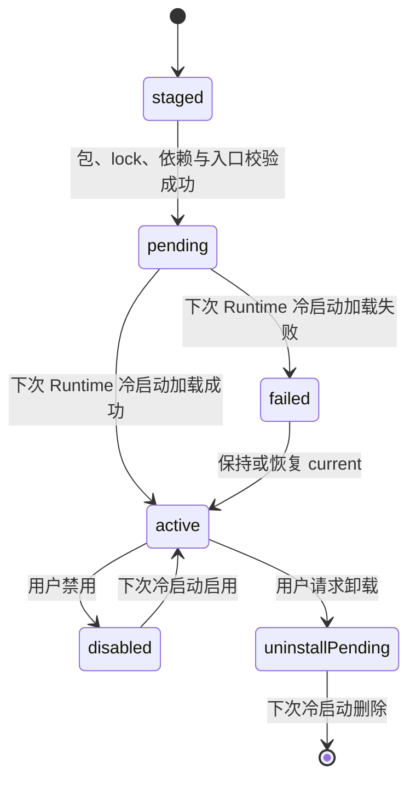

# 04 标准 Node 插件、依赖安装与仓库

## 已接受模型

MgRead 插件就是一个可信的标准 Node.js 24 项目。Runtime 复用 Node/npm 的项目、模块和
lockfile 语义，只额外负责安装事务、依赖内容仓、平台 Runtime 生命周期、MgRead Plugin API
以及 Flutter-facing Facade。决策由
[ADR-0015](adr/0015-standard-node-plugin-projects.md) 固定。

首版明确不提供插件沙箱、每插件 VM、Context 隔离、自定义 ESM Loader、模块实例隔离或代码
签名信任链。所有插件共享一个 Node VM、事件循环和标准模块缓存，插件可以直接使用 Node
内建模块和 `process`。这提供了最接近普通 Node 项目的行为，也意味着任意可信插件都可能阻塞
或破坏整个插件系统；详见 [ADR-0002](adr/0002-trusted-plugins.md)。

## 标准项目结构

```text
my-plugin/
  package.json
  package-lock.json
  dist/
    index.mjs
    source.mjs
    utils.mjs
  assets/
    icon.png
    rules.json
    dict.dat
  packages/
    optional-local-package/
  tools/
    mgread.mjs
  README.md
  LICENSE
```

TypeScript 只执行 `tsc`：`src/` 编译为普通多文件 `dist/`，不 bundle、不 tree-shaking，
也不把第三方依赖合并进入口文件。发布包默认不包含 `src/`、`test/` 或 `node_modules/`。

## `package.json.mgread` v1

插件元数据只写一次：

```json
{
  "name": "@mgread-plugin/example",
  "version": "1.2.3",
  "type": "module",
  "main": "dist/index.mjs",
  "engines": { "node": ">=24 <25" },
  "dependencies": {
    "cheerio": "1.1.0",
    "iconv-lite": "0.6.3",
    "my-parser": "file:./packages/my-parser"
  },
  "mgread": {
    "schemaVersion": 1,
    "id": "org.example.source",
    "displayName": "示例书源",
    "pluginApi": 1,
    "contentKinds": ["novel"]
  }
}
```

Runtime 安装前必须验证：

- npm `name` 与严格 SemVer `version`；版本目录以该 `version` 为准。
- `main` 是包内规范化相对路径且文件存在；不接受绝对路径、驱动器前缀、`..` 或符号链接。
- `engines.node` 明确兼容 Node 24；实际 Runtime 仍固定精确 Node 小版本。
- `mgread.schemaVersion == 1`、`pluginApi == 1`、稳定小写点分 `id`、非空
  `displayName` 和已知 `contentKinds`（仅 `novel` / `manga`）。
- `dependencies`、`optionalDependencies` 中每个直接版本与 lockfile 根记录一致，不接受
  可变 tag 或缺失 lock 条目。
- 旧格式在开发阶段直接返回 `plugin_package_legacy_unsupported`，不建立双格式兼容层。

Runtime 把验证结果映射为内部不可变 descriptor，再经 Facade 返回窄投影；未知字段不会作为
任意 Map 穿透到主项目。

## `package-lock.json` v3 是唯一精确依赖图

插件作者在开发机使用固定 npm 生成 `package-lock.json`。Runtime 不运行 npm/pnpm、不解析
SemVer，也不重新求解依赖，只恢复 lock 中已经确定的 `packages` 目录布局：

```text
package-lock.json
  -> installPath + version + resolved + integrity
  -> dependency object store
  -> plugin/version/node_modules
```

不再存在 `sharedDependencies`、`bundledDependencies` 或自定义 dependency lock。两个插件
使用相同完整性对象时自动复用物理文件，但共享不是插件协议，也不会改变各插件看见的普通
`node_modules` 树。

### 首版依赖范围

| 类型 | 状态 | 规则 |
| --- | --- | --- |
| 纯 JS、ESM、CommonJS | 支持 | 使用 Node 24 标准解析和模块缓存 |
| JSON、字典、模板、Wasm | 支持 | npm package 原样保留相对目录 |
| npm Registry | 支持 | 必须有 HTTPS `resolved` 与 SHA-512 SRI `integrity` |
| `file:./...` | 支持 | 只允许指向 `.mgplugin` 内的 `packages/` 子树 |
| `optionalDependencies` | 简单支持 | 下载/校验/文件缺失时跳过并计数；非 optional 立即失败 |
| `peerDependencies` | 支持 lock 结果 | 不求解，只恢复 lock 已确定布局 |
| Git dependency | 不支持 | 安装阶段稳定拒绝 |
| install script / node-gyp | 不执行 | 依赖其产物的 package 自然不兼容 |
| `.node`、`.dll`、`.so` | 不支持 | 包扫描时稳定拒绝 |

package 中声明 `postinstall` 本身不触发执行；Runtime 永远不执行任意安装脚本。

## Runtime dependency store

```text
runtime-data/
  dependencies/objects/
    sha512-<url-safe-digest>/package/...
  plugins/<pluginId>/
    versions/<version>/
      package.json
      package-lock.json
      dist/
      assets/
      packages/
      node_modules/
    current
    pending
    previous
    failed
  plugin-data/<pluginId>/
  plugin-cache/<pluginId>/
```

Registry dependency 安装流程：

1. 以 lock 的 `integrity` 计算稳定对象 ID；同一对象的并发下载合并为一项工作。
2. 缺失时下载 `resolved` tarball，在使用前验证 SHA-512 SRI。
3. 安全解压完整 npm package，拒绝路径穿越、符号链接、特殊文件和原生文件。
4. 为目标 lock `installPath` 创建普通目录，并优先逐文件 hardlink 对象仓内容。
5. hardlink 因文件系统或权限失败时逐文件 copy；两条路径得到相同 Node 可见布局。
6. 插件版本树和 dependency object 默认只读；可变状态只能写 `ctx.dataDir` 或
   `ctx.cacheDir`。

本地 `file:` package 同样完整保留资源，并从包内源目录物化到标准 `node_modules` 位置。
插件可继续使用 `new URL('./data/rules.json', import.meta.url)` 或 `fs.readFile()`，无需
`ctx.assets` 包装。

## `.mgplugin` 运输容器

`.mgplugin` 是确定性 ZIP，不是新的模块或依赖格式。默认允许：

- 根文件：`package.json`、`package-lock.json`、README、LICENSE；
- 根目录：`dist/`、`assets/`、`packages/`、`tools/`；
- 禁止：`node_modules/`、符号链接、绝对路径、驱动器路径、`..`、NUL、重复规范化路径和
  大小写碰撞。

安装器在落盘前限制条目数、单文件大小、总解压大小和压缩比，并只在同一数据根的 staging
目录内解压。校验、依赖恢复和入口预检全部成功后，版本目录才原子改名进入
`plugins/<id>/versions/<version>/`。默认包不携带依赖 tarball；离线 portable deps 需要单独
ADR，首版不实现。

## 插件入口与 MgRead 上下文

标准入口使用命名导出：

```js
export async function activate(ctx) {}
export async function discover(request) {}
export async function search(request) {}
export async function getDetail(request) {}
export async function getChapters(request) {}
export async function getContent(request) {}
```

六个命名导出和全部内容对象遵循
[插件内容 API v1](15-plugin-content-contract.md)。此前仅返回 `id/title/author` 的
`search(keyword)` 是未发布开发证据，不能继续作为公开契约；Runtime、Facade、fixture 与模板
必须同时切换，不能让主项目直接加载模块。开发期旧默认导出只作为读取旧包时拒绝迁移的对象，
不是公开模板契约。

`ctx` 只提供 MgRead 独有能力：

- `dataDir`、`cacheDir`：插件专属可写目录；
- `http`：Runtime 管理的请求入口，传播 capability 的取消和 deadline；
- `log`：只接受稳定、受控、脱敏事件；插件自由文本不直接持久化；
- `app`：Node、Runtime、Plugin API 的只读版本投影；
- `plugin`：稳定插件 ID 与当前版本。

Node 已有的 `fs`、`crypto`、`buffer`、`stream`、`url`、`path` 等不再包装。插件不应创建
Worker 或子进程；可信模型不把这些用法变成安全边界，Runtime 仍可能在启动/诊断阶段拒绝已知
不兼容项。

## 冷安装、激活与回滚

安装新版本不改变当前已加载模块：



- 版本目录不可变且不覆盖；重复安装同一版本只重写 `pending` 指针。
- 冷启动先尝试 `pending`；成功后把旧 `current` 写入 `previous`，原子切换 `current` 并清除
  `pending`。
- `pending` 加载失败时写 `failed`、清除 `pending`，继续加载旧 `current`；失败更新不能破坏
  已工作的版本。
- 禁用和卸载不尝试热卸载 ESM；当前模块直到进程退出才真正离开模块缓存。
- GC 扫描所有保留版本的 `package-lock.json` 收集 registry integrity，再删除未标记对象；
  不维护易漂移引用计数。

## Facade 与主项目边界

公开集成面仍是 Runtime 包的 `PluginRuntime.invoke(PluginInvocation<T>)`。当前主项目接入：

- `RuntimePingInvocation`：Runtime/Node 健康与版本；
- `InstalledPluginsInvocation`：已安装插件的只读状态投影；
- `SourceDiscoverInvocation`、`SourceSearchInvocation`、`SourceDetailInvocation`、
  `SourceChaptersInvocation` 和 `SourceContentInvocation`：按稳定 plugin ID 执行完整内容链路。

旧 `PluginSearchInvocation` 随极简 `plugin.search.v1` 一起删除。新内容能力
`SourceDiscoverInvocation`、`SourceSearchInvocation`、`SourceDetailInvocation`、
`SourceChaptersInvocation` 和 `SourceContentInvocation`；它们只返回 ADR-0017 的强类型字段，
不会把任意插件 Map 暴露给主项目。

主项目的插件状态页消费前两项，搜索/发现 application adapter 消费五个内容 invocation；它们
都不持有 Runtime 路径、Node executable、PID、端口、ready、bootId、WS/HTTP DTO 或安装器
对象。安装/更新 UI 后续必须等 Runtime 发布相应强类型 invocation，不得在 Flutter feature 内
复制安装逻辑。

## Registry 边界

首版产品只接受应用固定的官方仓库和用户显式选择的本地 `.mgplugin`。官方索引最终需要提供
稳定 plugin ID/version、包 URL、包 SHA-256/大小以及兼容投影；包内 npm 依赖仍由各自 lock 的
SRI 验证。仓库下载、文件选择和流式导入都属于 Runtime capability，不是主项目路径注入。
当前交付只实现本地标准包安装核心，官方索引/下载 invocation 尚未交付。

## 诊断、隐私与验收

| owner | 事件 | 级别/终态 | 允许字段 | 策略 |
| --- | --- | --- | --- | --- |
| Installer | `plugin_install_started/completed/failed` | info / success,error | 技术 plugin ID、耗时、hardlink/copy/optional 计数 | 每次安装一个 owner span |
| Installer | `plugin_dependency_gc_completed` | info / success | 扫描/删除对象计数、耗时 | 每次 GC 一项摘要 |
| Manager | `plugin_load_started/completed/failed` | info,error | 技术 plugin ID、版本投影、耗时、稳定错误码 | 每个冷加载一个 owner span |
| Manager | `plugin_invocation_started/completed/failed` | info,error | capability、技术 plugin ID、耗时、结果数量、稳定错误码 | 每次调用一个 owner span |
| Main Facade | `runtime.facade.call.start/complete/error` | info,error | capability、attempt、pluginCount/resultCount、resultState、稳定错误码 | 不复制 wire/端口信息 |

默认不记录搜索词、返回标题/作者、正文、URL、Cookie、Authorization、路径、异常文本或插件日志
自由文本；本链路不创建 payload 附件。高频统计应按时间窗聚合，不能把 plugin ID、trace ID 或
URL 作为指标 label。日志写入失败不能改变安装、加载或调用的业务终态。

最小验收覆盖：标准 metadata/lock、确定性 archive 与 traversal、registry SRI、完整资源、
`file:`、hardlink/copy fallback、optional 跳过、冷激活、失败更新回退、禁用/卸载、mark-sweep、
调用 success/error/cancel/timeout、恰好一个终态及 secret canary。Android Javet、macOS 和最终
应用包内运行必须在对应平台另行验收，Windows 源码闭环不能替代它们。
