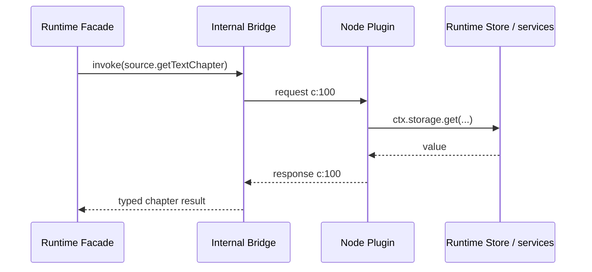

# 05 Runtime 内部 WS/HTTP 协议

## 协议目标

`mg_read_runtime` 的内部 wire 协议分成两个平面：

- **WS 控制面**：双向 RPC、响应、错误、事件和取消，只传小型 UTF-8 JSON。
- **HTTP 数据面**：图片、漫画、字体、插件 ZIP、下载文件、超限文本及未来音视频的字节流。

两者都只监听 Runtime 在当前启动周期绑定的 loopback 端点。首版不交换令牌、不做请求鉴权；`bootId` 和不可猜测句柄用于生命周期关联与降低误用，不是安全边界。它们由 Runtime 集成包完全封装，**不是** `mg_read` 的公开集成面；主项目只调用版本化、强类型的 `PluginRuntime.invoke(PluginInvocation)`。详见 [ADR-0004](adr/0004-ws-http-transport.md) 与 [ADR-0008](adr/0008-standalone-plugin-runtime-boundary.md)。

### 当前 M1.2 实现子集

Runtime 仓库目前只实现 desktop bootstrap 所需的内部 `/health/live`、`/health/ready` 与
`/v1/rpc`，以及 `runtime.hello`、`runtime.ping`、有幂等键的内部 `runtime.shutdown`。它
验证协议版本、bootId、`c:` ID、trace、deadline、对象参数和 64 KiB text frame；Node 与
Flutter 测试读取同一 fixture。当前也实现 Facade deadline 后的 best-effort `cancel`、256
在途请求上限和 1 MiB 写侧背压队列；它尚未实现事件、重连、snapshot、资源 HTTP、Range 或
任何插件业务方法，因此不能被主项目直接调用或视作本章完整协议已验收。详见
[Runtime M1.2 文档](../../../mg_read_runtime/docs/desktop-runtime-bridge.md)。

## 版本与 Schema

- 协议版本写为 `major.minor` 字符串，例如 `1.0`。
- 主版本不一致直接返回 `version_incompatible` 并关闭连接。
- 同主版本的新增可选字段可向前兼容；接收方忽略未知可选字段，但不能忽略未知 envelope 类型或必需语义。
- `runtime.hello` 协商功能位、`maxInlineBytes`、最大 WS frame 和资源能力；双方取更严格限制。
- ID、cursor、64 位长度和时间戳在 JSON 中使用字符串或明确安全范围，不能依赖 JavaScript 非安全整数。
- 正文以 Unicode 字符串传输；二进制永远不用 JSON 数组或 Base64。
- 规范 Schema 与固定 fixture 由 `mg_read_runtime` 维护。Runtime Flutter-facing 门面消费受控的公开类型；主项目不得直接消费 wire schema 或自行实现 WebSocket 客户端。

## WS 连接

- URL：`ws://127.0.0.1:{port}/v1/rpc`。
- Runtime 内部 Bridge 正常只维护一条业务 WS；它由 Runtime 集成包创建、重连和释放。
- v1 每个 text frame 包含一个 envelope，不支持批量 envelope；binary frame 以 `invalid_envelope` 关闭。
- 读循环只负责解析、基本验证和分派，不能等待当前 handler 完成后才读取下一帧。
- 两端分别维护“本端发出且等待响应”的并发表，以及有界的入站 handler 调度器。
- 不允许连接级同步锁、请求栈锁或“Facade 有请求在等待时暂停接收 Node 事件”的设计。

## 五种 Envelope

### Request

```json
{
  "v": "1.0",
  "type": "request",
  "bootId": "019ffa-runtime-opaque-id",
  "id": "c:01J5EXAMPLE",
  "method": "source.search",
  "pluginId": "org.example.library",
  "traceId": "01J5TRACE",
  "deadlineUnixMs": "1786608005000",
  "idempotencyKey": null,
  "params": {
    "query": "示例",
    "cursor": null,
    "pageSize": 20
  }
}
```

### Response

```json
{
  "v": "1.0",
  "type": "response",
  "bootId": "019ffa-runtime-opaque-id",
  "id": "c:01J5EXAMPLE",
  "traceId": "01J5TRACE",
  "result": {
    "items": [],
    "nextCursor": null
  }
}
```

### Error

```json
{
  "v": "1.0",
  "type": "error",
  "bootId": "019ffa-runtime-opaque-id",
  "id": "c:01J5EXAMPLE",
  "traceId": "01J5TRACE",
  "error": {
    "code": "rate_limited",
    "message": "请求过于频繁",
    "retryable": true,
    "retryAfterMs": 1500,
    "details": {
      "scope": "origin"
    }
  }
}
```

### Event

```json
{
  "v": "1.0",
  "type": "event",
  "bootId": "019ffa-runtime-opaque-id",
  "id": "n:01J5EVENT",
  "seq": "42",
  "method": "download.progress",
  "pluginId": "org.example.library",
  "traceId": "01J5TRACE",
  "params": {
    "jobId": "job_123",
    "transferredBytes": "1048576"
  }
}
```

### Cancel

```json
{
  "v": "1.0",
  "type": "cancel",
  "bootId": "019ffa-runtime-opaque-id",
  "id": "c:01J5CANCEL",
  "targetId": "c:01J5EXAMPLE",
  "traceId": "01J5TRACE",
  "reason": "caller_disposed"
}
```

## 字段规则

| 字段 | 规则 |
| --- | --- |
| `v` | 每条消息必需；协议版本 |
| `type` | `request`、`response`、`error`、`event`、`cancel` 之一 |
| `bootId` | 每条消息必需；不匹配当前启动周期立即拒绝 |
| `id` | 当前方向唯一；Runtime 内部 Bridge 发出的 ID 以 `c:` 开头，Node 发出的以 `n:` 开头 |
| `method` | request/event 必需；稳定命名空间加动作 |
| `pluginId` | 插件作用域方法必需；Runtime 全局方法省略 |
| `traceId` | Runtime 内全链路稳定；子操作继承原 trace |
| `deadlineUnixMs` | request 必需；发送方设定绝对 deadline，接收方只能缩短不能延长 |
| `idempotencyKey` | 写请求必需；读取可省略；只在方法定义的作用域和保留期内有效 |
| `params` | request/event 的对象；无参数时使用 `{}`，不使用任意顶层字段 |
| `seq` | event 必需；当前 `bootId` 内严格递增的十进制字符串 |
| `result` | response 必需，可为 `null` |
| `error` | error 必需，详情必须脱敏且符合对应错误 Schema |
| `targetId` | cancel 必需；必须指向同一连接和启动周期的在途 request |

接收方首先检查 frame/JSON/Schema/bootId，再注册或分派。重复 request ID、未知响应 ID、响应方向错误和超限 frame 都是协议错误并进入诊断。

## Runtime 内部并发与事件

Node 插件不直接看到原始 WS，也不能向 Flutter 主项目发起 `host.*`。插件对存储、
Cookie、文件和已实现的平台能力的访问由 Runtime Core 内部服务完成：



实现规则：

- Facade 等待 `c:100` 时，内部读循环继续处理事件、取消和其他独立调用；不得建立
  连接级同步锁。
- Node 插件调度槽可以等待 Runtime 内部存储/平台服务，但这些服务不得竞争同一个插件
  调度槽或持有连接锁。
- Runtime Store 事务不等待外部主项目回调；存储、文件与 Cookie 操作在 Runtime 内以
  有界、可取消的方式完成。
- trace、父 deadline 和取消信号贯穿 Bridge、Core、插件、Runtime Store 和资源流。
- Runtime 事件可由 Node 发给内部 Bridge 再投影为 Facade 的受控状态；主项目不处理
  wire event 或方向 ID。

## Runtime Facade → Node Core 方法

下表是 Runtime 内部 dispatch 表，不是 Flutter 主项目可拼接的字符串 API。每个方法在
实现前都必须有独立请求/响应 Schema，并由 `mg_read_runtime` 映射到版本化、强类型的
`PluginInvocation`。

| 命名空间/方法 | 用途 | 幂等性 |
| --- | --- | --- |
| `runtime.hello` | 协议/能力/限制协商 | 是 |
| `runtime.snapshot` | 重建当前插件、队列、下载运行状态和事件序号 | 是 |
| `runtime.ping` | 轻量活性与时钟诊断 | 是 |
| `runtime.shutdown` | 有序关闭请求 | 写；必须有幂等键 |
| `plugin.list` / `plugin.get` | 查询安装和运行快照 | 是 |
| `plugin.install` | 由仓库引用或 `packageHandle` 安装 | 写；必须有幂等键 |
| `plugin.enable` / `plugin.disable` | 改变逻辑启用状态 | 写；必须有幂等键 |
| `plugin.checkUpdate` | 查询候选版本 | 是 |
| `plugin.prepareUpdate` | 下载、校验并标记待激活 | 写；必须有幂等键 |
| `plugin.rollback` | 切换到保留版本 | 写；必须有幂等键 |
| `plugin.diagnose` | 获取脱敏诊断 | 是 |
| `registry.refresh` / `registry.list` | 条件刷新与查询官方仓库 | 是 |
| `source.discover` / `source.search` | 发现和搜索，不透明 cursor 分页 | 是 |
| `source.getItem` / `source.getCatalog` | 详情和目录 | 是 |
| `source.getTextChapter` | 小说正文或文本资源句柄 | 是 |
| `source.getComicChapter` | 有序漫画图片资源描述 | 是 |
| `resource.release` | 提前释放临时句柄 | 写但天然幂等 |
| `download.start` | 创建/绑定传输 | 写；必须有幂等键 |
| `download.pause` / `download.resume` | 改变传输状态 | 写；必须有幂等键 |
| `download.cancel` | 取消传输但不隐式删除书架 | 写；必须有幂等键 |
| `download.status` | 查询活动传输快照 | 是 |

搜索、详情、目录和读取方法即使业务上是读取，也可能触发缓存；协议层仍按幂等读取处理，但缓存副作用不能改变业务结果。

## Runtime Core 内部服务

`ctx.storage`、Cookie、文件、资源提交和插件安装直接落在 Runtime 自有服务与
Runtime Store；它们不是 WS 回调，也不存在 `host.*` namespace。

| 内部服务 | 用途 | 首版状态 |
| --- | --- | --- |
| `runtime.store.plugin.*` | 插件安装/启用、版本、激活和回滚状态 | 支持 |
| `runtime.store.library.*` | 书架、来源绑定、目录、进度和书签 | 支持 |
| `runtime.store.download.*` | 检查点、完成提交和恢复状态 | 支持 |
| `runtime.store.kv.*` | 插件作用域小型结构化 KV | 支持；有大小/频率上限 |
| `runtime.cookie.*` | 插件及源站作用域 Cookie jar | 支持基础 HTTP 场景；敏感且禁止日志 |
| `runtime.file.import/reveal` | Runtime 自有的受控文件交互 | 首版仅本地 ZIP 导入；其余未实现时 `unsupported` |
| `runtime.webview.*` | 交互登录/验证码 | 预留；首版返回 `unsupported` |
| `runtime.notification.*` | 系统通知 | 预留；未实现时 `unsupported` |
| `runtime.media.*` | 原生播放会话与后台服务 | 预留；首版返回 `unsupported` |

这些服务使用 Runtime 定义的强类型命令、事务、作用域、大小限制和幂等键。Node 不获得
任意 SQL、Runtime Store 连接或主项目数据库路径；主项目也不提供替代实现。

## 错误模型

稳定错误码使用小写 snake_case：

| 错误码 | 重试默认值 | 含义 |
| --- | --- | --- |
| `runtime_unavailable` | 否 | Runtime 未就绪或已失败 |
| `runtime_start_failed` | 否 | Runtime 创建/启动失败 |
| `runtime_not_ready` | 是 | ready 后探测尚未通过 |
| `transport_disconnected` | 视方法 | WS/HTTP 断开，结果未知 |
| `version_incompatible` | 否 | 协议、应用、Node 或插件版本不兼容 |
| `plugin_not_found` | 否 | 插件未安装 |
| `plugin_disabled` | 否 | 插件被逻辑禁用 |
| `plugin_damaged` | 否 | 包文件缺失或完整性失败 |
| `method_not_found` | 否 | 未知方法；与已知但延期的能力不同 |
| `unsupported` | 否 | 已知能力在当前平台/版本未实现 |
| `invalid_request` | 否 | 参数不符合 Schema 或业务前置条件 |
| `invalid_format` | 否 | 远端内容、ZIP 或响应格式错误 |
| `integrity_failed` | 视来源 | 摘要或文件校验失败 |
| `not_found` | 否 | 内容或资源不存在 |
| `interaction_required` | 否 | 需要登录、验证码或用户交互 |
| `rate_limited` | 是 | 插件、源站或全局限流；可带 `retryAfterMs` |
| `overloaded` | 是 | 有界队列已满 |
| `timeout` | 视方法 | deadline 到期 |
| `cancelled` | 否 | 调用方或生命周期取消 |
| `conflict` | 视方法 | 版本/状态/幂等冲突 |
| `disk_full` | 是 | 空间不足或配额拒绝 |
| `range_not_satisfiable` | 否 | 请求范围不合法或资源已变化 |
| `internal` | 否 | 已脱敏的未知内部错误 |

`message` 是面向当前 UI 的安全摘要，不作为程序分支依据。`details` 只能包含预定义字段，禁止堆栈、正文、Cookie、令牌、数据库内容、完整 URL 查询或任意插件对象。原始内部错误只在内存诊断中按同样脱敏规则处理。

## Deadline、取消与幂等

- 每个 request 都有 `deadlineUnixMs`。接收方创建 `AbortController`，并把 signal 传播到插件、`ctx.http`、资源流和 Runtime 内部服务。
- 调用方主动取消时发送 cancel；发送 cancel 是幂等的。
- 如果原请求已完成，响应可能先于 cancel 到达，首次终态获胜；后续消息只作诊断，不二次完成 Future/Promise。
- deadline 到期返回 `timeout`；显式取消返回 `cancelled`。
- HTTP 消费者关闭连接必须向上游传播取消并释放流/文件句柄。
- 读取只有在方法 Schema 声明幂等时才可自动重试。
- 写操作必须携带幂等键。断线后调用方先用 snapshot/查询方法确认状态，再用相同键重试；禁止换新键盲目重复写。
- 幂等结果有版本化保留期；在保留期之外重试必须返回明确 `conflict` 或要求状态核对，不能假装是同一事务。

## 事件与重连

- 事件 `seq` 在单个 `bootId` 内严格递增；Runtime 重启从新 `bootId` 和新序列开始。
- 进度事件允许合并和降频，最终权威状态来自 Runtime Store/snapshot，不依赖每个字节事件都到达。
- WS 断线时，所有在途调用立即显式失败。
- 如果 HTTP readiness 表明同一 Runtime 仍存活，Client 可有界重连 WS；重连后先 `runtime.hello`，再调用 `runtime.snapshot`。
- `runtime.snapshot` 返回当前序列水位、插件加载状态、活动下载和队列摘要。v1 不承诺事件回放；Client 用 snapshot 替换易失运行状态。
- 如果 `bootId` 改变，所有旧临时句柄和事件游标失效；持久下载/文件由 Runtime Store 恢复。

## HTTP 端点

| 方法与路径 | 用途 |
| --- | --- |
| `GET /health/live` | 进程/Runtime 活性；不表示业务已就绪 |
| `GET /health/ready` | Core、路由、恢复扫描和版本状态 |
| `GET /v1/resources/{handle}` | 获取资源全部或单段 Range |
| `HEAD /v1/resources/{handle}` | 获取与 GET 相同的资源元数据，不返回 body |
| `POST /v1/packages` | Runtime 自有本地导入服务将 ZIP 流上传到 Node 临时安装区 |

所有端点仅 loopback。请求带 `X-MgRead-Boot-Id` 用于拒绝跨启动周期请求，但该头不是鉴权凭据。

## `ResourceHandle`

RPC 返回描述，不返回二进制：

```json
{
  "id": "r_A9mOq8x...",
  "bootId": "019ffa-runtime-opaque-id",
  "mimeType": "image/webp",
  "length": "482913",
  "etag": "\"sha256-abc...\"",
  "rangeSupported": true,
  "expiresAt": "2026-08-13T08:05:00Z",
  "fileName": null
}
```

- 临时句柄使用密码学安全随机值并至少具有 128 位不可预测性，但仍不视为授权令牌。
- 句柄绑定 `bootId`、插件作用域、不可变资源快照和 TTL。
- 已提交持久资源可在新启动周期生成新句柄；不得复用旧 URL。
- `resource.release` 可提前释放；TTL 到期返回 HTTP 410。
- `length` 未知时可为 `null`，但播放器/下载需要 Range 的资源必须先落盘得到稳定长度。

## Range 与响应语义

- 支持 `GET`、`HEAD`、`Range: bytes=...`、`If-None-Match`、`Content-Length`、`Content-Type`、`ETag` 和取消。
- v1 支持单一 byte range；多 range 请求返回 416 或明确不支持，不能返回错误拼接内容。
- 完整响应为 200；合法 Range 为 206 并带 `Content-Range`；越界为 416 并带 `Content-Range: bytes */{length}`。
- `HEAD` 与对应 GET 返回一致的状态和元数据头，但无 body。
- 不变资源使用稳定强 ETag；内容变化必须产生新 ETag 和句柄快照。
- 命中 `If-None-Match` 时返回 304，无 body。
- `Cache-Control` 禁止共享代理缓存；实际离线缓存由 MgRead 自己管理。
- MIME 来自可信探测/映射并校验，不能直接把上游任意 header 传给 UI。

## 流式管线与背压

```text
origin response
  -> size/type/integrity guards
  -> optional same-volume .part cache file
  -> localhost HTTP response
  -> Runtime Facade / reader adapter consumer
```

- Node 不把完整图片、ZIP、下载文件或未来媒体读入内存。
- Writable 产生背压时暂停上游读取；消费者取消时中止 origin 请求和未共享传输。
- 同一不可变资源的并发请求可合并到共享传输/文件，但各消费者取消互不误伤；最后一个消费者取消才终止共享源。
- 上游不支持 Range 时，先流式写入临时文件、校验并原子提交，再从稳定本地文件提供 Range。
- 如果请求需要立即随机访问而上游不支持 Range，返回明确准备中状态/错误，由调用方观察下载任务，不能伪造 Range。
- 所有字节计数、队列等待和取消原因进入聚合指标，不记录内容。

## 本地 ZIP 上传

1. Runtime Flutter 集成包在用户触发 `plugin.importLocal` capability 后取得受控文件句柄；主项目不注入文件选择器。
2. Runtime 以流式 body 调用内部 `POST /v1/packages`，不在 UI Isolate 读取整个文件。
3. Node 边接收边执行大小限制和 SHA-256，写入唯一 `.part`。
4. 成功返回短期 `packageHandle`、字节数和摘要；失败清理或保留为可诊断残留。
5. Runtime 再以幂等键分派内部 `plugin.install({packageHandle})`。

`packageHandle` 不能作为普通资源下载，也不能跨 `bootId` 使用。官方仓库包由 Node Core 自行下载后进入相同校验/安装事务。

## 超限小说正文

- `runtime.hello` 协商 `maxInlineBytes`，不是产品代码中的散落常量。
- 预计小于限制的 UTF-8 小说正文可通过 RPC 返回。
- 超限或长度未知的正文注册为 `text/plain; charset=utf-8` 资源句柄。
- Runtime 集成包或 Runtime Core 在受控执行边界内流式/分块解码和后处理，再交给阅读器适配器；主项目 UI Isolate 不承担巨大 JSON 或文本解码。

## 协议验收 fixture

至少固定以下跨语言用例：

- 五种 envelope 的最小、完整、未知可选字段和非法字段。
- Runtime Bridge/Node 双方向 ID、重复 ID、未知响应和 bootId 不匹配。
- Runtime 内部存储服务、父 deadline、取消竞争和 handler 过载；明确断言没有 `host.*` 回调或主项目注入。
- 所有稳定错误码及 details 脱敏。
- WS 断线、同 bootId 重连、不同 bootId 重建 snapshot。
- HTTP 200/206/304/410/416、HEAD、慢消费者、取消、大文件和上游无 Range。
- ZIP 流上传、超限、摘要不匹配和跨启动句柄失效。
- 内联文本边界前后各一个字节的行为。
