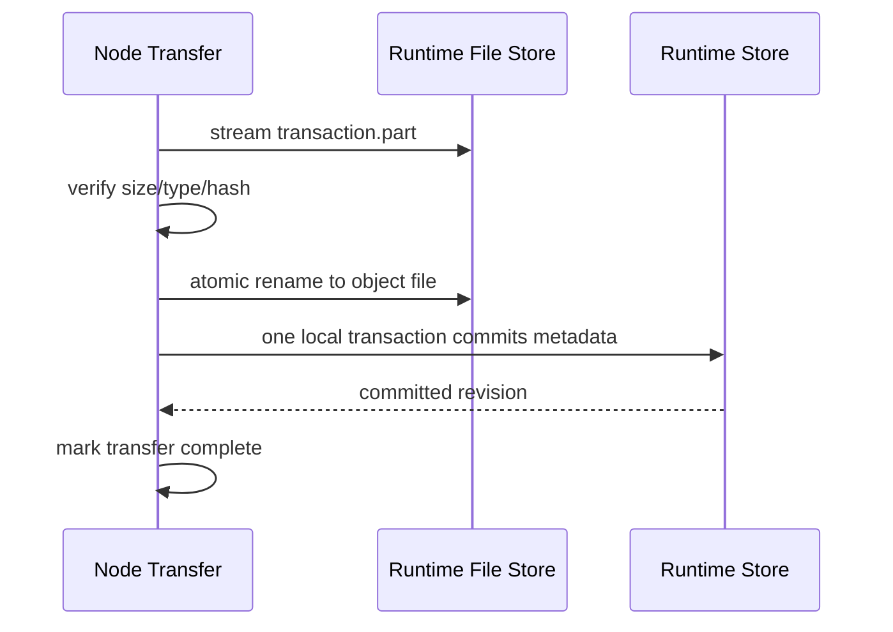
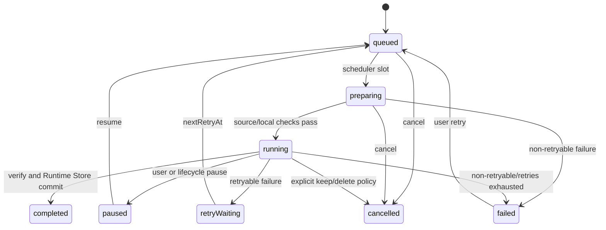

# 06 Runtime 数据、缓存与下载

## 所有权原则

插件和内容来源产生的所有持久状态都属于 `mg_read_runtime`。主项目只消费 Facade 返回
的强类型投影并保存短期 UI 状态，绝不注入、拥有或旁路这些数据。该规则由
[ADR-0008](adr/0008-standalone-plugin-runtime-boundary.md) 取代原 Flutter 数据库权威
模型。

- Runtime Store 是插件记录、书架、目录、进度、书签、下载、内容索引、缓存、Cookie、
  插件 KV、Runtime 设置和脱敏诊断的唯一权威来源。
- Runtime 自己打开、迁移和关闭受控持久层；主项目既不给出数据库路径或
  连接，也不得读取或修改其文件。
- Node Core 与 Runtime 平台集成共同管理二进制传输、临时文件、流式缓存、下载文件和
  原子提交；这不是 `host.*` 回调。
- Runtime Store 只保存稳定业务状态、相对文件标识和完整性元数据，不保存进程相关绝对
  路径或临时 HTTP URL。
- 插件不可用不等于用户数据不可用。Runtime 仍需通过 Facade 返回本地书架、目录快照、
  已下载内容、进度和书签，或返回稳定的不可用原因。

## 核心领域模型

以下字段是 Runtime 的逻辑契约。Runtime 可以按内部平台类型映射，但不能改变语义，
主项目也不得复制为第二份权威模型。

### `PluginInstallation`

| 字段 | 含义 |
| --- | --- |
| `pluginId` | 清单中的全局稳定 ID |
| `installedVersions` | 已完整提交的不可变版本集合 |
| `activeVersion` | 本启动周期期望加载的版本 |
| `pendingVersion` | 下次应用进程启动待激活版本 |
| `previousVersion` | 可回滚版本 |
| `enabled` | 是否允许接收新请求 |
| `status` | `installed/active/disabled/pendingActivation/damaged/rollbackAvailable` |
| `manifestSnapshot` | 已校验清单的规范快照 |
| `packageSha256` | 完整性摘要，不表示发布者身份 |
| `lastErrorCode` | 最近稳定错误码；不保存敏感详情 |
| `revision` | Runtime Store 乐观并发修订号 |

### `SourceBinding`、`LibraryItem` 与 `CatalogEntry`

```text
SourceBinding = pluginId + opaqueRemoteId + optional sourceKey
```

`opaqueRemoteId` 完全由插件解释。URL、标题或作者不能替代该绑定，也不能据此自动跨来源
合并。Runtime 为书架项、目录项和下载任务生成稳定 ID；主项目只回传这些 ID。

`LibraryItem` 保存内容类型、加入书架时的标题/作者/封面快照、主要来源绑定、明确添加的
其他绑定、在线/离线/插件禁用/插件缺失等可行动状态，以及当前目录 revision。

`CatalogEntry` 保存稳定目录 ID、不透明远端章节/图片集 ID、可选层级、规范排序键、标题
快照、远端版本、缓存状态和来源时间。目录刷新在 Runtime Store 事务中建立新 revision；
删除或改名不得破坏阅读进度锚点。

### `ResourceHandle`

`ResourceHandle` 是当前 Runtime 启动周期的传输描述：`id`、`bootId`、`mimeType`、
`length`、`etag`、`rangeSupported`、`expiresAt`。它不是数据库主键、文件路径或永久 URL。
Facade 将其封装为 Runtime 资源对象；主项目不构造 URL、头或句柄生命周期。

### `DownloadJob`

| 字段 | 含义 |
| --- | --- |
| `id` | Runtime 生成的稳定任务 ID |
| `libraryItemId/catalogEntryId` | 可选业务归属 |
| `pluginId` | 获取来源 |
| `resourceKey` | 规范资源身份，不是临时 handle |
| `priority` | 交互/用户下载/后台预取等规范级别 |
| `state` | 见下载状态机 |
| `transferredBytes/totalBytes` | 64 位语义；总量可未知 |
| `etag/lastModified` | 恢复验证信息 |
| `sha256` | 已知时用于最终完整性校验 |
| `partFileId` | Runtime 数据根目录中的相对临时文件标识 |
| `checkpoint` | Range offset、分块/资源游标等版本化结构 |
| `attempt/nextRetryAt` | 有界重试状态 |
| `revision` | 乐观并发与幂等提交 |

### `ReaderState`

- 小说保存阅读器公开 API 定义的章节 ID 和字符/段落语义锚点。
- 漫画保存章节 ID、图片 ID/索引及公开 API 定义的语义位置。
- 书签保存相同语义锚点、用户标签和上下文摘要策略；不保存整章正文。
- 页码、滚动像素、窗口尺寸和排版结果只可作为短期 UI 状态，不能成为跨布局持久进度。
- 同一本书的进度写入由 Runtime 串行合并，旧请求世代不能覆盖新位置。

## Runtime Store 与受控文件根

具体引擎、表和迁移在 Runtime 仓库中设计，但逻辑分区至少包括：

- `plugin_installations`、`plugin_versions`、`plugin_kv`、`cookies`。
- `library_items`、`source_bindings`、`catalog_snapshots`、`catalog_entries`。
- `reader_progress`、`bookmarks`。
- `download_jobs`、`content_files`、`cache_entries`。
- `runtime_settings`、`diagnostic_events`（只存脱敏聚合或稳定码）。

Runtime 平台集成包自行解析一个受控应用数据根目录：

```text
runtime-data/
  database/
  plugins/{pluginId}/versions/{version}/
  content/objects/{prefix}/{contentHashOrOpaqueFileId}
  downloads/parts/{jobId}.part
  cache/objects/{prefix}/{cacheFileId}
  staging/packages/{transactionId}.part
  staging/files/{transactionId}.part
  diagnostics/
```

- 数据库存相对 `fileId`，绝不存平台绝对路径。
- 临时文件与最终目标位于同一文件系统，确保原子重命名语义。
- 实际路径使用 Runtime 生成的安全 ID；插件/远端 ID 进入路径前必须映射或编码。
- Runtime Store 迁移、WAL/事务策略、索引、清理和恢复由 Runtime 测试；主项目无需也不得
  参与存储初始化。

## 文件提交与恢复



文件和元数据由同一个 Runtime 事务协调：原子重命名后、元数据提交前崩溃时，启动扫描
根据 sidecar/命名约定重试本地幂等提交或在安全期限后清理。若记录已存在但文件缺失，
Runtime 标记 `damaged` 并给出重新获取能力，绝不伪造成功。

恢复顺序：

1. Runtime 获取单实例文件维护锁。
2. 扫描 `staging` 和 `.part`，校验路径、sidecar 和大小，不递归跟随符号链接。
3. 使用 Runtime Store 中的检查点恢复合法传输和本地元数据提交。
4. 将无合法记录且超过保留期的残留纳入后台垃圾回收候选。
5. 抽样/按需验证已提交文件，标记缺失或摘要异常。
6. 发布恢复摘要后，内部 `/health/ready` 才成功。

启动关键路径只做有界必要扫描；全量审计在低优先级 Runtime 队列执行并可暂停/取消。

## 缓存与下载

缓存键至少包含：

```text
pluginId + opaqueRemoteId + catalogEntryRemoteId + resourceVariant + remoteVersion
```

- 元数据/目录快照位于 Runtime Store，二进制/大文本位于 Runtime 内容文件区。
- 缓存有全局和每插件字节预算；当前阅读、显式下载、书签依赖和合法 `.part` 为 pinned。
- 同一资源请求在 Node/Runtime 层合并；Store 只记录完成对象或显式部分状态。
- 清缓存只删除可再生缓存，不删除书架、进度、书签和用户显式下载。
- UI 通过 Facade 触发下载、暂停、恢复、取消和清理，并读取投影；不写检查点或扫描文件。



Range 恢复由 Runtime 根据持久检查点、HEAD/条件 Range、ETag、长度和最终摘要判断；主项目
不能从文件名、临时 handle 或旧 UI 状态推断是否可续传。

## 插件不可用与 UI 消费

| 能力 | 插件可用 | 插件禁用/缺失 |
| --- | --- | --- |
| 查看书架元数据 | 是 | 是，Runtime 返回本地快照 |
| 打开已下载正文/图片 | 是 | 是 |
| 查看/修改进度与书签 | 是 | 是 |
| 在线刷新详情/目录 | 是 | 否，返回可行动来源状态 |
| 读取未缓存章节 | 是 | 否 |
| 继续需要插件解析的下载 | 是 | 暂停并等待插件恢复 |
| 删除书架/本地内容 | 是 | 是，由 Runtime capability 执行 |

删除或禁用插件不得级联删除用户数据。重新安装相同稳定 `pluginId` 且兼容的插件后，
Runtime 可以恢复在线能力；远端 ID 是否仍有效由插件响应决定。

主项目页面在进入、恢复或 Facade 重新可用时请求 Runtime 投影。下载事件只是 UI 更新提示，
不得成为第二份权威状态；所有时间由 Runtime 以 UTC 存储，UI 仅负责本地化显示。
