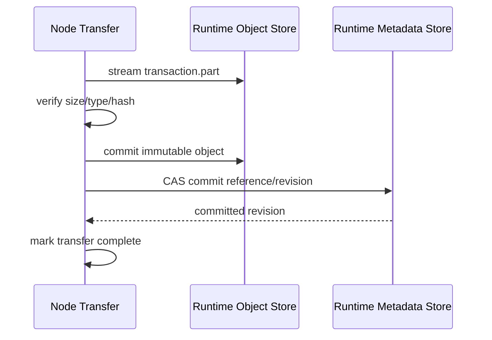
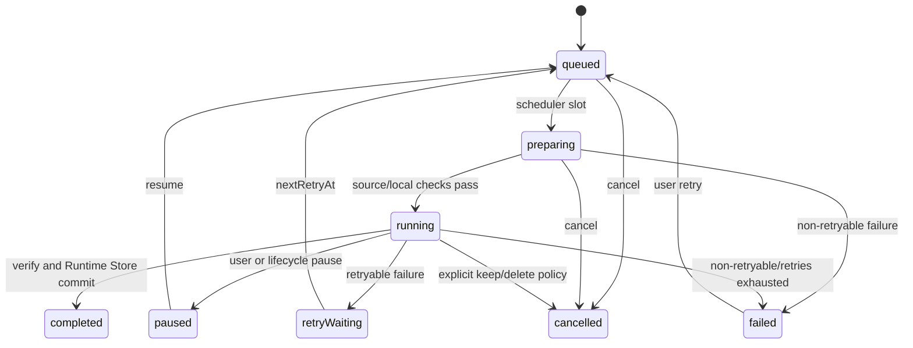

# 06 Runtime 数据、缓存与下载

## 所有权原则

插件和内容来源产生的所有持久状态都属于 `mg_read_runtime`。主项目只消费 Facade 返回
的强类型投影并保存短期 UI 状态，绝不注入、拥有或旁路这些数据。该规则由
[ADR-0008](adr/0008-standalone-plugin-runtime-boundary.md) 取代原 Flutter 数据库权威
模型。

- Runtime Store 是插件记录、书架、目录、进度、书签、下载、内容索引、缓存、Cookie、
  插件 KV、Runtime 设置和脱敏诊断的唯一权威来源。
- Runtime 自己打开、迁移和关闭受控持久层；主项目既不给出数据库路径或
  连接，也不得读取或修改其文件。
- Node Core 与 Runtime 平台集成共同管理二进制传输、临时文件、流式缓存、下载文件和
  原子提交；这不是 `host.*` 回调。
- Runtime Store 只保存稳定业务状态、相对文件标识和完整性元数据，不保存进程相关绝对
  路径或临时 HTTP URL。
- 插件不可用不等于用户数据不可用。Runtime 仍需通过 Facade 返回本地书架、目录快照、
  已下载内容、进度和书签，或返回稳定的不可用原因。

## 核心领域模型

以下是 Runtime Facade 的逻辑契约，不是“一字段一列”的数据库设计。按
[ADR-0009](adr/0009-scoped-versioned-json-records.md)，持久化使用少量稳定 envelope 和
按 `recordKind + scopeKind + formatVersion` 解释的 JSON payload：

- 稳定 ID、资料域、父子关系、唯一身份、排序、主要状态、revision、UTC 时间、大小与摘要
  等正确性/查询字段位于稳定骨架。
- 标题/作者/封面、插件 package 元数据快照、来源扩展、目录附加信息、语义锚点、下载 checkpoint、
  设置、插件 KV 和诊断上下文等易变内容位于受限版本 JSON。
- 未知 JSON 字段必须保留；正文、图片、ZIP、明文敏感数据和绝对路径不得进入普通 JSON。
- 主项目只看到强类型投影，不看到 JSON envelope、表或动态 Map。

完整 envelope、作用域、升级和内容对象设计见
[10 Runtime Store 持久化设计](10-runtime-store-persistence.md)。

### `PluginInstallation`

`pluginId` identity、安装/版本父子关系、主要 lifecycle state 和 revision 是稳定投影。
`installedVersions`、active/pending/previous 细节、已校验 package 元数据快照与脱敏错误扩展位于
版本化插件作用域 JSON。不可变插件包的摘要、大小和相对对象 ID 属于完整性 envelope，
不能藏在插件可修改的 JSON 中。

### `SourceBinding`、`LibraryItem` 与 `CatalogEntry`

```text
SourceBinding = pluginId + opaqueRemoteId + optional sourceKey
```

`opaqueRemoteId` 完全由插件解释。URL、标题或作者不能替代该绑定，也不能据此自动跨来源
合并。Runtime 为书架项、目录项和下载任务生成稳定 ID；主项目只回传这些 ID。

`LibraryItem` 的稳定 ID、内容类型、主要可用状态和 revision 是稳定投影；加入书架时的
标题/作者/封面、来源显示和未来扩展位于 library 作用域 JSON。每个 `SourceBinding` 是
独立子记录，使用 plugin-scoped identity hash 维持唯一性，opaque remote ID 保留在其
版本化 JSON 中。

`CatalogEntry` 一章一条记录。稳定目录 ID、父 snapshot/item、规范排序键和 revision 位于
envelope；不透明远端章节/图片集 ID、层级、标题、远端版本、来源时间和扩展元数据位于
catalog JSON。不得把整本目录保存为一个巨型 JSON 数组。目录刷新在 Runtime Store 事务
中建立新 revision；删除或改名不得破坏阅读进度锚点。

### `ResourceHandle`

`ResourceHandle` 是当前 Runtime 启动周期的传输描述：`id`、`bootId`、`mimeType`、
`length`、`etag`、`rangeSupported`、`expiresAt`。它不是数据库主键、文件路径或永久 URL。
Facade 将其封装为 Runtime 资源对象；主项目不构造 URL、头或句柄生命周期。

### `DownloadJob`

稳定任务 ID、业务父记录、priority/order、主要 state 和 revision 位于 envelope。plugin/
resource identity、64 位字节语义、ETag/Last-Modified、摘要、相对 `.part` ID、checkpoint、
attempt 和 retry context 位于 download 作用域版本 JSON；可能超过 JavaScript 安全整数范围
的值使用受校验十进制字符串。调度所需派生值由可信 codec 投影，插件不能提交任意索引。

### `ReaderState`

- 小说保存阅读器公开 API 定义的章节 ID 和字符/段落语义锚点。
- 漫画保存章节 ID、图片 ID/索引及公开 API 定义的语义位置。
- 书签保存相同语义锚点、用户标签和上下文摘要策略；不保存整章正文。
- 锚点和书签详情是各自独立版本 JSON 文档；稳定 item/entry 关系与 revision 位于 envelope。
- 页码、滚动像素、窗口尺寸和排版结果只可作为短期 UI 状态，不能成为跨布局持久进度。
- 同一本书的进度写入由 Runtime 串行合并，旧请求世代不能覆盖新位置。

## Runtime Store 与受控文件根

Store 的逻辑分区至少包括：container metadata、scoped records、record relations、idempotency
receipts、maintenance journal、encrypted secret records、content references/content objects 和
file objects。它们可以在探针通过后映射到稳定骨架表与作用域 JSON，而不要求每个领域类型
拥有一套随字段增长的列。

[ADR-0010](adr/0010-split-sqlite-content-store.md) 提议 SQLite 通过探针后使用轻量
`runtime.sqlite`、统一正文对象的 `content.sqlite` 和外部文件对象层。该 ADR 当前仍是
Proposed：精确后端/绑定、WAL、包体和三平台生命周期未获验证，旧 Drift 规划不能视为依赖
批准。

Runtime 平台集成包自行解析一个受控应用数据根目录：

```text
runtime-data/
  database/                         # 后端自有；SQLite 提议为 runtime.sqlite/content.sqlite
  plugins/{pluginId}/versions/{version}/
  content/objects/{prefix}/{contentHashOrOpaqueFileId}
  downloads/parts/{jobId}.part
  cache/objects/{prefix}/{cacheFileId}
  staging/packages/{transactionId}.part
  staging/files/{transactionId}.part
  diagnostics/
```

- 数据库存相对 `fileId`，绝不存平台绝对路径。
- 临时文件与最终目标位于同一文件系统，确保原子重命名语义。
- 实际路径使用 Runtime 生成的安全 ID；插件/远端 ID 进入路径前必须映射或编码。
- Runtime Store 迁移、WAL/事务策略、索引、清理和恢复由 Runtime 测试；主项目无需也不得
  参与存储初始化。

## 文件提交与恢复



对象和元数据由同一个 Runtime operation receipt/maintenance journal 协调，但不假定不同
数据库文件与文件系统存在一个原子事务。对象提交后、元数据引用提交前崩溃时，启动恢复
把它识别为有保留期的 orphan；引用已存在但对象缺失时，Runtime 标记 `missing/damaged`
并给出重新获取能力，绝不伪造成功。替换时先提交新对象和新引用，再异步回收旧对象。

恢复顺序：

1. Runtime 获取单实例文件维护锁。
2. 扫描 `staging` 和 `.part`，校验路径、sidecar 和大小，不递归跟随符号链接。
3. 使用 Runtime Store 中的检查点恢复合法传输和本地元数据提交。
4. 将无合法记录且超过保留期的残留纳入后台垃圾回收候选。
5. 抽样/按需验证已提交文件，标记缺失或摘要异常。
6. 发布恢复摘要后，内部 `/health/ready` 才成功。

启动关键路径只做有界必要扫描；全量审计在低优先级 Runtime 队列执行并可暂停/取消。

## 缓存与下载

缓存键至少包含：

```text
pluginId + opaqueRemoteId + catalogEntryRemoteId + resourceVariant + remoteVersion
```

- 元数据/目录快照位于记录层；正文位于统一内容对象层，图片及其他二进制位于文件对象层。
- 缓存有全局和每插件字节预算；当前阅读、显式下载、书签依赖和合法 `.part` 为 pinned。
- 同一资源请求在 Node/Runtime 层合并；Store 只记录完成对象或显式部分状态。
- 清缓存只删除可再生缓存，不删除书架、进度、书签和用户显式下载。
- UI 通过 Facade 触发下载、暂停、恢复、取消和清理，并读取投影；不写检查点或扫描文件。



Range 恢复由 Runtime 根据持久检查点、HEAD/条件 Range、ETag、长度和最终摘要判断；主项目
不能从文件名、临时 handle 或旧 UI 状态推断是否可续传。

## 插件不可用与 UI 消费

| 能力 | 插件可用 | 插件禁用/缺失 |
| --- | --- | --- |
| 查看书架元数据 | 是 | 是，Runtime 返回本地快照 |
| 打开已下载正文/图片 | 是 | 是 |
| 查看/修改进度与书签 | 是 | 是 |
| 在线刷新详情/目录 | 是 | 否，返回可行动来源状态 |
| 读取未缓存章节 | 是 | 否 |
| 继续需要插件解析的下载 | 是 | 暂停并等待插件恢复 |
| 删除书架/本地内容 | 是 | 是，由 Runtime capability 执行 |

删除或禁用插件不得级联删除用户数据。重新安装相同稳定 `pluginId` 且兼容的插件后，
Runtime 可以恢复在线能力；远端 ID 是否仍有效由插件响应决定。

主项目页面在进入、恢复或 Facade 重新可用时请求 Runtime 投影。下载事件只是 UI 更新提示，
不得成为第二份权威状态；所有时间由 Runtime 以 UTC 存储，UI 仅负责本地化显示。
