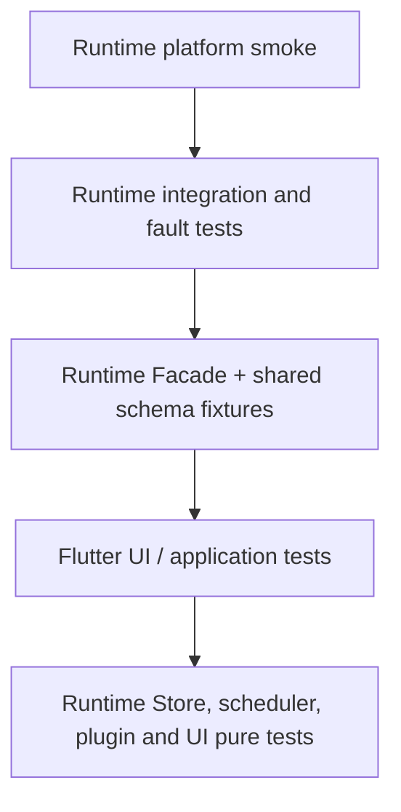

# 08 可靠性、可观测性与测试

> **适用范围提示**：通用故障、日志和证据分层仍有效；将 Runtime Store 视为书架、目录、
> 进度、书签或正文权威的旧测试段落已被 ADR-0011/ADR-0100 取代。当前测试所有者按
> [开发路由](../development/README.md)选择，不再建设历史 Runtime 业务 Store 套件。

## 可靠性原则

1. 每个 Runtime capability 只有一个明确终态：成功、失败、超时或取消；内部断线不能留下
   永远等待的 Future/Promise。
2. Runtime 自有运行数据与主应用权威业务数据分别由各自所有者恢复；Facade 重连不改变
   `AppPersistence` / `ContentLibrary` 的业务权威，也不创建跨边界影子副本。
3. 写操作由其所有者使用幂等键、事务或临时文件加原子提交保证可重试；读取只有声明幂等时
   自动重试。
4. 所有队列、重试、缓存、日志和恢复扫描都有界。
5. 错误先归一化为稳定码，再由主项目映射为用户可行动状态；插件原始异常不能直接显示
   或持久化。
6. Runtime 的失败不以主项目回调兜底。未实现能力返回 `unsupported`，来源不可用不伪装
   为空数据。

## 故障域

| 故障域 | 例子 | 隔离与恢复 |
| --- | --- | --- |
| Flutter 页面 | 页面销毁、旧请求回调、路由中断 | request generation/取消；从 Facade 投影重建 |
| Runtime Facade | 调用取消、版本不兼容、受控连接错误 | 稳定错误、诊断投影；不向主项目泄露 wire 状态 |
| Runtime 自有运行数据 | 迁移失败、文件损坏、磁盘满 | Runtime 恢复、只读诊断和明确 `disk_full` |
| 主应用持久化 | schema/事务失败、revision 冲突、磁盘满 | AppPersistence 恢复、稳定错误和可行动 UI |
| 内部 WS 控制面 | 断线、非法 frame、重复 ID | Runtime 结束在途调用；同 bootId 有界重连并 snapshot |
| 内部 HTTP 数据面 | 上游中断、消费者取消、Range 不一致 | 背压/取消传播；检查点和 ETag 验证后恢复 |
| Node Runtime | 启动失败、崩溃、事件循环卡死 | Runtime Supervisor `failed`；首版要求重启应用，不起第二 VM |
| 单个插件 | 格式错误、限流、加载失败 | 插件级错误/队列/断路；新版本失败回滚旧版本 |
| 源站 | 超时、认证、限流、内容变化 | origin 级退避；`interaction_required`；版本核对 |
| Runtime 文件存储 | `.part` 残留、摘要错误、记录丢失 | Runtime 启动恢复、原子提交、损坏标记和重新获取 |
| 平台生命周期 | Android 杀进程、桌面强退 | Runtime deadline flush；下次 Runtime 启动恢复 |

单 VM 只隔离异步任务状态，不隔离插件的同步 CPU 故障。事件循环 watchdog 能发现延迟但
不能可靠抢占死循环，这是架构已接受限制。

## 重试与 UI 错误

- 默认不重试；每个 capability/错误组合在 Runtime Schema 中明确是否允许。
- 只自动重试幂等读取、Runtime 内部连接建立和可验证的 Range 续传。
- 写操作断线后由 Runtime 查询自身权威状态，再使用原幂等键重试。
- 使用有限次数的指数退避、抖动和总 deadline；尊重 `retryAfterMs`。
- `invalid_request`、`version_incompatible`、`unsupported`、`plugin_disabled`、
  `interaction_required` 默认不自动重试。
- 应用重启不会清空 Runtime 任务的 attempt/checkpoint；过期 deadline 不跨重启复用。

主项目 Application 层只将 Runtime 的稳定错误映射为 UI 语义：

| UI 语义 | 用户动作示例 |
| --- | --- |
| `retryableTemporary` | 重试、稍后再试 |
| `runtimeUnavailable` | 查看诊断、重启应用 |
| `pluginUnavailable` | 启用、重新安装、回滚或选择其他来源 |
| `interactionRequired` | 首版说明能力暂不可用 |
| `contentUnavailable` | 返回目录、选择其他章节/来源 |
| `storagePressure` | 通过 Runtime capability 打开存储管理 |
| `incompatible` | 更新应用/插件或恢复兼容版本 |
| `cancelled` | 通常不弹错误；保留当前稳定页面状态 |
| `unknownSafe` | 显示 trace ID 和诊断入口，不显示原始堆栈 |

刷新失败且已有数据时保留现有 UI 数据并标记陈旧；首次加载失败显示明确错误状态。UI 不
应猜测插件、文件、缓存或数据库细节来决定恢复步骤。

## 结构化日志与指标

日志采用 [ADR-0014](adr/0014-tiered-diagnostics-storage.md) 固定的三层模型：小型 event
envelope、可关联 span/event、独立 attachment object。Runtime 负责插件、Store、通信、
HTTP 和平台诊断；主项目记录 UI/路由/应用持久化诊断。两边不共享数据库或文件，由未来
查看器通过强类型 query port、Runtime Facade 和 trace 联合展示。完整字段、附件、动态值、
保留、故障和性能设计见[全局日志与诊断数据系统](14-global-diagnostics-logging.md)。

普通事件允许 UTC 时间、固定 component/event、脱敏来源生命周期、`traceId`、技术
request/job ID、plugin ID、capability、队列类别、耗时、聚合字节、稳定结果码与版本投影。
它禁止正文、漫画内容、搜索词、书名/作者、用户标识、Cookie、令牌、Authorization、凭据、
验证码、Store 行内容、完整 URL/query、request/response body、任意插件对象、未脱敏堆栈
和绝对用户路径。

request/response body 与复杂动态结构不再被设计为“长日志正文”。只有用户显式开启、受
来源 allowlist、时间与磁盘配额约束的本地捕获会话，才可把允许的 payload 存成独立附件；
常规日志、常规导出和全文索引仍不包含它们。Authorization、Cookie、token、credential 和
已知 secret 字段永不自动捕获；未知类型或脱敏失败只记录 `policyBlocked`，不回退为 raw。

- 默认小事件位于各来源自有的有界诊断 index，按大小和时间轮转；附件使用独立对象目录。
- 诊断导出由用户显式触发，联合导出前再次脱敏并声明附件范围；敏感附件需要二次确认。
- 首版不默认上传远程遥测或崩溃数据。未来远程采集需要隐私说明、用户选择和单独决策。
- release 构建不依赖 console 作为唯一诊断渠道；Runtime 结构化接收桌面 stdout 并有界保存。

低基数指标至少覆盖 Runtime 启动/关闭/失败、Node 事件循环/RSS/heap、内部 WS/HTTP、
队列与限流、缓存/下载/Range/恢复、Runtime Store 事务/迁移、以及 Flutter build/raster
和页面关键阶段。不得把 remote ID、资源 URL、书籍 ID、trace ID 或错误自由文本作为
指标标签。

## Trace 与诊断界面

- Runtime Facade 或后台任务入口创建 `traceId`。
- Facade、Internal Bridge、Node handler、插件、`ctx.http`、资源流和 Runtime Store
  事务继承同一 trace；没有 `host.*` span 或主项目数据库事务。
- 性能诊断分解 queue wait、network、parse、Runtime Store 与 UI commit，避免把总耗时
  错误归因给协议。

普通诊断概览只读展示 Runtime Facade 投影：应用/平台/Runtime/Javet/Node/协议版本、
Supervisor 稳定状态、bootId 的短显示、内部 readiness、队列/内存概要、插件版本/回滚
状态、下载/缓存/恢复摘要、Runtime Store schema 版本、trace ID 和用户恢复动作。未来专用
查看器还可按 cursor/range 打开事件与附件，但不能执行任意脚本、HTML、SQL、URL、对象
getter 或文件路径，也不能直接查询 Runtime Store/诊断库或扫描对象目录。

## 自动化测试分层

### 主项目测试

- UI 域规则、错误映射、请求世代、路由和 Facade 替身下的状态转换。
- Widget 的加载、已有数据刷新、空、失败、取消、离线投影、待激活/损坏/回滚状态和
  明暗/窄宽/键鼠触摸语义。
- 主项目不创建 Runtime Store、协议 DTO、wire client、平台桥接或 `host.*` 测试替身。

### Runtime 自动化与契约测试

- TypeScript 类型检查、调度优先级、公平性、取消、deadline、插件 package/lock/ESM、`.mgplugin` 校验、
  安装事务、冷激活、回滚、`ctx.http`、Cookie、资源流、背压、Range 和恢复。
- Runtime Store 的迁移、事务、缓存/下载策略、原子文件提交、`.part` 恢复和数据损坏。
- 作用域 JSON codec、未知字段保留、旧/未来文档版本、revision、内容 generation 和
  跨元数据/正文/文件对象的崩溃切点。
- Runtime Facade 的强类型调用、错误投影、资源对象、自动启动和“零主项目注入”断言。
- shared schema/fixture 的 envelope、版本协商、错误码、Unicode、64 位数值、
  `ResourceHandle` 和插件 package 元数据边界。Runtime CI 定义生成、兼容检查和破坏性变更门禁。

### 当前 desktop 与标准插件已执行证据（不替代完整验收）

`mg_read_runtime` 当前 Windows x64 自动化已运行 Node Core 单测和实际 Flutter↔Node
集成测试：固定 Node child、stdout ready、loopback HTTP readiness、WS hello/ping、并发
Facade 调用共享一个 child、Windows Job Object 进程树关闭、缺 Node/缺主脚本/结构化 Node fatal
的诊断投影、受控 shutdown，以及与共享 fixture 的版本一致性。标准插件测试另外覆盖
package/lock 校验、确定性 archive、路径穿越、registry SRI、完整资源、`file:`、
hardlink/copy fallback、冷激活、失败安装终态和 dependency GC；Flutter Facade 已覆盖真实
Node 的 list/search。Android/Javet、macOS 运行/签名、最终应用包、完整 Runtime Store、资源
HTTP 和完整故障矩阵仍未执行。主项目不得以此为由新增 wire client 或跳过平台验收。

### 集成、故障与平台验收

Runtime 集成测试必须覆盖启动前失败、非法/重复 ready、readiness/hello 不兼容、内部
断线、deadline/取消竞争、snapshot、HTTP 200/206/304/410/416、慢消费者、大文件、
本地 `.mgplugin` 导入、安装中崩溃、Runtime Store 事务前后崩溃、下载恢复、磁盘满、插件缺失
离线投影，以及明确断言没有数据库/文件/Cookie/平台 callback 从主项目注入。

| 平台 | Runtime 必须验证 |
| --- | --- |
| Android arm64 | Javet Node 模式、专用线程、ESM、内部 HTTP/WS、Range、Runtime Store、前后台、强杀恢复、关闭、零注入 |
| Android x86_64 | 模拟器/CI 的同协议快速冒烟，不替代 arm64 真机 |
| Windows x64 | 包内 Node、隐藏启动、loopback、独立 Runtime 数据根、异常退出、安装升级 |
| macOS arm64 | 签名包内 Node、loopback、Hardened Runtime、公证产物启动、独立 Runtime 数据根 |
| macOS x64 | 独立 x64 包同等冒烟；不以 Rosetta 结果代替原生 x64 包验证 |

所有外部源站测试使用本地可控 fixture server，不依赖真实网站或真实凭据。

### 历史 Runtime Store 独立验收（不再作为当前门禁）

以下段落保留旧方案的验收思路，不再定义当前业务数据所有权或必跑测试。旧 Store 曾规划一套
不启动主应用、Node/Javet、WS/HTTP、插件或网络的独立验收。它只通过
Runtime 仓库内的测试专用 Store testkit 在全新临时数据根运行，覆盖 JSON/迁移、事务、
revision、备份、磁盘满、真实子进程强杀、两库/文件恢复、隐私 canary、150,000 条目录
规模和三个首发平台。完整用例与证据格式见
[11 Runtime Store 独立验收规范](11-runtime-store-acceptance.md)。

若未来 Accepted ADR 恢复等价能力，应重新定义所有者和门禁；现有 Store unit test、主应用
UI test、Node integration 或单平台冒烟不能自动视为该未来门禁的替代证据。

## 验收证据边界

交付报告必须分别说明文档/静态检查、自动化测试、主项目真实 UI 运行、Runtime 三平台
运行/安装、Android 真机原生行为和发布验收。任一层通过都不能替代另一层；未执行的层
必须明确写“未执行”和原因。

M0 文档阶段只执行术语、链接、交叉引用和两仓库边界一致性检查，以及既有静态检查。
它不运行应用、构建、平台冒烟或真机验收，也不为文档阶段创建空测试资产。
