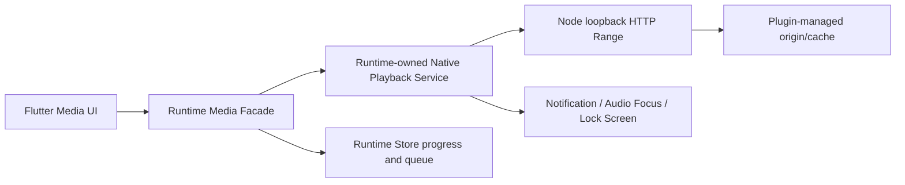

# 09 平台发布与未来能力

> **规划提示**：平台承载与发布门禁仍有效。文中把内容、阅读进度、下载队列或媒体状态直接
> 归为 Runtime Store 的段落是旧目标，不覆盖 ADR-0011/ADR-0100；未来媒体/下载持久化必须由
> 新的 Accepted ADR 明确跨边界所有权。

## 首发平台矩阵

| 项目 | Android | Windows | macOS |
| --- | --- | --- | --- |
| 优先级 | 第一 | 第二 | 第二 |
| 生产架构 | arm64-v8a | x64 | arm64、x64 独立包 |
| 开发/CI 附加架构 | x86_64 模拟器 | x64 | 对应原生架构 runner |
| Node 承载 | Runtime 自有 Javet 单 `NodeRuntime` | Runtime 自有官方 Node 24 子进程 | Runtime 自有官方 Node 24 子进程 |
| 最低平台 | Javet 选型要求至少 API 24 | 在实现里程碑固定并记录 | 在实现里程碑固定并记录 |
| 分发 | 站外签名安装包 | 站外签名安装包 | Developer ID + Hardened Runtime + 公证 |
| 最终运行证据 | arm64 真机 | Windows 主机/CI | 对应架构 macOS 主机/CI |

iOS、Linux、Web 不在承诺范围。添加这些平台必须先验证 Runtime 承载、协议、发布政策和阅读器公开 API，再新增 ADR；不能用条件编译把未验收分支塞进首版。

## 版本锁定与产物组成

每个应用发布由 `mg_read_runtime` 生成并随集成包提供 Runtime 物料清单；主项目只消费该
清单的展示投影。每个发布记录：

- MgRead 应用 SemVer/build number。
- `runtimeVersion` 与 `protocolVersion`。
- 精确 Node 24 版本。
- Android 精确 Javet/AAR 版本。
- `novel_reader_ui` 公开 API 版本/提交。
- Flutter/Dart 工具链版本。
- 平台、CPU 架构和最低系统版本。
- 包内 Node、Runtime Core、Schema 和默认资源的 SHA-256/物料清单。

Android 与桌面使用同一 Node 小版本和 Runtime Core 构建。升级 Node/Javet 时，三个平台的 M1 探针和协议 fixture 作为一个合并门禁，不能只更新某个平台后长期漂移。

## Android 直接分发

- 首版生产只打包 `arm64-v8a`；`x86_64` 用于模拟器和 CI，不进入面向普通用户的生产包。
- Javet AAR 的最低 API 要求纳入应用 `minSdk`，正式固定前通过依赖/Manifest 合并结果验证，而不是只抄文档。
- Node Runtime 只能由 Runtime 自有专用后台线程持有，Flutter UI Isolate 和主项目原生代码不执行脚本。
- 安装包使用项目发行密钥签名；密钥、密码和签名材料不进入仓库或日志。
- 升级必须保留 Runtime 自有运行数据和插件版本目录；下载 `.part` 与内容文件按未来 Accepted
  ADR 的所有权处理。卸载语义由 Android 系统决定并在 UI 明确告知。
- Android arm64 真机验证启动、系统返回、前后台、系统杀进程、磁盘不足和下载恢复。
- 普通阅读和缓存任务不依赖后台 Service 常驻。未来媒体必须使用符合系统规则的前台媒体服务。

首版是站外分发。如果未来进入 Google Play，必须新建 ADR 审查动态代码/脚本、下载内容、更新机制和商店政策；不能把当前插件模型视为普通渠道切换。[Google Play 动态代码政策说明](https://support.google.com/googleplay/android-developer/answer/16559646?hl=en)

## Windows 直接分发

- 仅发布 x64。
- Runtime 集成包负责在应用包内携带固定路径的官方 Node 24 x64 和 Runtime Core，不读取用户 PATH、npm 或全局 Node。
- Node 子进程默认隐藏窗口，显式环境 allowlist，loopback 原子端口绑定。
- 安装/升级逻辑不得覆盖 Runtime 自有运行数据和插件目录；内容目录按主应用权威边界处理，
  程序文件与各自所有者的用户数据目录分离。
- 建议发行产物使用代码签名并通过常见安全软件/SmartScreen 场景验证；是否启用和证书流程在平台发布里程碑记录。
- 运行验证覆盖非 ASCII 用户名、带空格/长路径、只读安装目录、磁盘不足、子进程被终止和防火墙/安全软件干预。
- 打包测试必须从最终安装位置启动，不能只用开发目录中的 Node 得出结论。

## macOS 直接分发

macOS 分别构建 arm64 和 x64 包，避免一个安装包重复携带两套 Node。每个包内只含匹配架构的 Flutter 原生代码、Node 和 Runtime 资源。

发行流程：

1. 在干净的对应架构构建环境生成 release 应用包。
2. 对包内 Node 可执行文件、动态库、Framework、辅助程序和主 `.app` 按由内到外顺序使用 Developer ID 签名。
3. 启用 Hardened Runtime，并只声明实际需要且经过审查的 entitlement。
4. 使用 `codesign --verify --deep --strict` 等适当工具验证完整签名闭包；实际门禁命令在发布自动化中固定。
5. 生成分发归档/磁盘映像并提交 Apple 公证。
6. 公证成功后 stapling，并在启用 Gatekeeper 的干净机器上验证首次启动、Node 子进程、HTTP/WS 和插件目录写入。
7. 分别发布 arm64/x64 摘要、版本和安装说明。

Node 和 Runtime Core 是 Runtime 产物的嵌套可执行内容，必须在签名与公证闭包内；运行时不能从网络替换包内 Node。插件是 Runtime 数据区的可信脚本，其在线安装政策在转向 Mac App Store 前必须重新审查。

依据：[Apple 直接分发说明](https://developer.apple.com/documentation/xcode/distributing-your-app-for-beta-testing-and-releases/)、[Apple 公证流程](https://developer.apple.com/documentation/security/notarizing-macos-software-before-distribution)。

## 插件与应用更新的分离

- **主项目更新**更换 Flutter UI、路由和阅读器视图宿主，不实现或替换 Runtime 内部组件。
- **Runtime 更新**更换 Runtime 集成包、平台适配、Runtime Core、Node/Javet、Runtime 自有运行
  数据迁移和协议实现，遵循 Runtime 的平台签名/公证与安装升级流程。
- **插件更新**只下载标准 Node `.mgplugin` 到应用数据目录，恢复 lock 依赖后使用不可变版本目录、完整性校验和下次应用进程冷激活。
- 插件不能更新或覆盖包内 Node、Runtime Core、Flutter 代码或原生库。
- Runtime/协议升级导致插件不兼容时，插件记录与离线内容保留；UI 显示兼容性动作，不自动删除。
- 官方仓库不可用不阻止已安装插件和离线内容启动。

## 发布门禁

每个平台发布前必须有：

- 静态检查、相关分层自动化测试和跨语言协议 fixture 结果。
- 对应架构 Runtime 冒烟及最终安装包证据。
- 安装、同版本重装、旧版本升级、数据保留和卸载行为记录。
- 插件安装、待激活、失败回滚和离线阅读场景。
- 大文件、Range、磁盘不足、Runtime 失败和恢复演练。
- 包内组件版本/摘要清单，且不包含密钥、测试凭据或开发服务器地址。
- Windows/macOS 只在对应主机或 CI 声明完成；Android 原生行为以 arm64 真机为最终入口。

## WebView 登录扩展边界

WebView 登录不是首版能力，但协议提前固定“需要交互”的诚实行为。

### 预留调用

```text
runtime.webview.openAuth({
  pluginId,
  sessionId,
  startUrl,
  allowedOrigins,
  completionRules,
  deadlineUnixMs
}) -> {
  outcome: completed | cancelled | expired,
  cookieRevision?
}
```

边界：

- 首版 handler 始终返回 `unsupported`，`source.*` 可先返回 `interaction_required`；不能弹出空白页面或伪造登录成功。
- 未来由 Runtime 创建用户可见、可取消的平台 WebView；插件不能获得任意平台视图控制或执行主项目原生代码。
- `startUrl` 与跳转限制在清单/请求允许的 origin；外部 scheme 需用户确认。
- Cookie 进入 `pluginId + origin + profileScope` 作用域的 Runtime 管理 jar，不通过日志或普通 RPC 返回全量值。
- WebView 完成规则、验证码、下载/上传、弹窗、新窗口和证书错误必须单独威胁建模。
- Android、Windows、macOS 使用 Runtime 内部各自受支持的 WebView 实现，但对插件暴露同一 Runtime Plugin API。
- 登录资料域若未来出现，必须由 Runtime 自身显式建模；不能注入主项目服务或引入全局 current user。

## Cookie 边界

- 基础 HTTP Cookie 由 `ctx.http` 和 Runtime Cookie Store 管理，作用域至少包含插件与 origin。
- Cookie 是敏感数据，不进入插件诊断、trace、崩溃报告、数据库通用 KV 或导出默认内容。
- 插件不获得其他插件 Cookie，也不能请求任意域的 Cookie。
- 清除插件数据显式清理其 Cookie；禁用插件不默认删除，以便用户重新启用。
- 未来 WebView/HTTP Cookie 同步使用 revision 和最小变更，不在 WS 广播原始 Cookie。

## 音频/视频扩展边界

`audio`、`video` 可以作为稳定 `ContentKind` 保留，资源数据面也从第一版支持通用 MIME、长度、ETag 和 Range；但首版不得实现播放器入口或返回“可播放”成功状态。

未来架构：



职责：

- Node/插件解析媒体地址、Cookie/headers、分片和缓存，并输出本地 HTTP 资源。
- Runtime 原生播放服务持有播放器、播放队列、音频焦点、锁屏/通知和后台生命周期。
- Flutter 只控制/观察会话，页面销毁不终止播放。
- 播放进度和队列由 Runtime Store 持久化，不由插件内存独占。
- Android 使用符合平台规定的前台媒体服务；Windows/macOS 使用对应原生媒体会话能力。
- DRM、HLS/DASH、字幕、投屏、离线许可和跨资源 header 规则必须在媒体里程碑单独设计。

预留的 `runtime.media.*` 在首版一律 `unsupported`。不得因为 HTTP 已能传视频字节，就把媒体生命周期视为完成。

## 商店分发变更规则

改为 Google Play 或 Mac App Store 不是打包开关，而是架构决策变更。新 ADR 至少审查：

- 在线下载和执行插件脚本是否符合商店政策。
- 官方仓库审核、下架、签名信任与紧急禁用机制。
- Runtime/插件更新边界是否被视为改变应用功能。
- WebView、Cookie、内容版权、支付和用户生成内容政策。
- 隐私披露、遥测、诊断导出和账号删除。
- 现有站外用户的数据迁移与回滚。

Apple App Review 的可执行代码规则见 [App Review Guidelines 2.5.2](https://developer.apple.com/app-store/review/guidelines/)。任何结论需在实际提交时按当时政策重新核验。
