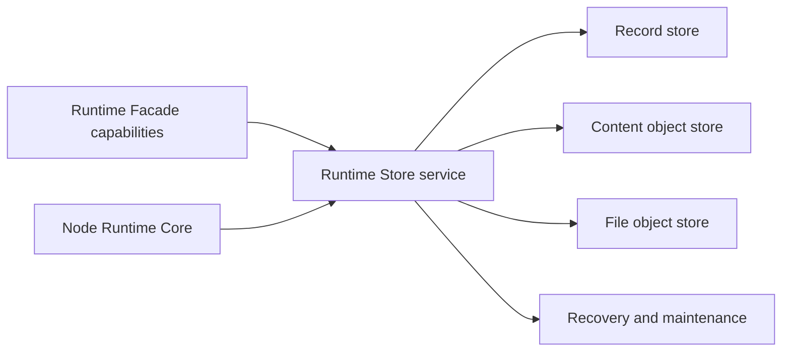
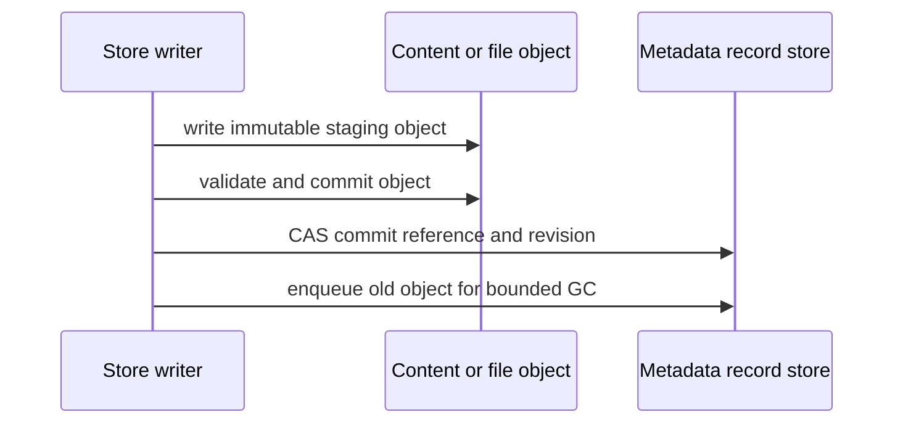

# 10 Runtime Store 持久化设计

## 状态与范围

本文是 Runtime Store 的设计基线，不是 `mg_read` 主应用数据库设计。持久化仍由
`mg_read_runtime` 独立拥有，主应用只消费强类型 Facade 投影。本文不新增实现、依赖或
真实书源；具体后端必须先完成 Runtime 仓库的跨平台探针。

- [ADR-0009](adr/0009-scoped-versioned-json-records.md) 已接受“稳定记录骨架 + 作用域化
  版本 JSON”。
- [ADR-0010](adr/0010-split-sqlite-content-store.md) 记录首选的 SQLite 元数据/正文分库，
  在 Android、Windows、macOS 探针通过前保持 Proposed。
- [独立 Store 验收规范](11-runtime-store-acceptance.md) 是实现阶段的单独退出门禁。

## 设计目标

1. 数据规范尚未稳定时，新增可选字段不反复修改数据库容器。
2. 不用“全部 JSON”牺牲稳定身份、关系、排序、状态查询、revision 和完整性。
3. 一套 Store 支持插件、书架、目录、阅读状态、下载、缓存、设置和未来显式资料域。
4. 正文可增长到数 GB/十几 GB，而关键元数据仍可快速打开、备份和恢复。
5. Store 可脱离 Flutter 页面、Node Runtime、网络和真实书源独立验证。
6. 崩溃、磁盘满、未来版本、损坏 JSON、缺失文件和跨库分裂提交都有明确终态。

本文不承诺账号、云同步、跨设备冲突解决、全文检索、正文压缩或敏感数据密钥方案已经
实现；这些能力不能从预留字段直接推导出实现授权。

## 独立模块边界



`Runtime Store service` 是 Runtime 内部端口，不是主应用 Repository。它隐藏后端、表、
路径、事务和迁移：

- 生产初始化由 Runtime 自己解析受控数据根，外部 Facade 没有 path/database 参数。
- Node Core 只能调用受限领域操作，不能执行 SQL、选择文件路径或读取加密 payload。
- 主项目、阅读器插件和数据来源插件都不能打开 Store 或扫描文件对象。
- 实现语言和 SQLite 绑定在探针前保持可替换；领域端口、记录 envelope、故障语义和验收
  fixture 不依赖具体绑定。
- 测试专用 factory 可以接受临时根目录、确定性时钟和故障注入器，但只存在于 Runtime
  Store testkit，绝不进入生产 Facade。

## 资料域与作用域

首版只有 `local` 资料域，但每条记录从第一天携带稳定 `spaceId`，不依赖全局“当前用户”。
未来账号或导入域必须创建新的显式资料域及 capability；不能把账号字段塞进全局设置后
隐式切换。

推荐的逻辑作用域如下。`scopeKind` 是稳定分类，`scopeId` 是 Runtime 生成或验证的稳定
ID；payload 的格式与配额由作用域和记录类型共同决定。

| 作用域 | 典型记录粒度 | 动态 JSON 内容 | 不应放入 payload 的内容 |
| --- | --- | --- | --- |
| `runtime` | 一项设置/诊断摘要一条记录 | 可选设置、脱敏上下文 | 数据根绝对路径、正文、凭据 |
| `plugin` | 安装、版本、KV key 各自一条 | manifest 快照、扩展状态、插件 KV | ZIP 字节、任意 SQL、无限 KV |
| `library` | 书架项、来源绑定分别一条 | 标题/作者/封面快照、来源附加信息 | 整本目录、整章正文 |
| `catalog` | snapshot 一条、entry 每章一条 | 章节标题、远端版本、层级扩展 | 一本书的巨型章节数组 |
| `reader` | 每书进度一条、每书签一条 | 版本化语义锚点、标签、短摘要策略 | 页码、像素偏移、整章正文 |
| `download` | 每任务一条 | checkpoint、条件请求、重试上下文 | `.part` 字节、绝对路径 |
| `content` | 每内容引用一条 | MIME/来源/转换描述 | 正文或图片 Base64 |
| `secret` | 每插件 Cookie jar/凭据域一条 | 加密前的版本化敏感 JSON | 明文 payload、日志/诊断副本 |

作用域不能由插件随意伪造。插件只能通过 SDK 的受限 KV/Cookie/内容 capability 操作自己的
命名空间，并受每记录、每插件和全局配额约束。

## 稳定记录 envelope

以下是逻辑结构，不是已经批准的最终 DDL：

```text
ScopedRecord
  recordId             globally stable Runtime ID
  spaceId              explicit data space, initially "local"
  recordKind           codec and behavior discriminator
  scopeKind/scopeId    ownership and quota boundary
  parentRecordId?      stable containment relation
  identityKey?         normalized/hash identity for uniqueness
  orderKey?            directory/queue ordering projection
  stateKey?            primary lifecycle/query projection
  formatVersion        payload document version
  revision             optimistic concurrency token
  payloadJson          bounded strict UTF-8 JSON object
  createdAtUtc/updatedAtUtc
```

这些字段不是把领域模型重新写死，而是所有记录共享的一致性骨架：

- `recordId`、`parentRecordId` 和 `identityKey` 支持稳定引用、唯一性与孤儿检查。
- `orderKey` 只承载规范排序，不承载显示标题或远端页码。
- `stateKey` 只投影最常用的生命周期过滤；完整状态详情仍在版本化 payload。
- `revision` 是 compare-and-swap 的唯一依据；客户端时间不能解决写竞争。
- `formatVersion` 让 Store 无需先解析 payload 就能选择 codec/upgrader。

只有存在可验证查询或正确性需求时才增加新的稳定 envelope 能力。低频动态过滤若确实成为
需求，可由可信 codec 生成通用、可重建的 named index term；插件不能自行声明 SQL 表达式，
派生索引丢失也不能造成权威数据丢失。

## 领域记录映射

Facade 领域类型保持强类型，持久化时按下表拆分。表中的“稳定投影”是 envelope/索引，
不是要求每个业务字段成为列。

| 领域记录 | 稳定投影 | 作用域 JSON |
| --- | --- | --- |
| `PluginInstallation` | plugin identity、parent/version relation、primary state、revision | manifest 快照、已安装/待激活/回滚详情、脱敏错误扩展 |
| `LibraryItem` | stable item ID、content kind、primary availability、revision | 标题/作者/封面快照、来源展示、目录 revision 扩展 |
| `SourceBinding` | parent item、plugin-scoped identity hash、revision | opaque remote ID、source key 和插件扩展 |
| `CatalogSnapshot` | parent item、snapshot revision/state | 来源时间、刷新上下文、可选摘要 |
| `CatalogEntry` | stable entry ID、parent snapshot/item、order key、revision | 标题、层级、远端版本、远端 opaque ID、扩展元数据 |
| `ReaderProgress` | item identity、revision | 阅读器公开类型定义的版本化语义锚点 |
| `Bookmark` | stable bookmark ID、parent item/entry、order/time projection | 语义锚点、标签、短上下文和未来扩展 |
| `DownloadJob` | stable job ID、parent/content relation、priority/order、primary state、revision | checkpoint、字节/校验信息、重试与来源上下文 |
| `ContentReference` | stable object ID、owner relation、availability、generation | MIME、codec、远端版本和转换描述 |
| setting / plugin KV | scope + document key identity、revision | 该 document kind 独立定义的任意受限 JSON object |

目录项始终一章一条记录，不能把数千章打包成一个 JSON 数组。这样新增章节字段不需要容器
迁移，同时目录分页、排序、单章更新和删除仍是有界操作。

## JSON 文档规则

每个 `recordKind + scopeKind` 在 Runtime Schema 注册表中声明：当前版本、允许的旧版本、
codec、validator、升级链、默认值投影、大小/深度/数组/键数量限制、是否允许插件扩展、
敏感级别和可生成的派生索引。

共同规则：

1. 根必须是 JSON object；拒绝重复键、非法 UTF-8、NaN/Infinity 和尾随垃圾。
2. 缺失表示“未提供/沿用默认”，显式 `null` 只有该文档规范允许时才表示清除。
3. 可能超过 JavaScript 安全整数范围的 ID、长度、offset 或时间使用十进制字符串，codec
   负责范围检查；不得在 Dart/JavaScript 往返中静默舍入。
4. 写入前先验证，再生成确定性的紧凑 UTF-8 表达；摘要只基于该规范字节。
5. 读取、修改、升级时保留所有未知字段。领域命令只更新自己拥有的键，不能通过整体
   反序列化覆盖未来字段。
6. 扩展键必须带所有者命名空间，例如 `extensions[pluginId]`；核心字段与插件扩展不能
   相互覆盖。
7. 二进制、正文、图片、Cookie 明文、绝对路径、临时 HTTP handle 和运行时对象禁止进入
   普通 payload。
8. 日志只记录 record kind、技术 ID、版本、字节数、耗时和稳定错误码，不记录 payload、
   书名、作者、搜索词或远端 ID。

JSON 字段动态，不等于协议动态。Facade 仍由强类型 capability 投影当前支持字段；Store
内部可以先保存未来/插件字段，而 UI 不必同步认识它们。

## 版本升级与兼容

### 文档升级

```text
read raw record
  -> choose codec(recordKind, formatVersion)
  -> strict validate old representation
  -> apply pure vN -> vN+1 chain in memory
  -> validate current representation
  -> return typed projection + preserved unknown fields
  -> optional CAS read-repair
```

- 升级器必须确定、无网络、无系统时间依赖、无随机值，并能在 fixture 上重复执行。
- 读操作不因 read-repair 写失败而伪造失败；返回已验证投影并安排有界重试。
- 后台批量升级按 checkpoint 继续，不能一次加载整个表，也不能阻塞 Runtime ready。
- 当前版本缺少升级链时保留原记录并报告稳定错误，不自动删除、降级或创建空对象。
- 未来版本默认只读；旧 Runtime 绝不能用自己的默认值覆盖未来 payload。

### 容器升级

容器迁移只处理稳定表/索引、加密 envelope 和文件布局。流程必须是：维护锁 → 一致备份或
可验证快照 → 事务迁移 → 完整性检查 → 更新 container version → 打开业务 capability。
失败时进入只读诊断或恢复旧版本，不能边运行边留下半迁移表。

动态 JSON 显著减少字段级容器迁移，但以下变化仍必须迁移或恢复：唯一约束、主键/关系、
加密方式、内容 generation、索引策略、数据库引擎和文件布局。

## 内容对象层

在 ADR-0010 被接受后，所有小说正文进入统一 `content_objects` 逻辑表：

```text
ContentObject
  objectId            stable primary key
  generation          content-store generation
  ownerRecordId       catalog/content reference owner
  mediaType           explicit text media type
  codec               initially identity only
  payloadBytes        UTF-8 text bytes; never JSON/Base64
  originalByteSize
  storedByteSize
  contentHash
  descriptorJson      bounded versioned metadata only
  revision/updatedAtUtc
```

- 不重复保存 `bookId`；`ownerRecordId` 已能回到目录/内容引用。
- 首版只接受未压缩 UTF-8 正文。`codec` 是演进位，不代表 zstd/gzip 已获准；压缩必须先有
  真实空间、CPU、包体和全文检索权衡证据。
- 阅读只按对象主键取当前章，并由上层有界预取相邻章；不会一次加载整本书。
- 批量下载使用有界事务批次。批次大小由基准和取消延迟共同决定，不把“每章一次 commit”
  作为实现。
- 未来 FTS 使用从已提交正文重建的派生索引；删除 FTS 不得影响正文权威。

漫画图片、封面、ZIP、插件包、`.part` 和大缓存继续使用文件对象。数据库只保存相对 file
ID、长度、摘要、MIME、generation 和动态 descriptor，绝不保存平台绝对路径。

## 两库/文件提交协议

跨 `runtime.sqlite`、`content.sqlite` 和文件对象不假定一个事务。所有创建/替换采用
“对象先行、引用后置”：



每个阶段都写入可幂等重放的 maintenance/operation receipt。恢复规则只有两种安全结果：

- 已提交对象但无引用：孤儿候选，保留到安全期限后回收。
- 有引用但对象缺失/摘要错误：标记 `missing` 或 `damaged`，保留用户元数据并提供重新获取。

删除采用相反顺序：先在元数据事务中解除引用/记录用户意图，再异步删除对象。插件禁用或
卸载不得级联删除书架、进度、书签或显式下载。

## 事务、并发与生命周期

- Store 只有一个协调写队列；读取可并发，但不能在 Flutter UI isolate 做 SQL、JSON
  升级、摘要或大文本解码。
- 每个领域写带 revision；旧进度、旧下载 checkpoint 和重复事件不能覆盖新状态。
- 同一本书的阅读进度串行合并，应用生命周期 flush 有 deadline，未完成写入在下次启动
  从已确认 revision 恢复。
- 批量目录/正文写入在短事务中分块，响应取消与磁盘压力；不使用无界 `insertAll`、
  `Promise.all` 或单个覆盖整库的事务。
- Runtime ready 只等待必要恢复；全量 orphan/integrity 扫描在低优先级有界任务运行。
- Store close 必须拒绝新写、等待/取消有界在途事务、checkpoint 并释放文件锁；强杀后的
  下次 open 必须完成恢复。

## 清理、备份与恢复

数据分为三类，UI 只能调用对应 Runtime capability：

| 类别 | 示例 | 清理语义 |
| --- | --- | --- |
| 用户权威 | 书架、进度、书签、设置、插件安装意图 | 普通清缓存不得删除 |
| 显式离线 | 用户下载的正文/图片 | 只能经明确删除离线内容操作 |
| 可再生缓存 | 预取、缩略图、临时解析结果 | 可按预算和 LRU 回收 |

- “清空正文”不是从主项目直接删除 `content.sqlite`；Runtime 记录维护意图、关闭内容库、
  轮换 generation、重建并发布一致投影。
- 轻量备份包含 `runtime.sqlite` 的一致快照和必要 manifest，不包含正文/缓存/`.part`；
  完整备份另含内容库与用户显式文件对象。
- 不能在数据库仍处于 WAL 写入时只复制主 `.sqlite` 文件。候选 SQLite 实现必须使用其
  一致备份能力或受控关闭/checkpoint 流程。
- 恢复先校验 manifest、版本、摘要和空间，再写入 staging 并原子切换；原数据在成功前
  保持可恢复。
- 敏感记录默认不进入普通诊断或轻量导出。跨设备/跨安装的密钥与加密备份需单独设计。

## 稳定错误

Store 至少区分：

- `store_unavailable`：无法打开或维护锁冲突。
- `data_version_unsupported`：文档/容器来自未来版本或缺少升级器。
- `data_invalid`：JSON、范围、引用或业务校验失败。
- `revision_conflict`：compare-and-swap 失败，调用方需重读。
- `storage_pressure` / `disk_full`：配额或底层空间不足。
- `content_missing` / `content_damaged`：引用存在但对象缺失或摘要错误。
- `store_corrupted`：完整性检查失败，进入只读诊断/恢复流程。
- `operation_cancelled`：事务提交前取消；提交点后的取消返回已确认结果。

错误详情只包含稳定码、阶段、技术 ID、可重试标记和 trace ID，不包含 payload、正文、
Cookie、绝对路径或原始 SQL。

## SQLite 候选实现约束

ADR-0010 尚未 Accepted。候选实现必须先证明：

1. 三个首发平台和目标 ABI 使用同一已记录 SQLite 行为/compile options。
2. 无 Node native addon，精确依赖版本、许可证、包体和升级/回滚可审计。
3. 支持事务、外键、busy timeout、WAL/checkpoint、一致备份、完整性检查和可靠 close。
4. 普通 JSON TEXT 在无 JSON 扩展时仍可由 Runtime validator 正确工作；不以 JSONB 为
   唯一持久格式。
5. `runtime.sqlite` 与 `content.sqlite` 不做跨 WAL 原子性假设，所有分裂阶段通过故障注入。
6. Store 能在 Runtime 仓库独立启动和测试，不需要 `mg_read`、Node 或用户数据目录。

SQLite 官方说明 JSON 本质上可作为普通文本保存，JSON 函数可能由编译选项省略；其 WAL
文档也明确多 attached 数据库只保证单文件原子性。因此本设计把 JSON 校验放在 Store
codec，并用显式恢复协议协调两库，而不依赖跨库 WAL 事务。

## 实施顺序

1. 在 Runtime 仓库建立后端/绑定探针和精确版本证据，不接业务 capability。
2. 冻结 `RuntimeStorePort`、record envelope、fixture 格式和稳定错误。
3. 实现纯 codec/validator/upgrader 与内存模型测试。
4. 实现单库 record store、事务、revision、备份和损坏恢复。
5. 实现 content store/文件对象、maintenance journal、generation 与跨层恢复。
6. 完整运行独立 Store 验收；探针与验收通过后再接受 ADR-0010。
7. 由 Runtime Facade 发布首个业务 capability，主项目只增加强类型 UI 消费测试。

任一步都不得在 `mg_read` 新增 SQLite、Drift、数据库路径、Repository 或 Store 测试替身。

## 外部依据

- [SQLite JSON functions：JSON 文本、compile option 与 JSONB 边界](https://www.sqlite.org/json1.html)
- [SQLite WAL：并发、checkpoint 与多数据库事务限制](https://www.sqlite.org/wal.html)
- [SQLite ATTACH：多数据库提交的 journal mode 条件](https://www.sqlite.org/lang_attach.html)
- [SQLite Online Backup API](https://www.sqlite.org/backup.html)
- [SQLite PRAGMA integrity_check](https://www.sqlite.org/pragma.html#pragma_integrity_check)
