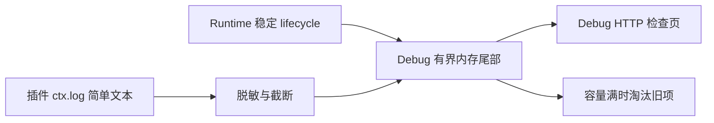

# 14 日志与诊断边界

状态：权威专题。复核日期：2026-08-25。

## 当前决策

App 与 Runtime 不再共享同一套复杂事件体系：

- App-owned 诊断继续遵守
  [ADR-0016](adr/0016-segmented-text-diagnostics.md)，用于 App 内关键操作、持久化与错误边界；
- Runtime 遵守
  [ADR-0024](adr/0024-runtime-transient-simple-logging.md)，不持久化结构化事件、span、capture、
  附件或历史查询数据；
- Runtime Debug 检查页只保留进程内有界实时日志，关闭 listener 或停止 Runtime 即清空；
- Flutter Supervisor 只保留少量稳定启动/终止诊断和有界 fatal fallback；
- App 不读取 Runtime 数据根，也不通过 Facade 查询 Runtime 历史日志。

任何日志路径都不得读取、构造、复制或保存 HTTP body、HTML、大 JSON、小说正文、图片内容、
用户输入、书名/作者、Authorization、Cookie、token、credential、原始异常或绝对路径。日志
失败、丢弃、缓冲区满或查看器断开不得改变业务结果。

## Runtime 简单实时日志

Runtime 日志固定满足：

- 只在 Debug listener 显式启用期间接收记录；
- 单条文本、条目数和分页数有硬上限；
- 插件文本先脱敏并截断，不能携带 body、对象 dump、路径或 secret；
- listener 关闭时清空，Runtime 停止时释放，不写入磁盘；
- 不创建 `diagnostics/events`、`details`、`staging`、日志数据库或索引；
- 不发布 `diagnostics.*` 控制协议和 Flutter Facade invocation；
- 实时日志不是业务权威，也不承诺跨重启回看。

Supervisor 的 lifecycle/fatal 诊断用于启动失败展示。ready 前的
`desktop-fatal-fallback.txt` 仍是独立、16 KiB 封顶的稳定错误摘要，不是通用日志文件，也
不能包含 stderr、路径、异常、请求或插件文本。

## App-owned 诊断

App 现有 `DiagnosticsManager`、registry、事件 TXT、显式详情 capture 和 App 查看器继续由
ADR-0016 约束。其目录、查询、保留、隐私和失败隔离只属于主应用，不得扩展为 Runtime 文件读取
或 raw transport。

App 默认只记录小型、脱敏、低基数事件。大型 JSON、HTML、HTTP body、正文和复杂对象在默认
路径不构造、不进入内存、不写盘。只有 App 专用调试窗口显式开启有时限、有字节预算和来源
allowlist 的 capture 时，详情 supplier 才可执行。

主应用查看器只显示 App 数据。原 Runtime 页签、Runtime capture、附件 range 和历史事件分页已
删除；Runtime 的当前日志改由 Debug HTTP 检查页查看。

## 隐私与失败隔离

- URL 只允许稳定 origin/route 投影；query value、用户名和密码不得记录。
- `Authorization`、`Cookie`、`Set-Cookie`、token、credential 和验证码永不进入日志。
- 未知异常只映射稳定 code/安全文案；不得调用未知对象的 getter、`toString()` 或 serializer。
- 日志缓冲、写入、控制台或浏览器输出失败只能丢弃日志，不能让业务请求失败。
- 插件只使用 `ctx.log`；禁止 `console.*` 和自行写日志文件。

## 验证门禁

Runtime 变更至少验证：

1. 启动和 capability 调用后不创建 `runtime/diagnostics`；
2. Debug 实时日志的容量、分页、关闭清空和 Runtime 停止清空；
3. plugin/runtime 简单日志的 secret、query、body、路径和 raw exception canary；
4. 日志 listener 缺失、抛错或压力不会改变插件与 Runtime 结果；
5. `runtime.hello` 不再协商任何 `diagnostics.*` capability。

App 诊断变更继续验证 span 唯一终态、默认禁用详情 supplier、TXT 轮转/恢复、secret/content
canary 和写入失败不影响业务。两套证据必须分开报告，不能用 App 的持久化测试证明 Runtime，
也不能用 Runtime 实时日志测试证明 App 事件存储。
