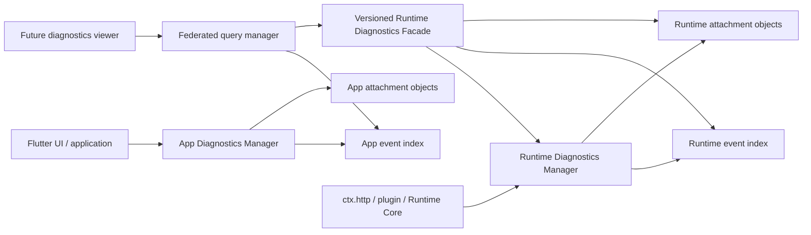

# 14 全局日志与诊断数据系统

## 状态与目标

本文定义 MgRead 的目标日志架构，落实
[ADR-0014](adr/0014-tiered-diagnostics-storage.md)。当前交付只完成设计，不表示主应用、
`mg_read_runtime` 或调试 UI 已经实现这些接口、表、对象目录或性能基线。

系统需要同时覆盖三类完全不同的负载：

1. 高频、很小的底层日志，例如生命周期、路由、队列和稳定错误码。
2. 可关联的高层事件和 span，例如一次搜索、插件调用、HTTP 请求与响应。
3. 数百 KiB 甚至更大的 HTTP body、JSON、HTML、二进制片段和复杂动态对象。

核心结论是：**日志事件只保存可查询的小型索引；大负载和复杂结构保存为独立附件；
管理层用稳定 ID 关联两者。** 任何实现都不能把所有内容拼成日志正文、把大 JSON 放进
SQLite 行，或为了查看器长期保留完整对象图在内存中。

## 全局语义，分域落盘

“全局”表示统一事件模型、trace、查询语义、捕获策略和查看体验，不表示 Flutter 与
Runtime 共同打开同一个数据库。



| 数据来源 | 写入与物理存储所有者 | 主应用如何查看 |
| --- | --- | --- |
| Flutter 启动、路由、UI 用例、主应用持久化 | `mg_read` | 通过 app diagnostics query port |
| 插件、调度、`ctx.http`、Runtime Store、内部通信与平台承载 | `mg_read_runtime` | 通过版本化 Runtime Diagnostics Facade |
| HTTP request/response body | 发起请求的 Runtime HTTP 层 | 通过 opaque attachment ID 分页/流式读取 |
| 导出的联合诊断包 | 主应用的显式导出用例 | 从两个 query port 拉取并重新脱敏 |

Runtime 诊断索引和附件是可删除的运行证据，不是书架、进度、下载或其他应用业务数据的
权威来源。它们不改变 [ADR-0011](adr/0011-app-owned-versioned-persistence.md) 的应用数据
所有权，也不授权 Runtime 打开 `app_metadata.sqlite`。主应用同样不得读取 Runtime 的
诊断数据库、对象目录、loopback URL 或内部句柄；所有读取都经强类型门面完成。

Runtime query 必须有降级读取路径：当前 Node/Javet Core 未 ready 或上一次运行已崩溃时，
Runtime 集成包仍能读取自己已经提交的诊断会话。offline reader 只能在该 store writer 已
停止后以只读方式打开，不能与存活 writer 双开同一数据库，也不能为了查看旧日志再创建或
重启一个 Node VM。writer 的具体平台承载与 offline handoff 在 Runtime 交付包中验证。

跨来源关联使用公开的 `traceId`、`spanId` 和父子关系。每个来源以自己的单调
`sourceSeq` 保证局部顺序；跨进程时间线使用 UTC 时间近似合并，不能伪装成严格全序。
Runtime 内部 `bootId`、端口和 wire request ID 不成为主应用查询键，只能按脱敏投影显示。

## 三层记录模型

### 第一层：小型日志事件

底层日志 API 只接受短摘要、稳定枚举和小型属性。建议稳定 envelope 如下：

| 字段 | 规则 |
| --- | --- |
| `eventId` | 当前来源内唯一且不可复用 |
| `source` / `component` | 低基数稳定枚举，例如 `app.router`、`runtime.http` |
| `sourceRunId` / `sourceSeq` | 一次来源生命周期与其中的单调序号 |
| `occurredAtUtcMicros` | UTC 墙钟时间，用于跨来源近似合并 |
| `monotonicOffsetMicros` | 可选；用于本来源内可靠计算耗时 |
| `severity` | `trace/debug/info/warn/error/fatal` |
| `eventName` / `eventSchemaVersion` | 稳定名称和独立演进版本 |
| `traceId` / `spanId` / `parentSpanId` | 可空；用于高层调用关联 |
| `phase` / `outcome` / `durationMicros` | span 生命周期和稳定终态投影 |
| `summary` | 已脱敏短摘要；不是任意异常或对象的 `toString()` |
| `attributes` | 受限的小型 `DiagnosticValue` object |
| `attachmentCount` / `capturedBytes` | 不读取附件即可显示的聚合投影 |
| `flags` | `sampled/truncated/redacted/droppedPayload/incomplete` 等稳定位 |

事件行的目标是快速筛选、时间线和故障定位。需要经常筛选的字段必须提升为稳定列，不能
依赖对任意 JSON 做全表 JSON-path 查询。

### 第二层：高层事件与 span

高层日志不是一条很长的 message，而是一组可关联的结构化事件。一次 HTTP 交换至少可以
产生：

```text
http.request.start
  -> http.response.headers
  -> http.response.complete | http.request.error | http.request.cancelled
```

它们共享 `traceId/spanId`。队列等待、DNS/连接、首字节、下载、解码、解析和存储可成为
子 span。开始与结束分开追加，避免必须原地更新一条长记录；应用或 Runtime 崩溃后，只有
start 的 span 会被恢复为 `incomplete`，不会伪造成成功。

事件名称必须有注册表和版本。例如 `http.response.complete@1`、
`plugin.invoke.failed@1`。专用查看器可按名称选择 renderer；未知名称或未来版本仍可用
通用字段/附件视图只读显示。

### 第三层：附件对象

下列内容不得内联到 `summary`、`attributes_json` 或业务 metadata JSON：

- HTTP request/response body、HTML、超限文本与二进制片段。
- 大型或深层 JSON。
- 含循环、特殊数值、日期、引用或截断节点的内部动态对象图。
- 脱敏后的 headers、堆栈、解析中间结果和专用调试快照超过小字段上限的部分。

事件只保存 `attachmentId` 和聚合投影。附件 descriptor 至少包含：

| 字段 | 说明 |
| --- | --- |
| `attachmentId` / `eventId` | 稳定关联，不暴露文件路径 |
| `kind` | 例如 `http.response.body`、`structured.tree`、`stack` |
| `mediaType` / `charset` | 原始声明与经验证的显示提示分开保存 |
| `formatId` / `formatVersion` | `raw-bytes`、`json`、`mgread.diagnostic-tree` 等 |
| `schemaId` / `schemaVersion` | 可选的业务/调试 schema，不等同存储格式版本 |
| `privacyClass` | `public/internal/content/restricted/secret` |
| `captureState` | `captured/truncated/policyBlocked/pressureDropped/failed` |
| `rawByteLength` / `storedByteLength` | 未知长度可空；64 位值使用安全表示 |
| `sha256` | 对实际持久化、已脱敏字节增量计算 |
| `storageCodec` | `identity` 或经基准批准的压缩 codec |
| `redactionVersion` | 记录经过的脱敏策略版本 |
| `truncationReason` | 大小、深度、节点数、背压或策略拒绝 |

公开 API 返回 descriptor 和 opaque attachment ID。对象 key、相对目录和数据库 row ID 都是
实现细节；绝对路径永不进入事件、附件 descriptor 或 Runtime Facade。

## 持久化布局

### 事件索引

主应用诊断使用独立的 `diagnostics/index.sqlite`，不复用高频写入不合适的
`metadata_records` 表，也不让日志轮转膨胀应用权威 `app_metadata.sqlite`。其 executor、
路径解析、schema 生命周期和关闭仍属于 `lib/core/persistence/`；process-scoped 管理、
策略和查询 port 位于 `lib/core/diagnostics/`。Runtime 在自己的仓库和数据根实现等价契约。

建议最小表集：

- `diagnostic_runs`：来源生命周期、版本、平台和结束状态。
- `diagnostic_capture_sessions`：捕获模式、开始/结束、配额、过期时间和显式用户选择。
- `diagnostic_events`：稳定 event envelope 与小型属性。
- `diagnostic_attachments`：逻辑附件 descriptor、对象引用和捕获状态。
- `diagnostic_objects`：物理对象 key、摘要、codec、长度和引用状态。

首版索引只服务明确查询：

- `(source_run_id, source_seq)` 保证来源顺序。
- `(capture_session_id, occurred_at_utc_micros, event_id)` 支持会话时间线。
- `(trace_id, occurred_at_utc_micros, event_id)` 支持 trace 展开。
- `(severity, occurred_at_utc_micros)` 和 `(component, event_name, occurred_at_utc_micros)`
  支持常用筛选。

默认不建立全文索引，也不索引任意 attributes 或附件正文。未来全文搜索只能作为可删除、
可重建、按会话显式生成的派生索引，并单独计入磁盘配额。

SQLite 使用单写入者、短事务和批量插入；采用 WAL 时必须监控 WAL 大小，并在空闲/阈值
条件下显式 checkpoint。备份或移动数据库时必须把 WAL 状态作为一致性边界处理，不能只
复制主数据库文件。

### 附件对象层

每个来源的数据根采用独立对象目录：

```text
diagnostics/
  index.sqlite
  objects/aa/bb/<opaque-or-content-key>
  staging/
  exports/
```

- 捕获先写 `staging`，边写边统计字节和摘要，完成校验后同卷原子提交。
- 数据库只保存相对 object key；Facade 连相对 key 也不暴露。
- 物理对象不可变。事件提交失败产生的孤儿由 mark-and-sweep 回收；不能只依赖易漂移的
  内存 refcount。
- 对象去重只能发生在相同来源和相同 privacy class 内，并以脱敏后的最终字节为准。
- 读取中的对象持有短租约；清理先标记，再等待租约或有界超时，最后删除。
- `staging` 残留在下次启动标记为 incomplete 并清理，不导入为成功附件。
- 诊断目录默认排除普通业务备份和系统云备份；导出是单独、显式操作。

压缩不在请求完成的关键路径同步执行。文本/JSON 是否压缩由后台策略和平台基准决定，
descriptor 必须记录 codec；未知 codec 只读报错，不能猜测。图片、ZIP 等已压缩媒体默认
不二次压缩。

## 写入管线与背压

### 调用方快路径

`DiagnosticsManager` 是 app composition root 注入、可释放的 process-scoped 基础服务，
不是保存当前用户或当前书籍的静态业务单例。调用路径必须：

1. 先用 severity/component/session 策略做廉价 `isEnabled` 判断。
2. 只构造小型 immutable draft；禁用时不插值长字符串、不抓堆栈、不序列化对象。
3. 将编码、递归脱敏、JSON 解析、压缩、SQL 和文件 I/O 放到有界后台 worker。
4. 入队立即返回；不得等待磁盘、Runtime Facade 或查看器。

小事件队列同时按条数和估算字节设硬上限。`trace/debug/info` 可按策略采样或丢弃；
`warn/error/fatal` 使用预留槽，但也不能无限阻塞 UI/Node。发生丢弃后，writer 在恢复时写入
合并事件 `diagnostics.eventsDropped`，包含级别、原因、数量和时间窗，不为每次丢弃再产生日志。

后台 writer 按“最大批量或最大等待时间，先到者”为边界提交短事务。具体条数、时间和 WAL
checkpoint 阈值必须由 Android arm64、Windows x64 与 macOS 基准决定，不写死为跨平台真理。

### 大负载快路径

HTTP 或其他字节流使用固定大小 chunk 的非阻塞 tee：业务消费者优先，诊断分支只把 chunk
ticket 放入有界 spool 队列。诊断写入变慢、磁盘满或队列满时：

1. 立即停止该附件后续捕获并标记 `truncated/pressureDropped`。
2. 继续向真实业务消费者传输，不因日志导致请求失败或显著降速。
3. 不把已捕获的前缀重新拼回内存；由 writer 完成或删除 staging 对象。
4. 在 completion 事件中记录业务总字节（若已知）与实际 captured bytes。

因此峰值内存由队列字节上限和固定 chunk 大小决定，而不是由 HTTP body 大小决定。几百 KiB
页面、数 MiB JSON 或更大的响应都不会作为一个 Dart/JS 字符串长期驻留在日志管理层。

## HTTP 专用诊断模型

HTTP 日志只能在 `mg_read_runtime` 的统一 `ctx.http` 层产生；插件和主应用不能各自复制一套
拦截器。默认记录：

- 脱敏 origin/route 投影、method、重定向次数、响应状态、MIME 和声明长度。
- queue、DNS/connect/TLS/TTFB/body/parse 等可取得的耗时。
- retry/缓存/Range/取消结果、上传与下载聚合字节、稳定错误码。
- header 名称及允许公开的值；`Authorization`、`Cookie`、`Set-Cookie`、token 和凭据值永不
  自动进入普通事件或附件。

body 捕获与日志级别是两个正交开关。`debug` 级别不自动等于“保存 body”。捕获模式为：

| 模式 | 行为 |
| --- | --- |
| `metadataOnly` | 默认；不保存 body，只记长度、类型、耗时和稳定结果 |
| `safeStructured` | 显式会话；只保存成功解析并通过递归脱敏的 JSON/form 等结构 |
| `contentPayload` | 显式会话；允许选定 component/origin 的 HTML、文本或内容负载，短期保留 |
| `restrictedRaw` | 高风险二次确认；保存原始字节，必须使用版本化加密对象、平台保护的会话密钥和更短 TTL；首个实现包不得默认启用 |

未知 content type、脱敏失败、超过配额或未被 allowlist 选中的响应只保留 metadata，并显示
`policyBlocked`，不能静默回退为原始捕获。请求和响应 body 使用两个附件，raw wire bytes 与
解压/解码后的逻辑 body 也必须是两个明确 kind，不能用一个字段含混表示。

常规导出不包含 `contentPayload/restrictedRaw`。用户显式选择包含它们时必须展示范围和预计
大小，重新运行脱敏，并在 manifest 中列出仍属敏感的附件；这不是“日志已脱敏”的默认保证。

## 动态结构化数据

### 小型 `DiagnosticValue`

事件 attributes 不直接接收跨层的 `Map<String, dynamic>`。生产者通过受控 builder 创建
`DiagnosticValue` tagged union：

```text
null | bool | string | int64Decimal | finiteDouble
list<DiagnosticValue> | object<string, DiagnosticValue>
redacted | truncated | attachmentRef
```

builder 在入队前只做浅层类型/预算检查，完整递归验证在 worker 完成。`int64` 使用规范十进制
字符串；非有限浮点、字节、DateTime、异常和任意 class 不能偷偷调用 `toString()`，必须由
明确 adapter 转成稳定节点。缺失字段与显式 null 保持不同。

小字段使用硬预算。建议实现起点为编码后 16 KiB、深度 8、每 object 128 个 key、每 array
256 项、单 string 4 KiB；达到上限写入 typed `truncated` 节点并记录原始计数（若可得）。
这些是首轮基准参数，可在不改变格式的前提下收紧；不得改成无界。

### 大型 JSON

合法 JSON 输入优先按原始 UTF-8 附件保存，不在捕获关键路径解析成 Dart/JS 对象。descriptor
记录 `application/json`、schema 和版本。专用查看器选择附件后，后台 worker 才执行：

- 增量验证和递归脱敏。
- 按 JSON Pointer/节点 cursor 分页。
- 大数组和 object 虚拟化。
- 可删除的节点 offset/index 缓存。

UI API 返回 `StructuredNodePage`，不返回整个 `Map<String, dynamic>`。关闭详情页即可释放
解析缓存；日志列表永远不解析 body。

### 非 JSON 动态对象图

内部调试对象可能包含循环引用、DateTime、64 位整数、特殊浮点、类型名或对其他附件的
引用。它们使用版本化 `application/vnd.mgread.diagnostic-tree+json`，显式节点类型至少包括：

```text
scalar | object | list | ref | dateTime | int64 | nonFinite
attachment | redacted | truncated | unsupported
```

object/list 节点可有局部 `nodeId`，循环或共享引用使用 `ref`，从而不会递归爆栈或复制整个
图。serializer 同时限制总节点数、深度、key 数、数组长度、字符串和总字节；无法适配的类型
产生 `unsupported` 节点，不执行任意 getter、迭代器、代理或自定义 `toJson()`。schema registry
决定专用 renderer；未知 schema 用通用树只读显示并保留原始附件。

## 管理层公开能力

建议主应用内部 port：

```text
DiagnosticsManager
  isEnabled(component, severity, payloadKind)
  emit(eventDraft)
  startSpan(spanDraft) -> SpanHandle
  startCapture(capturePolicy) -> CaptureSession
  stopCapture(sessionId)
  flush(deadline)
  dispose()

DiagnosticsQuery
  listSessions(filter, cursor, limit)
  listEvents(filter, cursor, limit)
  getEvent(eventId)
  listAttachments(eventId)
  openAttachment(attachmentId, range) -> byte stream
  listStructuredNodes(attachmentId, path, cursor, limit)

DiagnosticsMaintenance
  enforceRetention()
  deleteSession(sessionId)
  exportBundle(selection, exportPolicy)
```

`SpanHandle` 只能结束一次，并有 deadline/dispose 兜底。`flush` 是有界 best effort，不承诺在
进程强杀或磁盘故障时保存全部日志。生产代码不能通过 manager 执行任意 SQL、打开对象路径
或绕过 privacy policy。

Runtime Facade 发布等价的版本化强类型 query/capture capability；主应用的 federated query
manager 维护 app cursor 与 Runtime cursor，再做有界 merge。它不得复制 wire envelope、构造
loopback URL 或为了统一查询把 Runtime 全量日志搬进 app SQLite。

## 未来查看器约束

- 会话、事件、trace、附件都使用 cursor 分页，单页有服务端硬上限。
- 列表只读 event projection；选择一项后才加载附件 descriptor 和短 preview。
- 文本用 range/chunk 读取；十六进制、图片、JSON tree 和 HTTP exchange 是独立 renderer。
- JSON tree、长文本和 diff 在 worker 中解析；Widget 只持有当前虚拟化窗口。
- live tail 按帧/时间窗合并更新，不能每个事件或网络 chunk 触发 rebuild。
- 搜索默认只查索引列与短摘要。正文搜索必须由用户对选定会话显式建立派生索引。
- renderer 只展示数据，不能执行脚本、HTML、SQL、URL、插件表达式或对象 getter。HTML 默认
  以文本/安全语法视图展示，不在 WebView 中运行。
- 删除、导出、包含敏感附件和延长 retention 都是显式用户动作，并展示影响范围。

## 捕获策略、隐私与保留

日志系统必须先分类再持久化：

- `secret` 永不持久化，包括 Authorization/Cookie/token/credential/验证码和已知密钥字段。
- `restricted` 只允许高风险显式捕获会话，默认不导出、不全文索引、最短 TTL。
- `content` 只允许选定来源和事件类型的显式会话，常规日志与常规导出均不包含。
- 未分类字段按更严格等级处理；加密或 app-private 目录不是绕过分类的理由。
- URL 默认只保存 origin、route 模板、query key 名和哈希；搜索词、用户 ID、书名、作者及
  完整 query value 不进入常规事件。
- 堆栈先做路径、参数和自由文本清洗；原始 exception `toString()` 不直接落盘。

建议首轮实现默认预算如下，最终数值要用首发平台基准校准：

| 范围 | 初始默认 | 行为 |
| --- | --- | --- |
| 常规事件保留 | 3 天或 32 MiB，先到者 | 只含小型事件，不含 body |
| 显式捕获会话 | 24 小时或 256 MiB，先到者 | 到限额停止新附件，事件仍记截断状态 |
| 单附件 | 16 MiB | 超限保存前缀或拒绝，明确 `truncated` |
| 小型 attributes | 16 KiB | 超限转附件或截断 |
| 列表查询 | 默认 100、硬上限 200 | 使用稳定 cursor |
| preview | 最多 2 KiB | 单独派生，不等于完整附件 |

保留管理按 `expired -> deleting -> deleted` 两阶段执行。先删除最旧、未查看、未导出的已结束
会话；活动会话不被回收，但达到硬配额后停止附件捕获。所谓“固定/保留”也必须受全局磁盘
硬上限约束，不能产生永不清理的日志。

## 性能目标与测量

以下是设计门禁，不是当前已验证结果：

- UI isolate/Node caller 只做等级判断和小 draft 入队；无同步 SQL、文件、压缩、大 JSON 解析。
- 队列、chunk pool、并发附件 writer、解析 worker、查询页和 live tail 全部有界。
- 小事件批量事务；禁止每个 HTTP chunk 写一行或每个事件立即 checkpoint。
- 大负载流式落盘，峰值内存不随 body 大小线性增长。
- 关闭/后台切换只做有 deadline 的 flush；超时保留 incomplete 状态，不无限阻塞生命周期。
- viewer 打开 100,000 条事件的会话时只加载首个分页，不创建 100,000 个 Dart model/Widget。

每个平台基线至少记录：

| 场景 | 必测数据 |
| --- | --- |
| disabled/filtered emit | caller p50/p95/p99、分配数 |
| 高频小事件 | 1k/10k/100k events、吞吐、队列高水位、drop 数、WAL 大小 |
| HTTP 附件 | 500 KiB、8 MiB、并发 1/8/16；业务吞吐差异与峰值 RSS |
| 动态 JSON | 深度、节点数、脱敏、截断、解析/分页耗时与峰值内存 |
| 查询 | 100k/1m 事件下按会话、trace、level、component 的分页分位数 |
| retention | 配额到达、活动 reader、对象租约、孤儿和崩溃恢复 |
| UI | live tail、展开 HTTP exchange、长文本滚动、JSON tree 虚拟化帧耗时 |

所有报告固定设备、构建模式、版本、fixture、运行次数和分位数。若日志开启后成为业务网络
或 UI 的主要耗时，优先降低捕获、采样、批量和派生工作，不允许把队列改成无界。

## 故障与恢复

- index 写成功但对象未提交：attachment 标记 `failed/incomplete`，不返回不存在的 body。
- 对象提交但 index 事务失败：对象成为可回收孤儿，启动 mark-and-sweep 删除。
- 磁盘满：停止附件，合并报告 `diskFull`，保留业务请求和已有日志可读性。
- writer 崩溃：调用方继续运行；重启 writer 前按策略丢弃低优先级事件，不无限积压。
- Runtime 崩溃：Runtime 自己恢复其 staging/index；主应用不扫描 Runtime 路径。
- Runtime 无法 ready：Facade 使用 Runtime-owned offline reader 返回旧会话和启动失败投影，
  不启动第二个 VM，也不让主应用直接开库。
- viewer 中途关闭：取消 range/parse，释放对象租约和解析缓存。
- 未来格式：descriptor 与原始对象保持只读；未知 renderer/codec 返回稳定 unsupported，不改写。

## 验收矩阵

### 纯单元与 Store testkit

- event/attachment schema、稳定 cursor、trace/span 重建和未来版本只读。
- privacy 分类、header/body 脱敏、未知字段、null/缺失和 typed dynamic tree。
- 深度/节点/字节/队列上限，循环引用、特殊数值和恶意 `toJson()` 不被执行。
- 批量事务、对象原子提交、孤儿清理、租约、配额、轮转和磁盘满故障注入。
- 高低优先级丢弃策略只产生合并 drop event，不形成递归日志风暴。

### Runtime 集成

- `ctx.http` request/response/error/cancel 的 trace 与附件关联。
- 慢诊断磁盘不拖慢业务消费者；附件截断后 HTTP 仍成功。
- headers、Cookie、Authorization、query value 和 fixture secret canary 不出现在 index、对象、
  preview 或默认导出。
- Runtime Facade 分页、range、取消、未来版本和零路径/零 wire 泄露。

### 主应用与 UI

- app/Runtime 两个 cursor 的稳定 merge、来源断开和部分结果。
- 100k 事件虚拟列表、live tail 合并、附件按需加载和页面 dispose 释放。
- 明暗/窄宽/键鼠触摸视图最终在查看器交付包单独验收；本文不提前实现 UI。

## 分步交付边界

1. **D1 契约与 testkit**：事件、附件、动态值、策略、Store port、临时数据根和性能 fixture。
2. **D2 主应用底层日志**：app manager、独立 index/object store、批量 writer、retention；无 UI。
3. **D3 Runtime 诊断**：在 `mg_read_runtime` 实现相同公开契约、HTTP instrumentation 和 Facade。
4. **D4 专用查看器**：联合查询、timeline、HTTP exchange、JSON tree、长文本/range 和导出。
5. **D5 敏感原始捕获**：只有跨平台私有存储、显式确认、脱敏/导出测试和性能基准通过后，
   并由单独安全决策固定流式加密格式、密钥生命周期和平台凭据存储后，才可启用
   `restrictedRaw`。

每次只完成一个交付包。D1/D2 不得顺手把 Runtime transport 或 HTTP 拦截器放进
`mg_read`；D3 必须在 `mg_read_runtime` 完成；D4 不能用先加载全部数据的临时实现绕过分页。

## 外部依据

- [SQLite Write-Ahead Logging](https://www.sqlite.org/wal.html)
- [Dart concurrency and isolates](https://dart.dev/language/concurrency)
- [Drift isolate guidance](https://drift.simonbinder.eu/isolates/)
