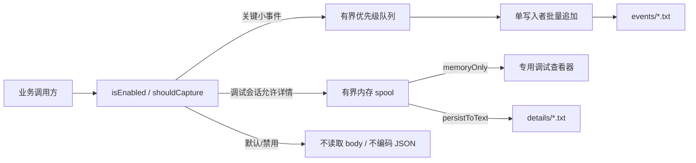

# 14 全局日志与诊断数据系统

## 状态与不可变结论

本文落实 [ADR-0016](adr/0016-segmented-text-diagnostics.md)，替代 ADR-0014 的日志 SQLite
方案。日志实现必须同时满足以下结论：

- 日志只持久化为 UTF-8 `.txt`，不创建日志 SQLite、WAL 或二进制索引。
- 默认只记录关键、小型、脱敏事件；大型 JSON、HTML、HTTP body、小说正文和复杂对象不显示、
  不构造、不进入内存，也不写盘。
- 只有专用调试窗口可见或显式调试会话活动时，详情才可进入有界内存 spool；只有会话选择
  `persistToText` 时才异步写入独立详情 TXT。
- App 与 Runtime 使用同一语义但各自落盘。主应用只能经版本化 Runtime Facade 查询 Runtime，
  不能读取其路径或共享文件。
- 日志失败、队列满、磁盘满或详情截断不能让业务失败，也不能把队列改成无界。

## 分层模型



### 第一层：关键事件

事件分段使用扩展名为 `.txt` 的 NDJSON，每行一个 `recordType=event` 的稳定 JSON envelope。
它是可直接检查的文本，同时仍由强类型 schema 管理，不允许调用方拼自由文本协议。

每个事件至少包含：

| 字段 | 规则 |
| --- | --- |
| `schemaVersion` / `eventName` | 独立版本、进入 registry，不临时拼名 |
| `eventId` / `sourceRunId` | 不含路径或用户数据的稳定诊断 ID |
| `occurredAtUtcMicros` / `monotonicMicros` | 跨来源近似排序与单进程耗时 |
| `component` / `severity` / `outcome` | 受控枚举或 registry 值 |
| `traceId` / `spanId` / `parentSpanId` | 跨层关联；不得成为指标 label |
| `durationMicros` / `queueWaitMicros` | 终态和性能事件适用 |
| `count` / `bytes` / `attempt` | 仅小型聚合投影 |
| `errorCode` / `stackFingerprint` | 稳定码与脱敏摘要，不保存原始异常文本 |
| `attributes` | `DiagnosticValue`，编码后有硬预算 |
| `attachmentCount` / `capturedBytes` | 不读详情即可显示的投影 |

默认不得出现在事件中的内容：HTTP body、HTML、JSON 文档、小说正文、书名/作者、搜索词、
用户输入、完整 URL/query value、Authorization/Cookie/token/credential、SQL 参数、行内容、
对象 dump、原始堆栈和绝对路径。

### 第二层：span

每个用户操作、跨边界调用或长任务只有一个 owner span。owner 写一个 start，并在
`success/error/cancelled/timeout/overloaded` 中恰好写一个终态。阶段耗时使用 child span；
错误由能决定恢复语义的 owner 记录一次，上层只有增加新语义时才补事件。

### 第三层：调试详情

详情包括 HTTP request/response body、大 JSON、HTML、长文本以及版本化复杂对象树。详情与
日志级别是两个正交开关：开启 `debug` 级别不等于允许读取 body。

只有同时满足以下条件，详情 supplier 才可被执行：

1. 专用调试窗口处于可见/订阅状态，或用户显式启动了未过期 capture session。
2. session 模式允许该 payload kind。
3. component、脱敏 origin/route 与 payload kind 命中 allowlist。
4. 单条、会话、内存和磁盘预算仍有余量。

调用方必须以惰性 supplier、流或 chunk ticket 提供详情。禁用路径不得调用 supplier、
`toJson()`、getter 或响应 `clone()`，不得先构造完整字符串再询问 manager 是否启用。

详情捕获状态固定为：

```text
captured | truncated | policyBlocked | pressureDropped | failed
```

事件只保存 opaque `attachmentId`、kind、mediaType、capturedBytes、digest、captureState 与
redaction profile。绝对路径永不进入事件、descriptor 或 Runtime Facade。

## 持久化布局

App 与 Runtime 各自在自己拥有的数据根使用相同逻辑布局：

```text
diagnostics/
  events/
    run-<opaque-run-id>-000001.txt
    run-<opaque-run-id>-000002.txt
  details/
    <opaque-attachment-id>.txt
  staging/
    <opaque-attachment-id>.partial.txt
```

不得在该目录创建 `.sqlite`、`.sqlite3`、`.db`、`-wal` 或 `-shm`。主应用诊断目录由
`lib/core/persistence/` 的生命周期端口拥有，但不属于应用权威数据库；Runtime 目录完全由
`mg_read_runtime` 拥有。

### 事件 TXT

- 单写入者把小事件先编码成一批完整行，再一次追加；禁止每事件 open/close/fsync。
- 初始单分段上限 4 MiB。达到上限、运行结束或格式变更时关闭并创建下一段。
- 每行必须以 `\n` 结束。恢复时只接受完整 UTF-8 行；尾部半行截断并产生一次合并恢复事件。
- 会话 start/stop、run start/end、attachment descriptor 和 retention tombstone 也是有
  `recordType` 的小型行，启动时按顺序 fold 重建当前目录。
- 当前进程可维护有界稀疏目录（分段范围、每 N 行 offset、session/event locator），但目录
  不持久化为第二种格式，关闭后可丢弃。

### 详情 TXT

- 详情先进入按字节计费的有界内存 spool，不进入事件队列。
- `memoryOnly` 只供当前调试窗口按 range 读取，窗口关闭/会话结束/TTL 到达即清空。
- `persistToText` 在后台将已脱敏 chunk 写入 staging，完成摘要后同卷原子重命名为 `.txt`，
  然后立即释放对应内存 chunk。
- 不得用 StringBuffer/数组收集完整 HTTP body 后一次性写盘；业务字节流优先，诊断 tee 只能
  投递固定大小 chunk。
- staging 残留在启动时清理；没有成功 descriptor 的详情文件是孤儿，按保留任务删除。
- 二进制默认不捕获。未来确需捕获时必须转成受控文本表示且经过单独预算，不得伪装 Base64
  正文塞入普通事件。

## 模式与级别

### 运行模式

| 模式 | 默认行为 | 详情行为 |
| --- | --- | --- |
| `off` | 除最早启动 fallback 外不持久化 | 不执行 supplier、不缓冲、不写盘 |
| `keyOnly` | 默认；关键 info、终态、warn/error/fatal、性能摘要写事件 TXT | 不执行 supplier、不缓冲、不写盘 |
| `memoryOnly` | 增加选定 component 的 debug/trace | allowlist 详情进入有界内存，不持久化 |
| `persistToText` | 同上 | allowlist 详情异步写独立详情 TXT |

Debug/Profile 构建默认是 `keyOnly`，不是“全量日志”。Release 默认至少保留 warn/error/fatal
和有界生命周期/健康摘要，仍不得自动捕获详情。

非 Release 构建向进程调试输出实时镜像人可读摘要：关键用户流程的 start/terminal，以及所有
warn/error/fatal。摘要按单行显示时间、级别、稳定事件名、耗时和少量受控字段；它不是完整 JSON
envelope，也不逐条输出底层持久化/循环事件。完整结构化记录仍在 App/Runtime 的 TXT 与专用查看器
中。控制台摘要只来自已通过 schema 和隐私策略的事件，不能输出正文、HTTP body、书名/作者、用户
输入、Cookie、token、绝对路径或原始异常。控制台镜像使用独立的有界队列；镜像失败、控制台关闭或
输出压力不得改变业务结果和有界 TXT 队列语义。该镜像不把 `keyOnly` 变成全量内容捕获。

### 捕获模式

| payload 模式 | 行为 |
| --- | --- |
| `metadataOnly` | 不读取 body，只记录类型、声明长度、实际字节、耗时和稳定结果 |
| `safeStructured` | 显式调试会话；只保留成功解析并递归脱敏的 JSON/form/对象树 |
| `contentPayload` | 显式调试会话；允许选定来源的 HTML/文本内容，短 TTL |
| `restrictedRaw` | 当前 unsupported；不得静默降级为原始捕获 |

## 动态 JSON 与复杂对象

小型 attributes 只能使用 `DiagnosticValue`：

```text
null | bool | string | int64Decimal | finiteDouble
list<DiagnosticValue> | object<string, DiagnosticValue>
redacted | truncated | attachmentRef
```

建议初始预算为编码后 16 KiB、深度 8、object 128 key、array 256 项、单 string 4 KiB。
超限产生 typed `truncated`，不能转成任意字符串绕过预算。

大型合法 JSON 只有在调试详情门禁通过后才以 UTF-8 流进入 spool。查看器选择该附件后，才在
后台执行增量解析、递归脱敏和节点分页；列表页永远不解析完整 JSON。

非 JSON 动态对象使用版本化 tagged tree：

```text
scalar | object | list | ref | dateTime | int64 | nonFinite
attachment | redacted | truncated | unsupported
```

serializer 限制总节点、深度、key、数组长度、字符串和总字节；循环/共享引用使用 `ref`。
不得执行未知 getter、iterator、Proxy hook、自定义 `toString()` 或 `toJson()`。未知 schema
只读展示，不改写原始详情。

## HTTP 日志

HTTP 事件只由 Runtime 的统一 `ctx.http` 层产生。默认 `keyOnly` 记录：

- method、脱敏 origin/route 模板、redirect/retry/cache/Range 投影；
- status、MIME、声明/实际上传下载字节；
- 可取得的 queue/DNS/connect/TLS/TTFB/body/parse 分段耗时；
- header 名称和明确允许的公开值；
- cancel/timeout/overload/error 的稳定错误码。

默认路径不得 clone response、调用 request body supplier、读取响应文本或解析 JSON。调试捕获
路径仍永不自动保存 Authorization、Cookie、Set-Cookie、token、credential。request 与
response 是两个 attachment；raw wire 与解码内容也不能混为一个 attachment。

## 管理层 API

主应用内部端口：

```text
DiagnosticsManager
  isEnabled(component, severity)
  shouldCapture(component, payloadKind, originProjection)
  emit(eventDraft)
  startSpan(spanDraft) -> SpanHandle
  startDebugSession(policy) -> CaptureSession
  stopDebugSession(sessionId)
  attachLazy(eventId, descriptor, supplier)
  flush(deadline)
  dispose()

DiagnosticsQuery
  listSessions(filter, cursor, limit)
  listEvents(filter, cursor, limit)
  getEvent(eventId)
  listAttachments(eventId)
  readAttachment(attachmentId, offset, length)
  listStructuredNodes(attachmentId, path, cursor, limit)

DiagnosticsMaintenance
  enforceRetention()
  deleteSession(sessionId)
  exportBundle(selection, exportPolicy)
  getStatistics()
```

Runtime Facade 发布等价的版本化强类型 query/capture capability。主应用联合查询只合并两个
cursor page，不复制 Runtime 全量 TXT，不接受路径，不构造 loopback URL。

### cursor 与查询

- cursor 是带版本的 opaque token，内部只含来源、segment ID、byte offset 和排序锚点。
- 默认每页 100、硬上限 200；每次只打开需要的有限分段并按完整行读取。
- 筛选可利用启动时后台重建的稀疏内存目录；目录未完成时返回有界部分结果/加载状态，不能在
  UI isolate 扫描全部历史。
- range 读取有单次字节上限并支持取消。查看器关闭页面必须释放 parse cache 与内存详情租约。

## 性能、背压与轮转

调用路径固定为：廉价 gate → 小 draft → 有界队列 → 后台编码/脱敏 → 批量 TXT append。
禁用时不得插值长文本、抓堆栈、遍历对象或编码 JSON。

初始硬预算：

| 资源 | 初始值 | 到限额行为 |
| --- | --- | --- |
| 事件队列 | 4096 条且 4 MiB | 丢低优先级，预留终态槽，合并 drop 事件 |
| 事件分段 | 4 MiB | 轮转到下一 TXT |
| 常规事件 | 3 天或 32 MiB | 删除最旧已关闭分段 |
| 详情内存 spool | 全局 8 MiB | 停止该详情，标记 `pressureDropped` |
| 单详情 | 8 MiB | 截断并记录 captured/total bytes |
| 调试持久化会话 | 24 小时或 128 MiB | 停止新详情，关键事件继续 |
| 小 attributes | 16 KiB | typed `truncated` |
| preview/range | 2 KiB / 256 KiB | 使用下一 range 继续 |

数值必须通过 Android arm64、Windows x64、macOS 基准校准，只能收紧或通过集中策略变更，
不得在 feature 散落魔法数。高频 frame/scroll/chunk/item/loop 只做 counter、histogram 或时间窗
摘要，禁止每帧、每像素、每条目、每 chunk 写事件。

超过基线阈值写版本化 `*.slow` 聚合事件，包含阈值、平台和构建模式。性能至少区分 queue
wait、实际工作、first-byte/first-result 和端到端耗时。

## 隐私与导出

- `secret` 永不持久化；`content` 只在选定来源的显式调试会话捕获。
- URL 只保存 origin、route 模板、query key 名或不可逆受控摘要；不保存 query value。
- 常规导出只含关键事件 TXT，不含详情。包含 content detail 必须由用户二次选择范围、显示
  预计大小并再次脱敏。
- HTML 只以文本/安全语法树显示，禁止 WebView 执行；JSON/tree renderer 不执行脚本、URL、
  SQL 或对象 getter。
- 事件/详情 TXT 均位于 app-private 数据根，不等于内容可免于分类或脱敏。

## 强制覆盖矩阵

| 链路 | 必须记录的关键事件 | 关键性能投影 |
| --- | --- | --- |
| App bootstrap/lifecycle | 阶段 start/terminal、前后台、退出/flush | 阶段与端到端耗时 |
| 页面与用例 | 稳定 route、关键意图、loading/terminal/cancel/stale | 首内容、generation、count |
| Runtime Facade | queue/start/terminal/deadline/retry | queue/bridge/runtime/UI commit |
| Runtime/插件 | start/ready/fail/shutdown、load/invoke/parse/overload | queue、slot、attempt、event-loop delay |
| HTTP | start/headers/terminal；详情仅显式调试 | 阶段耗时、status、bytes、cache/Range |
| SQLite 业务持久化 | open/migrate/query/write/transaction/recovery | queue/SQL/codec/WAL；无参数/行内容 |
| TXT diagnostics | writer/batch/rotate/recover/drop/retention | queue high-water、append、segment/detail bytes |
| 书架/目录/阅读器 | refresh/page/fetch/cache/launch/first-frame/commit/exit | first content、parse/paginate/layout |
| 下载/缓存/文件 | 状态迁移、checkpoint/verify/commit/cleanup | 时间窗吞吐、Range、retry、quota |
| 崩溃边界 | Flutter/isolate/Node/Javet/child fatal 与恢复 | 阶段、fingerprint、last trace |

日志系统记录自身故障时必须走非递归健康计数器，并在恢复后合并成单个事件，禁止失败日志再
触发相同 writer 形成递归风暴。

## 专用查看器

- 日志列表始终只显示关键事件；进入专用调试页面即显式启动 `memoryOnly` 详情会话，
  不显示不存在的“详情”占位。
- 用户明确选择“保存详细日志”后才切换为 `persistToText`，界面持续显示剩余时间、
  内存/磁盘预算、allowlist 与截断数。
- 关闭窗口时自动停止当前详情会话；`memoryOnly` 内容同时清空，已成功写出的详情 TXT 继续
  受 retention 管理。
- 列表虚拟化，live tail 按帧/时间窗合并；选择事件后才请求 descriptor/preview/range。
- HTTP exchange、JSON tree、HTML text、长文本和 diff 使用独立 renderer；解析在后台完成。
- 删除、导出、包含内容详情和延长保留都是显式动作。

## 故障恢复

- 事件 TXT 尾部半行：截断到最后一个换行，保留此前完整记录。
- staging 详情：启动时删除；成功详情无 descriptor 时作为孤儿回收。
- 磁盘满：停止详情与低级事件写入，业务继续；恢复后合并 `diskFull`/drop 统计。
- writer 故障：队列保持硬上限，调用方继续；关闭时 best-effort 有界 flush。
- Runtime 未 ready：Runtime-owned offline reader 可读取已关闭分段；主应用不直接开 Runtime 文件，
  也不为看日志启动第二个 VM。
- 未知未来 record/schema：只读跳过或返回 unsupported，不改写文件。

## 测试与性能门禁

必须包含：

- span success/error/cancel/timeout/overload 与恰好一个终态；
- 禁用/默认模式不执行详情 supplier/getter/serializer/response clone；
- secret canary、HTML、JSON、小说正文不出现在默认内存、事件 TXT、详情 TXT、preview、控制台
  和常规导出；
- debug memory/persist、allowlist、TTL、配额、截断、背压和业务结果不受 writer 故障影响；
- TXT 批量追加、4 MiB 轮转、尾部半行恢复、staging/原子提交、孤儿和 retention；
- 100k 事件 cursor 分页只加载一页，长详情 range 读取不整文件驻留；
- 数据根扫描确认没有 diagnostics `.sqlite/.db/-wal/-shm` 文件。

每个性能关键改动比较 `off`、默认 `keyOnly`、显式详情捕获三组，报告 p50/p95/p99、吞吐、
分配/峰值内存、队列高水位、drop、事件 TXT 与详情 TXT 增长。普通测试或静态分析不能替代
日志验收。

## 交付顺序

1. 契约、registry、privacy、TXT store 与 testkit。
2. 主应用 manager、关键路径接入、恢复/轮转/retention。
3. Runtime manager、`ctx.http`、插件/生命周期接入和强类型 Facade。
4. 专用查看器、联合分页、实时 memory session、详情 renderer 和显式导出。
5. `restrictedRaw` 只有新安全 ADR 被接受后才能实现。
