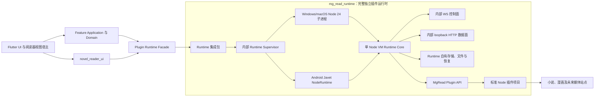

# MgRead 架构文档

本目录是 MgRead 产品范围、系统架构、公开协议和已接受架构决策的唯一入口。当前状态为
**契约基线加有限实现证据**：同级 `mg_read_runtime` 已实现 Windows desktop Core、
Runtime-owned Flutter Facade、标准 Node 插件项目解析、`.mgplugin` 安装、lockfile 恢复、依赖
对象仓、冷激活以及 `plugins.list.v1` / `plugin.search.v1`。主项目已通过版本化 Facade 接入
Runtime 健康和插件状态页。Windows 实现由 Runtime 自己用 Job Object 清理 Node 进程树并
使用有界 WS 多路复用；它不表示 Android/Javet、macOS、完整 Runtime Store、官方仓库或最终
应用包已验收。完整证据边界见
[Runtime desktop 文档](../../../mg_read_runtime/docs/desktop-runtime-bridge.md)。

## 文档状态与优先级

- 基线日期：2026-08-14。
- 首版平台：Android、Windows、macOS，Android 优先。
- 当前阶段：主项目通过 Facade 接入 Runtime 状态；Runtime 独立推进标准插件业务能力与平台验收。
- 当前阶段禁止：在 `mg_read` 新增运行时代码、平台桥接、真实书源或半成品媒体播放器；主应用核心持久化按 ADR-0011 单独演进。
  desktop 已实现能力不得被当作例外搬运到主项目。
- 冲突处理顺序：已接受 ADR → 本目录中的协议/专题规范 → 根目录 `AGENTS.md` → README 与实现说明。
- 已接受 ADR 不能被实现或普通文档修改隐式推翻；变更时必须新增替代 ADR，并标记旧 ADR 被取代。

## 首版边界

| 范围 | 首版承诺 | 说明 |
| --- | --- | --- |
| 插件生态 | 是 | 官方单仓库、本地 `.mgplugin`、安装、更新、启停、诊断、失败回滚 |
| 内容获取 | 是 | 发现、搜索、详情、目录、小说正文、漫画图片描述 |
| 书架与阅读 | 是 | 加入书架、小说/漫画阅读、语义进度、书签 |
| 离线能力 | 是 | 缓存、可恢复下载、插件不可用时保留本地内容 |
| 本地资料域 | 是 | 本地数据优先，不建立全局当前用户 |
| 账号与云同步 | 否 | 延期到显式数据作用域设计完成之后 |
| WebView 登录 | 仅协议预留 | 首版调用统一返回 `unsupported` |
| 音频与视频 | 仅类型和边界预留 | 不交付播放器、后台播放或媒体服务 |
| 安全沙箱/签名信任链 | 否 | 插件完全可信；能力清单暂不强制隔离 |
| iOS、Linux、Web | 否 | 不得为了未承诺平台破坏首发平台边界 |

## 总体架构

最重要的硬约束：

1. 一个应用进程只有一个 Node Runtime、一个 V8 Isolate/Context；插件不得创建 Worker、子进程、第二个 VM 或加载原生 Addon。
2. 单 VM 的目标是高并发异步 I/O，不承诺 CPU 密集脚本并行；同步死循环可以拖死整个插件系统。
3. WS 是 Runtime 内部的全双工控制面，HTTP 是 Runtime 内部的资源数据面；二进制和超限文本不进入 JSON/Base64，主项目不直接连接任一端点。
4. Runtime 负责插件执行与平台运行时，不能打开主应用 SQLite 或获得其路径/连接；应用权威元数据由主项目 core persistence 持有。
5. 已加载插件不热替换；更新在下次应用进程启动时冷激活。
6. 首版插件被视为完全可信，本地 loopback 通信也不鉴权；这些是明确接受的风险，不是安全保证。
7. Runtime Store 使用稳定记录骨架与按作用域版本化 JSON；大正文/二进制不进入 JSON，
   动态持久化格式也不穿透强类型 Runtime Facade。
8. 全局日志使用“小型事件索引 + 独立附件对象”；App 与 Runtime 分域落盘并以 trace/Facade
   联合查询。HTTP body 和复杂动态结构只在显式、有界的调试捕获会话中保存。

## 文档导航

| 文档 | 负责的唯一主题 |
| --- | --- |
| [01 产品范围与路线图](01-product-roadmap.md) | 首版闭环、页面范围、里程碑、阶段退出条件 |
| [02 系统分层与组件边界](02-system-architecture.md) | Flutter 分层、进程边界、依赖方向、仓库职责 |
| [03 Runtime 生命周期](03-runtime-lifecycle.md) | Node/Javet 启停、探针、ready、后台与故障状态机 |
| [04 插件项目、安装与仓库](04-plugin-sdk-packaging-registry.md) | package.json、lockfile、依赖对象仓、安装、更新与回滚 |
| [05 WS/HTTP 协议](05-transport-protocol.md) | Runtime 内部双向 RPC、事件、错误、取消、资源流、Range |
| [06 数据、缓存与下载](06-domain-data-cache-downloads.md) | Runtime 自有领域模型、存储、文件提交、缓存和恢复下载 |
| [07 并发与性能](07-concurrency-performance.md) | 有界调度、背压、取消、主项目 UI/Runtime Store 性能规则 |
| [08 可靠性、可观测性与测试](08-reliability-observability-testing.md) | 错误恢复、日志指标、诊断、分层测试与验收边界 |
| [09 平台发布与未来能力](09-platform-release-future-capabilities.md) | Android/桌面发布、站外分发、WebView 与媒体扩展 |
| [10 主应用持久化设计](10-app-persistence-design.md) | 应用权威元数据、版本 JSON 与后台 executor |
| [11 主应用持久化独立验收](11-app-persistence-acceptance.md) | 临时数据根、独立 Store 验收与故障矩阵 |
| [13 内容资料库](13-content-library.md) | 书架、目录、正文、漫画文件对象与跨库恢复边界 |
| [14 全局日志与诊断数据](14-global-diagnostics-logging.md) | 事件/span、HTTP body、动态结构、附件对象、管理层与查看器边界 |
| [ADR 索引](adr/README.md) | 不得被隐式改变的架构决策 |

## 术语

| 术语 | 固定含义 |
| --- | --- |
| 主项目 | Flutter UI、路由、主题、用户交互和阅读器视图宿主；只消费 Runtime 门面 |
| Runtime | `mg_read_runtime` 交付的独立插件运行时，含平台承载、Core、通信、存储和 Flutter-facing 门面 |
| Runtime Facade | 主项目唯一可见的高层调用面；以版本化 `PluginInvocation` 调用能力，不泄露内部协议 |
| Plugin / 插件 | 带 `package.json.mgread` 和 npm lockfile、由 Runtime 加载的可信标准 Node 项目 |
| Reader plugin / 阅读器插件 | 同级 `mg_read_reader_ui` Flutter 插件，与数据来源插件不是同一概念 |
| Source / 来源 | 某个插件暴露的内容站点或逻辑数据源 |
| Control plane / 控制面 | WS 上的小型 JSON RPC、事件与取消消息 |
| Data plane / 数据面 | loopback HTTP 上的图片、`.mgplugin`、文件、字体、漫画及未来媒体字节流 |
| Semantic anchor / 语义锚点 | 阅读器公开 API 定义的章节、字符或图片位置，不是页码或像素偏移 |
| App process / 应用进程 | 一次前台应用进程生命周期；冷激活边界以此为准 |

## 计划中的仓库边界

以下是目标拆分，不代表这些仓库现已创建：

| 仓库 | 职责 |
| --- | --- |
| `mg_read` | Flutter UI、路由、主题、用户交互、阅读器视图宿主和本文档；不实现或注入 Runtime |
| `mg_read_reader_ui` | 已存在的独立 Flutter 阅读器插件，只暴露公开小说/漫画契约 |
| `mg_read_runtime` | 完整独立插件运行时：平台承载、Runtime Core、内部 WS/HTTP、Runtime 存储、Plugin API、Schema、fixture 与 Flutter-facing 门面 |
| `mg_read_plugin_template` | 官方空白插件、假数据插件、构建、校验、打包和契约测试 |
| `mg_read_plugin_registry` | 唯一官方仓库索引、插件包及发布自动化 |

跨仓库类型不能靠复制后手工维护。规范 Schema、fixture 与 Runtime Facade 的公开类型由 `mg_read_runtime` 维护；主项目只消费其版本化发布物。职责边界由 [ADR-0008](adr/0008-standalone-plugin-runtime-boundary.md) 固定，标准 Node 插件格式由 [ADR-0015](adr/0015-standard-node-plugin-projects.md) 固定。

## 外部依据

- [Node.js：不要阻塞事件循环](https://nodejs.org/learn/asynchronous-work/dont-block-the-event-loop)
- [Javet 项目与支持矩阵](https://github.com/caoccao/Javet)
- [Javet Android 构建配置](https://github.com/caoccao/Javet/blob/main/android/javet-android/build.gradle.kts)
- [Javet 与 Node.js Runtime 交互](https://www.caoccao.com/Javet/tutorial/advanced/interact_with_node_js.html)
- [Android 后台执行限制](https://developer.android.com/about/versions/oreo/background)
- [Android Service 指南](https://developer.android.com/develop/background-work/services)
- [Apple 直接分发与发布](https://developer.apple.com/documentation/xcode/distributing-your-app-for-beta-testing-and-releases/)
- [Apple 公证流程](https://developer.apple.com/documentation/security/notarizing-macos-software-before-distribution)
