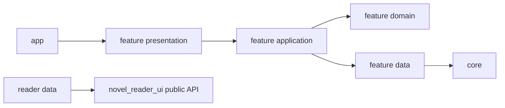

# MgRead 主应用模块结构

## 状态和目的

本文将 `docs/architecture/` 中已接受的主应用边界映射为可提交的 Flutter 目录骨架。它不替代 ADR、协议或领域规范，也不实现 Runtime、ZIP、真实书源、数据库访问、文件传输或下载行为。

`core/runtime/` 是其他并行工作承载 Node 生命周期、WS/HTTP 控制面和协议适配的唯一预留位置。本次只创建目录边界，未在其中新增任何实现、依赖或通信契约。

## 实际目录树

```text
lib/
  app/
    bootstrap.dart                 # Flutter 初始化与 ProviderScope 组合入口
    app.dart                       # 根 Widget 的稳定公开入口
    mg_read_app.dart               # MaterialApp.router 当前具体实现
    app_router.dart                # 声明式类型化路由
    app_theme.dart                 # 语义主题
    app_strings.dart               # 集中可见文案
  core/
    diagnostics/                   # 脱敏只读诊断基础能力
    errors/                        # 稳定错误与安全归一化
    files/                         # 应用文件布局与恢复基础能力
    persistence/                   # Drift/SQLite 执行器、Schema、迁移
    runtime/                       # Runtime Supervisor、WS/HTTP Client、协议适配
    scheduling/                    # 有界后台计算、取消和 deadline
  features/
    library/
      application/ domain/ data/ presentation/
    plugins/
      application/ domain/ data/ presentation/
    discovery/
      application/ domain/ data/ presentation/
    content_detail/
      application/ domain/ data/ presentation/
    downloads/
      application/ domain/ data/ presentation/
    reader/
      application/ data/ presentation/
    settings/
      application/ domain/ data/ presentation/
  shared/
    presentation/ utilities/

test/
  app/
  core/{diagnostics,errors,files,persistence,runtime,scheduling}/
  features/{library,plugins,discovery,content_detail,downloads,reader,settings}/
  support/
```

空目录通过 `.gitkeep` 保留；它们不是功能完成的声明。每个实现模块必须与对应测试一同进入仓库。

## 依赖与执行边界



| 层 | 可以做什么 | 不可以做什么 |
| --- | --- | --- |
| `app` | 组合 Provider、路由、主题、生命周期入口 | 保存业务全局状态、解析站点、直接访问数据库/Node |
| `presentation` | 渲染不可变状态、转发用户意图 | 在 `build()` 请求/写入，直接访问数据库、文件、Runtime |
| `application` | 编排用例、generation、取消、事务边界 | 站点解析、持有 Widget、直接渲染 UI |
| `domain` | 业务类型、规则、窄端口 | Flutter、Drift、Node、HTTP 或文件实现依赖 |
| `data` | Repository、数据库映射、协议/阅读器适配 | 跨 feature 直接驱动页面或路由 |
| `core` | 通用基础设施 | 保存书架、当前用户、当前书籍等业务权威状态 |
| `shared` | 真正跨 feature 的无业务 UI/工具 | 演变成业务 Service Locator |

UI Isolate 只做渲染、轻量状态映射与输入校验；SQLite 只在 `core/persistence/` 的受控后台 Isolate 中运行；大计算进入 `core/scheduling/` 的有界执行器；Node 业务通信仅由 `core/runtime/` 实现，并且 Node 不获得数据库路径。

## 模块职责与后续开发入口

| 模块 | 负责内容 | 首个可开发入口 |
| --- | --- | --- |
| `app` | 启动组合、全局主题、类型化路由、可见文案 | 按功能页面添加 route；仅传稳定 ID 或轻量值 |
| `core/errors` | 稳定错误码、UI 安全映射 | 已有 `AppError`，协议/Repository 都必须归一化到它 |
| `core/runtime` | Supervisor、协议 Client、Runtime 快照和取消 | 其他线程的 Node/WS/HTTP 实现；禁止保存业务数据 |
| `core/persistence` | 单一 Drift/SQLite 执行器、Schema、迁移 | M2.2：WAL、外键、事务、批处理和迁移测试 |
| `core/files` | 受控文件 ID、同卷原子提交、恢复决策 | M2.3：不存绝对路径或未编码外部 ID |
| `core/scheduling` | 有界 Isolate 计算与背压 | M2.3：固定 worker/队列、deadline、取消、诊断 |
| `core/diagnostics` | 脱敏只读诊断模型 | M2.4：聚合 Runtime、数据库、缓存和平台快照 |
| `features/library` | 本地书架入口、书架投影和业务动作 | M2.2：Repository 替换目前的空 loader |
| `features/plugins` | 安装记录、启停、版本、待激活和回滚的产品语义 | 先建 domain 端口，再接 Runtime 命令与持久化记录 |
| `features/discovery` | 发现、搜索和不透明 cursor 分页 | 先建请求/结果 domain 类型与可取消 application 用例 |
| `features/content_detail` | 内容详情、来源绑定、目录快照 | 先建稳定 ID/绑定规则，目录刷新必须原子切换 revision |
| `features/downloads` | 下载任务、状态机、用户动作 | 先建持久状态和 Repository；传输由 Runtime 完成 |
| `features/reader` | 阅读器公开 API 适配、语义进度/书签、宿主页 | 仅 `data/` 导入 reader plugin 公开 API；不持久化页码/像素 |
| `features/settings` | 设置和诊断页面产品层 | M2.4：只读诊断投影，设置经 Repository 持久化 |
| `shared` | 无业务公共 UI/小工具 | 只有两个以上 feature 复用时才抽取 |

## 推荐的单模块开发顺序

1. 阅读对应的 `docs/architecture/` 专题和相关 ADR，先写出 domain 类型与端口。
2. 为规则、错误映射、并发或迁移先补单元测试。
3. 在 `application/` 编排用例、请求 generation、取消和不可变 Riverpod `Notifier/AsyncNotifier` 状态。
4. 在 `data/` 实现 Repository/协议/阅读器适配；不要反向让 Widget 访问基础设施。
5. 最后在 `presentation/` 建 UI，并补 Widget 测试。
6. 每个模块交付前运行格式、分析、相关测试及必要的生成步骤；运行验收、桌面验收和 Android 真机验收分别报告。

## 明确禁止的跨界实现

- Widget 直接打开 Drift、文件、Runtime Client 或发网络请求。
- Node/Runtime 直接打开 Flutter SQLite、保存书架/目录/进度/书签权威数据。
- 路由携带正文、图片、Repository、controller 或其他可变依赖。
- 为了共享方便将业务模型塞入 `shared/`、将所有接口塞入 `core/`。
- 为音频、视频、WebView、账号或未承诺平台加入半成品分支。
- 使用全局 `currentUser`、`currentBook`、`currentProgress` 单例代替显式 Provider 范围。
