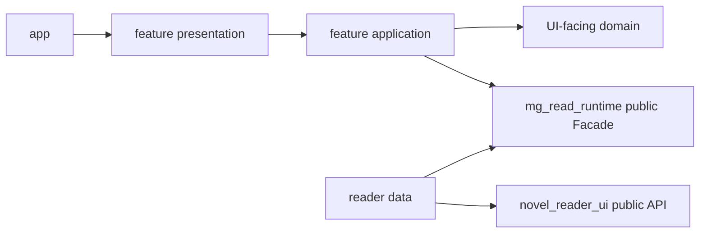

# MgRead 主项目 UI 模块结构

## 状态和目的

本文将 [ADR-0008](../architecture/adr/0008-standalone-plugin-runtime-boundary.md) 的主项目
边界映射为可提交的 Flutter 目录骨架。它不替代 Runtime 的协议、SDK、存储或平台文档，
也不授权在本仓库实现 Runtime、ZIP、真实书源、数据库、文件传输、下载或 Node/Javet。

`mg_read_runtime` 交付唯一的 Flutter-facing Runtime Facade、阅读器数据源/状态存储适配
以及全部内部平台 Runtime。`mg_read` 不创建 `core/runtime/`、`core/persistence/`、
`core/files/` 或 Runtime 用途的 `core/scheduling/`。

## 目标目录树

```text
lib/
  app/
    bootstrap.dart                 # Flutter UI 组合入口
    app.dart                       # 根 Widget 的稳定公开入口
    mg_read_app.dart               # MaterialApp.router 当前具体实现
    app_router.dart                # 声明式类型化路由
    app_theme.dart                 # 语义主题
  core/
    diagnostics/                   # Runtime 脱敏快照的 UI 投影
    errors/                        # 稳定错误与 UI 安全归一化
  features/
    library/
      application/ domain/ data/ presentation/
    plugins/
      application/ domain/ data/ presentation/
    discovery/
      application/ domain/ data/ presentation/
    content_detail/
      application/ domain/ data/ presentation/
    downloads/
      application/ domain/ data/ presentation/
    reader/
      application/ data/ presentation/
    settings/
      application/ domain/ data/ presentation/
  shared/
    presentation/ utilities/

test/
  app/
  core/{diagnostics,errors}/
  features/{library,plugins,discovery,content_detail,downloads,reader,settings}/
  support/
```

空目录通过 `.gitkeep` 保留时不表示能力已经实现。每个 UI 实现模块必须与对应测试一同
进入仓库。已有的空 Runtime 预留目录不能作为未来代码入口；新 Runtime 工作必须转到
`mg_read_runtime`。

## 依赖与执行边界



| 层 | 可以做什么 | 不可以做什么 |
| --- | --- | --- |
| `app` | 组合 UI Provider、路由、主题 | 保存插件业务权威状态、解析站点、启动 Node/Javet |
| `presentation` | 渲染不可变状态、转发用户意图 | 在 `build()` 请求/写入，直接访问 Runtime Store、文件或 raw Runtime 协议 |
| `application` | 编排 UI 用例、generation、取消、Facade 调用 | 管理 Runtime 生命周期、传输、平台适配或持久化 |
| `domain` | UI 稳定类型、显示规则、窄端口 | Flutter、Runtime wire schema、Node、HTTP/WS/Store 实现依赖 |
| `data` | Runtime Facade/阅读器公开 API 的 UI 映射 | Repository、SQLite、文件、Cookie、协议 client 或插件解析 |
| `core` | 通用 UI 基础设施 | Runtime Supervisor、Store、书架/下载/插件权威数据 |
| `shared` | 真正跨 feature 的无业务 UI/工具 | 演变成 Runtime Service Locator |

UI Isolate 只做渲染、轻量状态映射、输入校验与 Runtime 结果展示。Runtime 自动启动、
大解析、持久化、文件、下载、平台线程、WebSocket 和 HTTP 都在 `mg_read_runtime` 内。

## 模块职责与开发入口

| 模块 | 负责内容 | 首个可开发入口 |
| --- | --- | --- |
| `app` | 启动 UI 组合、全局主题、类型化路由 | 按功能页面添加 route；仅传稳定 ID 或轻量值 |
| `core/errors` | Runtime 稳定错误码到 UI 的安全映射 | `AppError` 不保留原始异常或敏感 details |
| `core/diagnostics` | 脱敏 Runtime 诊断的 UI 模型 | 只消费 Facade snapshot，不查询 Store |
| `features/library` | 书架页面投影和用户动作 | 通过 Facade 读取/更新 Runtime 书架投影 |
| `features/plugins` | 插件中心 UI | 通过 capability 显示安装、启停、更新、回滚状态 |
| `features/discovery` | 发现、搜索和不透明 cursor 页面 | 强类型 capability + 可取消 application 用例 |
| `features/content_detail` | 详情、来源和目录 UI | 消费 Runtime 内容/目录投影 |
| `features/downloads` | 下载状态机的 UI 展示和用户动作 | Runtime 返回状态；不写检查点或传输文件 |
| `features/reader` | 阅读器视图宿主 | 仅使用 Runtime 发布的 DataSource/StateStore 和 reader 公开 API |
| `features/settings` | 设置、诊断和用户操作页面 | 只读 Runtime 投影与 Runtime capability |
| `shared` | 无业务公共 UI/小工具 | 只有两个以上 feature 复用时才抽取 |

## 明确禁止的跨界实现

- 在本仓库新增 `RuntimeSupervisor`、Runtime Client、WebSocket/HTTP client、Javet/Node
  bridge、端口/ready/bootId 管理或 raw protocol DTO。
- 在本仓库实现/注入 Runtime Store、SQLite、文件、Cookie、下载、缓存、`host.*` handler
  或任何平台能力给 Runtime。
- 主项目复制书架、目录、进度、书签、下载和插件安装的权威状态，或直接扫描 Runtime 文件。
- Widget 直接调用 Facade；必须由 application 状态边界发起并处理取消/请求世代。
- 路由携带正文、图片、Repository、Runtime 连接、controller 或其他可变依赖。
- 为音频、视频、WebView、账号或未承诺平台在主项目加入 Runtime 条件分支和半成品实现。
