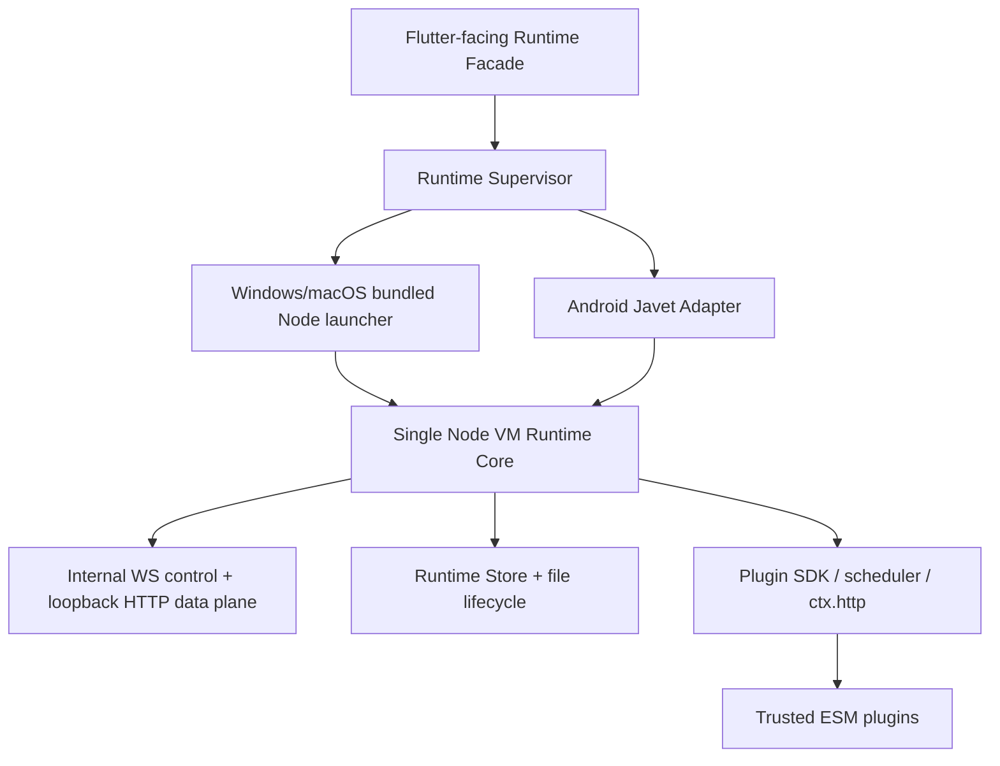

# 独立插件运行时契约

## 状态与优先级

本文固定 `mg_read_runtime` 的目标职责。当前仓库已进入 **M1.2 desktop communication
slice + M1.3 template-fixture verification**：固定 Node 24 child、stdout ready、loopback
HTTP/WS bootstrap、Runtime-owned Flutter Facade 和一条受控空白模板 Runtime 往返均已在当前
Windows x64 主机测试。模板只能由 Runtime-owned test flag 加载固定仓库入口；它不表示通用
插件系统、Runtime Store、Android Javet、macOS 包集成或完整 Flutter 产品集成已经实现，也不
授权把 Runtime 代码放进主项目。

运行时边界与主项目的对应决策是
[MgRead ADR-0008](../../mg_read/docs/architecture/adr/0008-standalone-plugin-runtime-boundary.md)。
若两个仓库的说明冲突，以该 ADR 与本文为准；变更已接受边界必须先新增替代 ADR。

## 产品定位

`mg_read_runtime` 是一个可独立运行的、完整的多平台插件运行时产品，不是要求
`mg_read` 主项目拼装的 Node Core。它必须能够在没有主项目数据库、路径、Cookie、文件
服务、平台通道、callback 或 `host.*` handler 注入的情况下，启动、恢复、加载并执行
插件的全部首版能力。

主项目只负责 UI、路由、主题、用户交互和阅读器视图宿主。它不应知道 Node/Javet、
子进程、端口、ready、bootId、WebSocket、HTTP、Runtime Store 或插件内部协议。

## 主项目唯一公开面

Runtime 发布版本化 Flutter-facing 集成包。其唯一高层模式是调用 capability：

```text
PluginRuntime.invoke<T>(PluginInvocation<T>) -> Future<T>
```

`PluginInvocation` 包含稳定的插件 ID、版本化 capability、强类型参数、取消语义和结果
类型。它可以表达插件管理、发现、搜索、详情、目录、书架、阅读状态、下载、诊断和
资源访问；主项目不得拼接 raw method 字符串或直接使用 wire envelope。

- 第一次 `invoke()` 自动完成启动、兼容检查、Runtime Store 恢复、内部 HTTP readiness
  和 WS hello。
- 资源结果以 Runtime 管理的强类型资源对象返回；主项目不构造/猜测 loopback URL、请求
  头、`bootId`、handle TTL 或 Range。
- Runtime 将稳定错误、进度和脱敏诊断投影为 Facade 类型；主项目不处理内部连接重试、
  端口、事件序号或进程状态机。
- 小说/漫画 `DataSource`、`StateStore` 和资源适配由 Runtime 的 Flutter 集成包发布，
  主项目只交给 `novel_reader_ui` 的公开 API。

这不是“把 `RuntimeClient` 换个名字”。公开 Facade 必须屏蔽所有平台和传输细节，不允许
以可选 `HostPort`、service locator、database/path 参数、callback 或 `host.*` 的形式
绕过边界。

## Runtime 必须完整拥有的组件



Runtime 仓库必须拥有并测试：

- Android Javet Adapter、专用线程、事件循环泵送、异常/关闭 watchdog；Windows/macOS
  固定 Node 子进程、允许列表环境、包内路径、签名/公证集成和启动/终止。
- 单 Node VM、ESM 插件加载、SDK、`ctx.http`、有界调度、限流、取消、deadline、
  冷激活、更新、回滚和诊断。
- 内部 WS 控制面、loopback HTTP 数据面、ready/hello、资源句柄、Range、背压、重连
  和协议 fixture。它们是实现，不是主项目 API。
- ZIP 本地导入/官方仓库、安装校验、不可变版本目录和插件启停。需要用户交互的文件选择
  必须由 Runtime 的集成包实现，不由主项目提供服务。
- Runtime Store、受控数据根、迁移、原子文件提交、缓存、下载、Cookie、插件 KV、恢复、
  诊断和所有插件/内容来源相关持久化。
- 未来 WebView、通知、媒体和其他平台能力的 Runtime 自有实现，或明确、稳定的
  `unsupported`。未实现能力绝不反向要求主项目实现 callback。

## Runtime Store 的数据所有权

Runtime Store 是以下数据的唯一权威：

- 插件安装、版本、启用、待激活、回滚和诊断。
- 书架、来源绑定、目录快照、阅读进度、书签和离线状态。
- 下载任务、内容/缓存文件、临时 `.part`、恢复检查点和完整性元数据。
- 插件作用域 KV、Cookie、Runtime 设置和脱敏运行诊断。

Runtime 自己解析应用数据根目录，自己管理持久层、事务和文件路径；主项目既不传入这些
能力，也不打开 Store 或扫描 Runtime 文件。插件缺失时，Runtime 仍负责返回本地投影和
可行动错误，而不是把离线恢复交还给主项目。

M1.1 尚未选择 Runtime Store 的具体持久化引擎。未来选型必须遵守“无原生 Node addon”、
Android Javet/Windows/macOS 一致性、迁移、原子文件恢复、包体和真实平台探针约束；不得
因为主项目曾规划 Drift/SQLite 就将 Flutter 数据库或未经审查的 native SQLite 包带入 Runtime。

## 不变量

- 每个应用进程只有一个 Node Runtime、一个 V8 Isolate/Context。插件不得创建 Worker、
  子进程、第二个 VM 或原生 Addon。
- Android 使用一个 Javet `NodeRuntime` 并由 Runtime 自有专用线程持有；Windows/macOS
  只启动 Runtime 包内、版本矩阵记录的精确 Node，不依赖用户 PATH 或全局 Node。
- Node/Javet/桌面 Node/协议/Facade 兼容矩阵整体升级；所有版本精确固定。
- 业务大资源只经过 Runtime HTTP 数据面，JSON/WS 不承载二进制或超限文本。
- 已加载插件仅在下次应用进程启动时冷激活；不得用 Runtime 热重启绕过该规则。
- 首版插件完全可信，但信任模型不允许放宽 ZIP 校验、日志脱敏、输入上限、SDK 网络入口
  或有界并发。

## 未来能力扩展规则

新增能力必须遵循：

1. 在本仓库为 capability、参数、结果、错误和资源语义定义版本化公开类型。
2. 将所需平台实现、存储、隐私、生命周期和失败恢复放入 Runtime 内部设计与测试。
3. 用 Runtime Facade 发布该 capability 和脱敏投影；主项目只增加 UI 消费。
4. 若改变单 VM、平台承载、数据所有权、冷激活或传输边界，先在 `mg_read` 架构集新增
   替代 ADR，并同步本文件、Schema、fixture 和两个 README。

禁止以“主项目已有 Flutter/原生能力”为由添加 callback、`HostPort`、`host.*`、数据库
路径或直接 platform-channel 注入。Runtime 无法独立实现的能力必须返回 `unsupported`，
直到 Runtime 仓库完成相应设计和平台实现。

## 当前 M1.2/M1.3 与验证边界

M1.2 当前验证精确 Node/npm、TypeScript Core、npm 无原生 Addon 依赖，以及 Windows x64
上的完整 Flutter↔Node desktop bootstrap：Runtime-owned Facade 在 child 创建前持有 Windows
`JOB_OBJECT_LIMIT_KILL_ON_JOB_CLOSE` Job Object，启动固定 Node、解析 ready、通过内部 HTTP
readiness 与 WS hello，并在同一 WS 上并发调用 `runtime.ping`。控制面固定 64 KiB frame、256
在途请求、1 MiB 写侧队列、deadline best-effort cancel；超限大内容仍属于未来 HTTP 数据面。
Facade 对缺 Node、缺主脚本、启动 fatal 和 readiness 失败返回稳定错误与有界脱敏 diagnostics，
并且 Job Object 测试验证 child 后代会随 Job close 被内核终止。

M1.3 额外验证一个检查入仓库的空白 TypeScript 模板：仅 `desktopForTesting` 的固定布尔开关
可让 CLI 加载 `templates/mgread-plugin-template/dist/index.mjs`；Core 以有界输入分派
`plugin.template.roundTrip`，模板通过唯一白名单 `context.runtime.request('runtime.template.context')`
回调 Runtime 内部服务，Core 再校验结果并以 test-only 强类型投影返还 Flutter。模板和 Core
都只能输出固定、脱敏 diagnostics；运行时不接受插件路径、package bytes、callback、host.*、
主项目数据库/路径/Cookie/文件/平台通道。Node 与 Flutter 测试共用
`protocol/fixtures/desktop-runtime-m1.3.json`；生产 Flutter 面仍只有
`RuntimePingInvocation`，不泄露 wire metadata。详见
[M1.2/M1.3 桌面 Runtime 通信闭环](desktop-runtime-bridge.md) 与
[空白插件模板](plugin-template.md)。

它仍未证明：

- Android Javet 或任意移动端路径；本轮明确不测试移动端。
- macOS 执行、签名/公证，或最终 Windows/macOS 应用包内的 bundle locator/隐藏窗口；Windows
  asset staging 已实现，但最终应用包内启动尚未作为验收运行。
- Runtime Store、通用插件执行、ZIP/仓库、业务 capability、资源流、下载、阅读器适配和恢复。
- Android ABI 打包、macOS 签名/公证、最终应用集成或主项目 UI 行为。

后续实现每次都必须先运行固定 Node/npm 的 `npm ci`、`npm run typecheck`、`npm test` 与
`npm run check:no-native-addons`；触及 desktop Facade/transport 时还必须运行
`npm run test:flutter-desktop`。单独报告未运行的 Android/Javet、macOS 与最终发布包探针；
静态检查或 Windows 通信测试都不是完整独立 Runtime 验收。
